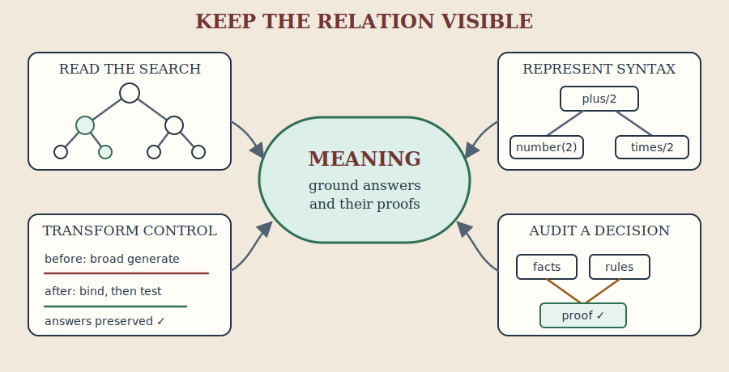
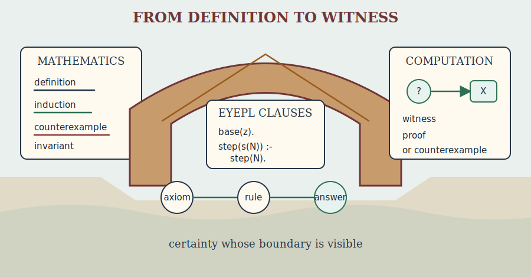
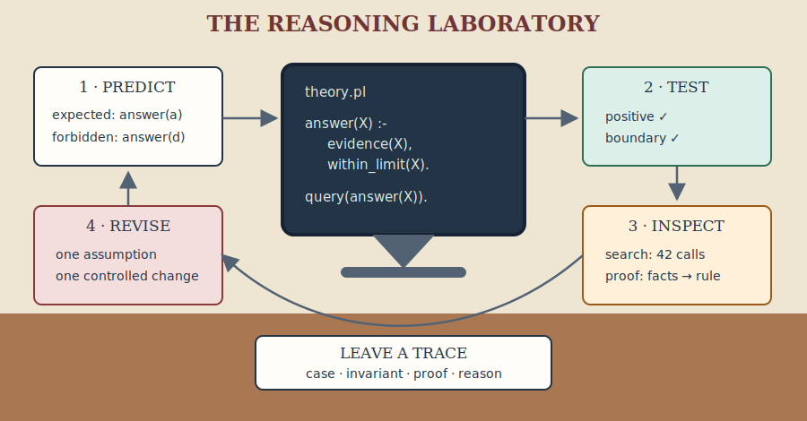
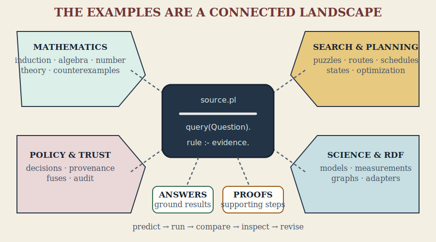

# The Art of Eyepl

<p align="center">
  
</p>

## Relations, search, and explanations in a small logic language

Eyepl turns facts and rules into answers and inspectable proofs. This book is an
original introduction to the habits of logic programming: describe a world,
state the relationships that hold in it, and let unification and search connect
the two.

Its subject is not syntax alone. A logic program has two inseparable aspects:
the relation described by its clauses and the procedure induced when goals are
selected and clauses are tried. The first tells us what answers are justified;
the second tells us whether and how the machine will find them. Learning to
program in Eyepl means learning to move comfortably between these views.

The name *Eyepl* combines *EYE* with *pl*: EYE-style reasoning in a compact,
Prolog-like notation. Eyepl inherits the relational outlook of Prolog, but it is
its own deliberately small language. It supplies facts, Horn clauses, terms,
lists, finite search, built-ins, automatic tabling, and proof output. It does not
attempt to reproduce the whole ISO Prolog environment.

This places Eyepl in a tradition that joins automated deduction, database
querying, and programming. Jacques Herbrand's doctoral work made ground terms
and ground instances central to proof theory; Robinson's later resolution
principle turned unification and refutation into a general proof procedure;
early Prolog showed that Horn clauses could also be executable programs;
deductive databases emphasized finite relations and fixed points. Eyepl
borrows from all three traditions without pretending that they are identical.
Its clauses are logical statements, its query execution is an ordered
computation, and its proof terms make the connection between the two available
for inspection.

That history explains a recurring theme of the book. Logic programming is not
the claim that control disappears. It is the discipline of stating the
relation clearly enough that control can be studied and improved separately.
Robert Kowalski's phrase “algorithm = logic + control” names this separation;
Eyepl's small surface makes it unusually easy to see in running examples.

Complete Eyepl code displays from the book are also available as files under
[`examples/book/`](examples/book/), grouped by chapter. From a source checkout,
use Node.js 18 or newer, install the dependencies, and run the CLI:

```sh
npm install
node bin/eyepl.js examples/socrates.pl
```

The first command should print:

```text
type(socrates, mortal).
is(test, true).
```

Then ask for the derivations:

```sh
node bin/eyepl.js --proof examples/socrates.pl
```

Readers who do not want to install anything can begin in the
[browser playground](https://eyereasoner.github.io/eyepl/playground). Paste
the source of `examples/socrates.pl` into the editor and run it. The playground
and local CLI use the same language, though filesystem, URL, and embedding
examples naturally require a local checkout.

The best way to read is beside a running interpreter. Before each run, predict
the answer; after it, change one fact or query and explain the difference.
Use `npm run generate` after editing the book to refresh the extracted
`examples/book/` files.

### The promise of this book

This book treats logic programming as a craft, not a collection of clever
tricks. By the end, a reader should be able to:

1. state a domain as relations whose ground instances have an unambiguous
   meaning;
2. read every clause both as a logical sentence and as a computation;
3. design finite searches, justify termination, and recognize when a calling
   mode is unsafe;
4. construct programs from examples and invariants, then improve their control
   without quietly changing their meaning;
5. test conclusions, reject inconsistent inputs with fuses, and inspect proofs
   as evidence; and
6. connect an Eyepl theory to JavaScript and RDF without hiding the knowledge
   boundary.

That is the stake in the ground: a small language is enough to teach the large
ideas when its semantics, execution, and evidence remain visible together.
The reference implementation is therefore part of the argument. The examples
are programs, the appendices describe the running system, and
`npm test` checks the complete code displays, local references, and
built-in index against the source tree.

### A working discipline

Approach each example through the same six moves:

1. **Sentence.** Say what one ground instance means.
2. **Question.** Choose the bindings with which the relation will be called.
3. **Prediction.** Write the expected answers before running the program.
4. **Search.** Trace the first choice, the bindings it adds, and the next goal.
5. **Evidence.** Inspect a proof and distinguish it from the failed search
   branches that were explored.
6. **Revision.** Change one fact, query, goal order, or representation and
   explain what should remain invariant.

This rhythm deliberately joins declarative reading, operational reading, and
program construction. Readers new to logic programming can follow Parts I–III
in order. Experienced Prolog programmers can begin with Chapters 3, 13, and
17 to see where Eyepl's hybrid execution and proof-oriented design differ.
Appendix D gives further routes through the material.

### Choose a route

The book supports several paths; reading every chapter in order is not a test
of seriousness.

| Reader | Suggested route | What to postpone |
| --- | --- | --- |
| New to programming | Chapters 1–10, 11–12, 18–20, then Laboratories I.1–I.4 | The formal parts of Chapter 3, embedding, RDF, and Parts V–VI |
| Programmer new to logic | Parts I–II, Chapters 11–13 and 17–25, then Part VII | Detailed history and mathematical foundations on the first pass |
| Experienced Prolog programmer | Chapters 3, 7, 11–13, 16–17, and 31–33 | Introductory syntax and list material |
| Knowledge engineer | Chapters 7, 11–16, 25, 31–33, then Laboratories I.9–I.12 | Symbolic mathematics unless it serves the domain |
| Mathematics reader | Chapters 1–5, 19, and 26–30 | Embedding and RDF until an application needs them |
| Instructor or study group | Parts I–III, one route through Part V or VI, then selected laboratories | Appendix details until reference work begins |

On a first pass, treat sections marked **Deeper foundations** as optional. They
make the semantics precise but are not prerequisites for writing and running
the next program.

## Contents

### Part I — Relations

1. [A program is a little theory](#1-a-program-is-a-little-theory)
2. [Terms, variables, and substitution](#2-terms-variables-and-substitution)
3. [Rules and their two readings](#3-rules-and-their-two-readings)
4. [Recursion: describing reachability](#4-recursion-describing-reachability)
5. [Lists as relations](#5-lists-as-relations)

### Part II — Search

6. [Arithmetic and finite generation](#6-arithmetic-and-finite-generation)
7. [Failure, negation, and quantification](#7-failure-negation-and-quantification)
8. [Collecting and choosing answers](#8-collecting-and-choosing-answers)
9. [Structured data, strings, and contexts](#9-structured-data-strings-and-contexts)
10. [From puzzles to models](#10-from-puzzles-to-models)

### Part III — Trustworthy reasoning

11. [Queries, answers, and proofs](#11-queries-answers-and-proofs)
12. [Integrity constraints and inference fuses](#12-integrity-constraints-and-inference-fuses)
13. [Termination, tabling, and performance](#13-termination-tabling-and-performance)
14. [Knowledge engineering](#14-knowledge-engineering)
15. [RDF 1.2 as relational data](#15-rdf-12-as-relational-data)
16. [Embedding Eyepl](#16-embedding-eyepl)

### Part IV — The craft of logic programming

17. [Logic and control](#17-logic-and-control)
18. [Constructing a program](#18-constructing-a-program)
19. [Correctness and termination](#19-correctness-and-termination)
20. [Improving a program](#20-improving-a-program)

### Part V — Advanced relational design

21. [Reading the computation](#21-reading-the-computation)
22. [Trees, languages, and symbolic evaluation](#22-trees-languages-and-symbolic-evaluation)
23. [Transforming programs](#23-transforming-programs)
24. [Designing finite search](#24-designing-finite-search)
25. [Case study: an auditable decision service](#25-case-study-an-auditable-decision-service)

### Part VI — Mathematics made executable

26. [A proof can be a computation](#26-a-proof-can-be-a-computation)
27. [Recursion is induction in motion](#27-recursion-is-induction-in-motion)
28. [Algebra, symmetry, and representation](#28-algebra-symmetry-and-representation)
29. [Search as experimental mathematics](#29-search-as-experimental-mathematics)
30. [What mathematics promises](#30-what-mathematics-promises)

### Part VII — The reasoning laboratory

31. [Testing a theory](#31-testing-a-theory)
32. [Debugging by meaning, search, and proof](#32-debugging-by-meaning-search-and-proof)
33. [A pattern language for Eyepl](#33-a-pattern-language-for-eyepl)

### Appendices

- [A. Language summary](#appendix-a-language-summary)
- [B. Built-in predicates](#appendix-b-built-in-predicates)
- [C. Command-line reference](#appendix-c-command-line-reference)
- [D. Study paths and review](#appendix-d-study-paths-and-review)
- [E. Further examples](#appendix-e-further-examples)
- [F. Conformance and portability](#appendix-f-conformance-and-portability)
- [G. Notes and references](#appendix-g-notes-and-references)
- [H. Glossary](#appendix-h-glossary)
- [I. Twelve laboratories](#appendix-i-twelve-laboratories)

---

# Part I — Relations

<figure>
  
  <figcaption>One ordinary scene contains many relations: who lives where, who is a parent, who attends school, and who owns the bicycle.</figcaption>
</figure>

We begin with connection rather than calculation. Facts place points in a
relational world; variables draw threads between them; rules make one pattern
follow from another.

## 1. A program is a little theory

Logic programming begins with a change of emphasis. Instead of listing the
steps that calculate an answer, write sentences that are true in the problem
domain.

```eyepl
parent(ada, byron).
parent(byron, clara).
parent(clara, diego).
```

Each line is a **fact**. `parent/2` is a relation: the name is `parent` and the
arity is two. Arity matters. `parent/2` and `parent/3` are different predicates.

A **query declaration** selects the relation whose ground answers Eyepl prints:

```eyepl
child(Child, Parent) :- parent(Parent, Child).
query(child(X, Y)).
```

The answers are:

```eyepl
child(byron, ada).
child(clara, byron).
child(diego, clara).
```

Eyepl distinguishes solutions found by the solver from answers printed by the
CLI. A query such as `query(parent(X, Y)).` can find the three source facts
internally, but the normal CLI output suppresses answers that merely repeat
source facts. Derived `child/2` answers are printed. Chapter 11 explains this
output policy; it does not change what calls inside rules can prove.

The program did not copy values through named slots. It found substitutions
for `Child` and `Parent` that made the rule body true, then applied those same
substitutions to the head.

Before writing a relation, ask:

1. What does one ground fact mean as a sentence?
2. Which arguments are normally known when it is called?
3. Is the relation finite in that calling pattern?

For `parent(Parent, Child)`, a ground fact reads naturally from left to right.
Calling it with a parent enumerates children; calling it with a child enumerates
parents; calling it open enumerates the finite database. A good relation has a
clear sentence and useful modes.

Facts are data, not commands. Clause order can affect search order, but a fact
does not mean “do this now.”

### Learning to see relations

The shift from functions to relations takes practice. A function is normally
introduced with a direction: put an input in one side and receive an output
from the other. A relation begins with a set of tuples. Direction enters only
when somebody asks a question.

Take `parent/2`. The program does not store a procedure named “find children.”
It stores pairs for which the relation holds. From that single relation, one
may ask for a child's parents, a parent's children, whether two named people
stand in the relation, or every known pair. The source text stays fixed while
the binding pattern changes.

This is why the wording of a predicate matters. Before adding a rule, read a
ground instance aloud:

> `parent(ada, byron)` means that Ada is a parent of Byron.

Now replace one name at a time with a question:

> For which `Child` is Ada a parent?
>
> Who is a `Parent` of Byron?
>
> Which `Parent`–`Child` pairs are known?

If those questions feel like natural uses of one statement, the relation is
probably well shaped. If each reading requires a different interpretation of
an argument, split the concept before the ambiguity spreads into later rules.

**Exercise.** Add `grandparent/2` using two calls to `parent/2`. Query all
grandparents, then only the grandparents of `diego`.

**Checkpoint.** Before continuing, make sure you can (1) read
`parent(ada, byron)` as a sentence, (2) explain what the two variables in
`query(child(X, Y))` ask for, and (3) predict which output changes after adding
`parent(diego, elena).`

## 2. Terms, variables, and substitution

Eyepl programs are built from terms:

- atom constants: `ada`, `accepted`, `'atom with spaces'`;
- strings: `"sensor too hot"`;
- numbers: `42`, `-7`, `3.14159`, `1.2e3`;
- variables: `X`, `Person`, `_temporary`;
- compound terms: `point(3, 4)`, `reading(temp, 91)`;
- lists: `[]`, `[red, green, blue]`, `[Head | Tail]`.

Plain atom constants begin with a lowercase ASCII letter. Variables begin with
an uppercase letter or underscore. The bare `_` is anonymous and every
occurrence is fresh. `_Name` is a named variable; repeated occurrences refer to
the same variable within its clause. Variables are local to a clause.

### Unification

Unification asks whether two terms can be made identical by binding variables.

```text
reading(Sensor, 91)
reading(temp, Value)
```

They unify with `Sensor = temp` and `Value = 91`. Structure must agree
recursively. `point(X, X)` unifies with `point(2, 2)` but not `point(2, 3)`.
Functor and arity must agree.

<figure>
  
  <figcaption>Unification walks corresponding branches of two term trees and records the bindings needed to make them identical.</figcaption>
</figure>

The picture is worth lingering over. Unification does not assign values in a
one-way parameter list. It aligns two structures. A variable on either side
may receive a binding; a nested pair of compounds causes the same comparison
to continue recursively. The result shown is the most general substitution:
it commits to exactly what structural agreement requires and nothing more.

Eyepl exposes unification as `eq/2`:

```eyepl
same_shape(Pair) :- eq(Pair, pair(X, X)).

query(same_shape(pair(red, red))).
query(same_shape(pair(red, blue))).
```

Only the first query succeeds. `neq/2` succeeds when two resolved terms are not
structurally equal.

Compound terms retain domain structure:

```eyepl
measurement(battery_1, sample(17, volts(28.4), amps(12.1))).
route(a, d, path([a, b, d], cost(9))).
```

As a fact head, `measurement(...)` is an atomic formula. Nested terms are data.
The same surface form serves both roles; context decides which.

`ready` is an atom constant and `"ready"` is a string. Keep symbolic vocabulary
as atoms and human text as strings. Quoted atoms remain atoms:

```eyepl
label(sensor_1, "Cabin temperature").
web_name(sensor_1, '<https://example.org/sensor/1>').
```

**Exercise.** Write `diagonal/1`, which succeeds for `point(X, X)`. Then write
`same_ends/1` for a three-element list whose first and last values agree.

**Checkpoint.** Without running Eyepl, decide whether each pair unifies:
`point(X, X)` with `point(red, red)`, `point(X, X)` with
`point(red, blue)`, and `[Head | Tail]` with `[a, b, c]`. Then run a small
`eq/2` query to check each prediction.

## 3. Rules and their two readings

The executable-clause idea emerged from work on automated theorem proving.
Robinson's resolution principle supplied a general proof rule, while the
development of Prolog specialized proof search around clauses that could be
read as procedures. Eyepl begins further downstream: it offers a compact
definite-clause language rather than a general first-order theorem prover. The
restriction buys a direct correspondence between a rule body and the
subquestions used to establish its head.

A rule has a head and a comma-separated body:

```eyepl
eligible(Person) :-
  age(Person, Years),
  ge(Years, 18),
  registered(Person).
```

Read it declaratively: a person is eligible if the person has an age of at
least 18 and is registered. Read it operationally: to solve the head, solve the
body goals in their written dependency order, carrying bindings into later
goals. Eyepl normally selects from left to right. As a safe optimization, it
may run a ready deterministic built-in filter early; such a filter cannot add
alternative answers and already has the inputs its registered mode requires.

Both readings matter. The declarative reading checks the model. The operational
reading helps make search finite and selective. Put a generator before a
built-in that needs its input:

<figure>
  
  <figcaption>A clause is both a sentence in a theory and a recipe for reducing a question to subquestions.</figcaption>
</figure>

The two readings are not rivals. The logical reading prevents an efficient
program from quietly answering the wrong question. The operational reading
prevents a beautiful specification from wandering forever without producing
an answer. Much of the craft in this book consists of keeping one reading
steady while improving the other.

```eyepl
adult(Person) :-
  age(Person, Years),
  ge(Years, 18).
```

Multiple clauses express alternatives:

```eyepl
can_enter(Person) :- staff(Person).
can_enter(Person) :- visitor(Person), escorted(Person).
```

Helper predicates reveal the model and improve explanations:

```eyepl
high_score(Case) :-
  score(Case, Score),
  threshold(Threshold),
  ge(Score, Threshold).

status(Case, accepted) :- high_score(Case).
reason(Case, "score meets threshold") :- high_score(Case).
```

### Deeper foundations: Herbrand's move

This section through “Meaning is not the search strategy” supplies the formal
model behind the earlier examples. On a first practical reading, it is safe to
continue at Chapter 4 and return here after writing a recursive relation.

The terminology in the next section honors a remarkably early source. Jacques
Herbrand developed the relevant ideas in his 1930 doctoral thesis,
*Recherches sur la théorie de la démonstration* (“Investigations in proof
theory”). His fundamental theorem connected first-order derivability with
propositional reasoning over suitably chosen ground instances. In broad terms,
quantified proof obligations could be studied through formulas obtained by
substituting constructed terms for variables.

That move supplied more than names. It made syntax usable as a mathematical
universe: constants and function symbols generate ground terms, and atomic
formulas over those terms provide a concrete space in which proofs can be
analyzed. This viewpoint became foundational for automated theorem proving.
Unification can be understood as finding substitutions that bring symbolic
formulas together, while later proof procedures can search among clause
instances without first assigning terms to an unrelated external domain.

The historical distinctions matter. Herbrand did not invent Robinson's 1965
resolution calculus, nor did his thesis state the later least-model semantics
of logic programs in its modern form. Rather, his proof theory laid essential
groundwork. Resolution supplied a powerful subsequent inference mechanism, and
van Emden and Kowalski later gave definite logic programs their fixed-point and
least-Herbrand-model account. Eyepl sits downstream of this sequence:

```text
Herbrand: ground terms and instances as a proof-theoretic foundation
  -> Robinson: resolution and unification as a proof procedure
  -> logic programming: executable clauses and least-model semantics
  -> Eyepl: a small relational language with inspectable derivations
```

Herbrand completed this work while still in his early twenties and died in
1931. The scale of its later influence—in proof theory, automated deduction,
and logic programming—is one reason the word *Herbrand* recurs throughout this
book rather than appearing only as historical attribution.

### The Herbrand world

The declarative reading needs a precise answer to a deceptively simple
question: what can a term denote? Eyepl uses **Herbrand semantics**. Its
universe contains exactly the ground terms that can be constructed from the
program's atom constants, strings, numbers, list constructors, and compound
functors. There are no unnamed elements hiding behind the notation. A ground
term denotes itself.

This separates the **Herbrand universe**, whose members are terms such as
`pat`, `3`, `[red, blue]`, and `ticket(alice)`, from the **Herbrand base**,
whose members are ground atomic formulas such as `person(pat)` and
`owns(alice, ticket(17))`. A term is not true or false merely by existing:
`pat` is a possible argument, whereas `person(pat)` is a proposition that an
interpretation may make true.

<figure>
  
  <figcaption>Terms provide the vocabulary; atomic formulas provide the possible claims; facts and rules select the least model.</figcaption>
</figure>

This three-level distinction answers several recurring questions. A newly
constructed term does not automatically assert anything. A formula that can be
written is not automatically true. And the model is not an arbitrary
collection of convenient formulas: it is the smallest collection forced by
the program. Keeping those levels separate makes symbolic data safe to inspect
without confusing mention with assertion.

A **Herbrand interpretation** is a set of ground atomic formulas regarded as
true. A source fact contributes one such formula:

```eyepl
parent(pat, jan).
```

A rule stands for all of its ground instances. Thus:

```eyepl
ancestor(X, Z) :- parent(X, Y), ancestor(Y, Z).
```

says that for every substitution of `X`, `Y`, and `Z` by Herbrand terms, truth
of both body formulas entails truth of the head formula. Variables in rules
are implicitly universally quantified.

The declarative meaning of a pure Eyepl program is its **least Herbrand
model**: the smallest interpretation containing every fact and closed under
every rule. One mathematical way to obtain it is the immediate-consequence
operation. Begin with the facts; add each ground rule head whose ground body is
already true; repeat until reaching the least fixed point. This construction
defines meaning. It does not prescribe that the implementation enumerate the
model from the bottom up.

### Why terms denote themselves

Herbrand semantics is a particular form of ordinary model theory, chosen
because logic programs inspect and construct symbolic terms. Consider:

```eyepl
different(alice, bob) :- neq(alice, bob).
different(ticket(alice), ticket(bob)) :-
  neq(ticket(alice), ticket(bob)).
```

In an unrestricted first-order interpretation, `alice` and `bob` could denote
the same object unless a unique-name axiom forbids it. Even if they denote
different objects, the interpretation of `ticket` need not be injective.
Additional axioms would be required to show that `ticket(alice)` and
`ticket(bob)` differ.

In the Herbrand universe those terms differ by construction. Different atom
constants are different terms; compound terms are free constructors and are
identical only when functor, arity, and corresponding arguments are identical.
Lists follow the same rule through `[]` and the internal `./2` constructor.
Unification, read-back, witness construction, and proof explanations therefore
share one predictable notion of identity.

This is a property of the representation, not a claim that two names can never
refer to one real-world entity. If `robert` and `bob` name the same person, say
so with `same_as(robert, bob)` or normalize them to one canonical term. The
Herbrand layer keeps names unambiguous; domain rules express equivalence.

The runnable
[`examples/herbrand-semantics.pl`](examples/herbrand-semantics.pl) example and
its normal and proof outputs make this distinction concrete.

### Quantification and visible witnesses

Variables range over Herbrand terms, not external records, pointers, or
host-language objects. Variables in a selected goal are existential in the
logic-programming sense: Eyepl searches for substitutions that make the goal
follow from the program.

Eyepl has no blank nodes or existential variables in rule heads. When a rule
needs to name a consequent object, construct an explicit witness:

```eyepl
has_parent(Child, parent_of(Child)) :-
  person(Child).

registration(Student, Course, registration_of(Student, Course)) :-
  takes(Student, Course).
```

The same inputs construct the same witness term; different inputs construct
different terms. The witness is printable, queryable, and visible in a proof,
rather than being an anonymous object created behind the program's back.

### Equality, unification, and the occurs check

Equality in the pure Herbrand reading is syntactic identity after substitution.
Operationally, unification discovers a substitution that makes terms
identical. Eyepl does not perform an occurs check. Cyclic terms therefore lie
outside the portable Herbrand reading even if an internal binding can
temporarily be recursive. Portable programs should not depend on calls such as:

```eyepl
eq(X, wrapper(X)).
```

### Meaning is not the search strategy

Eyepl's evaluator is goal-directed. It resolves selected goals against facts,
rules, and built-ins using ordered conjunction, clause selection, indexing,
tabling, and deterministic host operations. Written order defines the normal
dataflow; a mode-ready deterministic built-in may be selected early as a pure
filter. For the pure Horn-clause fragment, the answers it finds are intended to
belong to the least Herbrand model. The evaluator is not, however, a complete
bottom-up enumerator. Infinite generation or nonterminating recursion can
prevent it from reaching a true answer.

Built-ins extend the pure core. Relational built-ins such as `eq/2`,
`append/3`, and `member/2` are readily understood over Herbrand terms.
Arithmetic, date handling, regular expressions, aggregation, `once/1`, and
negation have additional operational definitions. They still consume and
produce Eyepl terms: `add(2, 3, X)` binds `X` to the Herbrand number term `5`,
not to an invisible host value.

`not(Goal)` succeeds when the current finite search finds no solution for
`Goal`; it does not insert a negative formula into the Herbrand model.
User-defined negative dependencies should be stratified. In a stratified
program, positive dependencies may remain in the same or a lower layer, while
every negative dependency points strictly downward:

```eyepl
closed(X) :- blocked(X).
open(X) :- candidate(X), not(closed(X)).
```

A cycle containing a negative edge is not stratified:

```eyepl
p(X) :- q(X).
q(X) :- not(p(X)).
```

The CLI reports such portability problems with `--warnings`. JavaScript
embedders can inspect `stratifiedNegation`, `negationStratificationErrors`,
`negationDependencies`, and per-group `negationStratum`; request eager analysis
with `analyzeNegation`, reject it with `strictNegation`, or call
`program.assertStratifiedNegation()`.

**Checkpoint.** Read one rule twice: first as a sentence about all its ground
instances, then as a left-to-right sequence of subquestions. Identify which
body goal first binds each variable. If you took the practical route, defer
Herbrand bases and interpretations without guilt; recursion is next.

## 4. Recursion: describing reachability

Recursive rules define an unbounded family of finite proofs. An ancestor is a
parent, or a parent of an ancestor:

```eyepl
ancestor(X, Y) :- parent(X, Y).
ancestor(X, Z) :- parent(X, Y), ancestor(Y, Z).
query(ancestor(X, Y)).
```

The first clause is the base case. The second reduces an ancestor question to a
subquestion one edge farther through the graph. To design recursion, draw one
proof, find the repeated subquestion, and ensure some path reaches a base case.

Real graphs contain cycles. Naive depth-first recursion can revisit a call
forever. Eyepl analyzes predicate dependencies and automatically tables
suitable positive recursive groups. A table records answers for a recursive
call, iterates cyclic calls to a fixed point, and reuses results. Authors
describe `path/2`; the engine chooses the recursive strategy.

<figure>
  
  <figcaption>Recursive route questions may return to the same station. A table acts like a route ledger: new destinations are recorded and recurring questions reuse them.</figcaption>
</figure>

Tabling does not make every open relation finite. A rule that constructs
ever-larger terms can still produce infinitely many distinct calls or answers.
Keep the selected query and its generators finite.

A relation can construct a witness:

```eyepl
path(X, Y, [X, Y]) :- edge(X, Y).
path(X, Z, [X | Rest]) :-
  edge(X, Y),
  path(Y, Z, Rest).
```

On cyclic graphs, track visited vertices and use `not_member/2` to obtain finite
simple paths rather than arbitrary walks.

**Checkpoint.** In the three-edge family from Chapter 1, predict the direct and
indirect `ancestor/2` answers. Point to the base clause and recursive clause,
then say what becomes smaller or moves closer to a known fact in one successful
derivation.

## 5. Lists as relations

`[a, b, c]` abbreviates nested cons cells. `[Head | Tail]` exposes one cell;
`[]` is empty.

<figure>
  
  <figcaption>A list resembles a train: expose the first carriage as the head, pass the remaining train as the tail, or join two trains with an append relation.</figcaption>
</figure>

```eyepl
first([Head | _], Head).

contains_item(X, [X | _]).
contains_item(X, [_ | Rest]) :- contains_item(X, Rest).

joins([], Ys, Ys).
joins([X | Xs], Ys, [X | Zs]) :- joins(Xs, Ys, Zs).
```

Different modes give `joins/3` different uses. It can construct a concatenated
list, enumerate every prefix/suffix split, or find a missing part. This is the
practical meaning of a relational definition.

Some algorithms carry explicit state through an accumulator:

```eyepl
reverse_acc(List, Reversed) :- reverse_go(List, [], Reversed).
reverse_go([], Acc, Acc).
reverse_go([X | Xs], Acc, Reversed) :-
  reverse_go(Xs, [X | Acc], Reversed).
```

No mutation occurs; every call receives a new term. Eyepl also includes
`member/2`, `append/3`, `select/3`, `nth0/3`, `reverse/2`, `length/2`,
`sort/2`, slicing helpers, and numeric summaries. Improper lists such as
`[a | Tail]` are valid terms, but operations requiring a proper finite list
fail unless the tail is `[]`.

**Checkpoint.** Trace `joins([a], [b, c], Whole)` by hand. Then reverse the
question: bind `Whole` to `[a, b, c]` and predict all prefix/suffix splits.
Finally explain why `[a | Tail]` is not yet known to be a proper finite list.

## Part I summary

Part I established the relational eye:

- a program is a theory of ground sentences, not a sequence of assignments;
- variables acquire meaning through consistent substitution;
- unification connects a question to facts and rule heads by structure;
- every rule has both a declarative and an operational reading;
- recursion describes an unbounded family of finite proofs;
- lists are inductive terms whose relations can support several modes.

You should now be able to read a program aloud, predict a unifier, write base
and recursive clauses, and explain why a list relation may construct as well
as inspect its arguments. Carry forward one habit: begin with a meaningful
ground instance, then ask which variables may safely replace which parts.

### Historical note: clauses become a programming medium

The ingredients of Part I were assembled across several traditions.
First-order logic supplied variables, substitution, and quantified formulas.
Herbrand made ground terms and ground instances central to proof theory.
Robinson's 1965 resolution principle gave automated deduction a uniform,
machine-oriented inference rule whose practical force depended on unification.

Prolog emerged when these ideas met a natural-language project in Marseille in
the early 1970s. Colmerauer and Roussel stress that the project did not begin
as an abstract attempt to invent a programming language: the need to analyze
French drove the development of executable clauses and their control. Lists
then became more than containers. They naturally represented sentences,
syntax, proof states, and sequences of goals. The familiar two-clause list
program condenses a much older mathematical pattern—definition by constructors
and structural induction—into executable form.

---

# Part II — Search

<figure>
  
  <figcaption>A route is found by exploring alternatives, recognizing dead ends and cycles, and carrying a productive choice toward the destination.</figcaption>
</figure>

A theory may justify many conclusions, but an evaluator must still find them.
This Part studies the finite domains, constraints, failure, and choice that
turn a field of possibilities into a productive computation.

## 6. Arithmetic and finite generation

Arithmetic is predicate-based. There is no `is` operator:

```eyepl
next(X, Y) :- add(X, 1, Y).
area_rectangle(W, H, Area) :- mul(W, H, Area).

hypotenuse(A, B, C) :-
  mul(A, A, A2),
  mul(B, B, B2),
  add(A2, B2, C2),
  sqrt(C2, C).
```

Inputs must be bound to suitable numbers before a numeric function runs.
Comparisons filter generated solutions:

```eyepl
safe_reading(Sensor, Value) :-
  reading(Sensor, Value),
  ge(Value, 0),
  le(Value, 80).
```

`between(Low, High, Value)` enumerates an inclusive integer range or checks an
already-bound value:

```eyepl
square(N, Square) :-
  between(1, 10, N),
  mul(N, N, Square).
```

Finite generators turn loops into searches. Recurrences need intended modes:

```eyepl
factorial(0, 1).
factorial(N, F) :-
  gt(N, 0),
  sub(N, 1, Previous),
  factorial(Previous, PF),
  mul(N, PF, F).

mode(factorial, 2, [in, out]).
```

Mode and determinism declarations are advisory facts for readers and tooling;
they do not direct the solver.

**Checkpoint.** For every arithmetic goal above, mark which arguments must be
numbers before the goal can run. Explain why `between/3` is a generator in
`square/2` but merely a check when its third argument is already bound.

## 7. Failure, negation, and quantification

A goal fails when no clause or built-in proves it under current bindings.
Failure prunes that branch and search tries another choice.

Failure is an operational event, not automatically a statement about the
world. Turning failure into `not(Goal)` is justified only relative to the
program and the current bindings. This is the **closed-world move** familiar
from databases: for some bounded relation, what cannot be derived is treated
as absent. It differs from the open-world stance common on the Web, where a
missing claim may simply be unknown. Neither stance is universally right; the
modeler must say which knowledge boundary is complete.

`not(Goal)` succeeds when `Goal` has no solution:

```eyepl
allowed(User) :-
  user(User),
  not(blocked(User)).
```

This means “blocked cannot be proved from this program,” not classical
negation. Bind variables before negating. Putting `not(blocked(User))` before
`user(User)` asks whether there is no blocked user at all, not whether this
particular user is unblocked.

<figure>
  
  <figcaption>Absence becomes informative only inside a declared complete boundary: Clara is allowed because the event registry is complete and she is not on its blocked list.</figcaption>
</figure>

Negative dependencies should be stratified: compute a lower relation, then
negate it from a higher layer. Use `--warnings` to report negative recursion:

```sh
eyepl --warnings program.pl
```

`once(Goal)` keeps the first solution. `forall(Generator, Check)` succeeds when
every generated solution passes its check; an empty generator makes it true.

```eyepl
all_tests_pass(Suite) :-
  forall(test_in(Suite, Test), passed(Test)).
```

Use negation where the knowledge boundary is closed: a complete roster,
configuration, or finite result set. In open-world data, model explicit states
such as `confirmed_absent` instead of deriving absence from silence.

**Checkpoint.** Compare `user(User), not(blocked(User))` with
`not(blocked(User)), user(User)`. State the question each ordering asks and the
completeness assumption needed before calling either result “allowed.”

## 8. Collecting and choosing answers

Finite aggregation asks about a solution set:

```eyepl
findall(Template, Goal, List).
countall(Goal, Count).
sumall(Value, Goal, Sum).
```

```eyepl
outgoing_costs(Node, Costs) :-
  findall(Cost, edge(Node, _, Cost), Costs).

total_outgoing(Node, Total) :-
  sumall(Cost, edge(Node, _, Cost), Total).
```

`findall/3` returns `[]` for no answers; counts and sums return zero.

<figure>
  
  <figcaption>Aggregation temporarily treats a finite family of solutions as a collection: the same baskets can be counted, summed, or compared.</figcaption>
</figure>

Optimization can retain only a best solution:

```eyepl
best_route(From, To, Route, Cost) :-
  aggregate_min(
    [CandidateCost, CandidateRoute],
    CandidateRoute,
    route(From, To, CandidateRoute, CandidateCost),
    [Cost, Route],
    Route
  ).
```

The key `[Cost, Route]` supplies deterministic tie-breaking through term order.
`aggregate_min/5` and `aggregate_max/5` fail when their goal has no answers.
An aggregate opens a smaller query scope inside the surrounding proof, and its
inner search must be finite.

**Checkpoint.** For an empty route relation, predict the behavior of
`findall/3`, `countall/2`, `sumall/3`, and `aggregate_min/5`. Then identify the
finite generator that bounds each aggregate in a program of your own.

## 9. Structured data, strings, and contexts

Term predicates decompose or construct general terms:

```eyepl
functor(Term, Name, Arity).
arg(Index, Term, Value).
compound_name_arguments(Term, Name, Arguments).
```

`arg/3` uses one-based indexes. Prefer direct pattern matching when the shape
is known; use inspection for generic transformations.

Text is best normalized at the model boundary:

```eyepl
normalized(Input, Words) :-
  trim(Input, Trimmed),
  lowercase(Trimmed, Lower),
  split(Lower, " ", Words).
```

Conversions include `number_string/2`, `atom_string/2`, and `term_string/2`.
Pattern operations include `contains/2`, `matches/2`, `not_matches/2`, and
named-capture `matches/3`. Turn text into structured terms early; keep central
rules relational.

Parenthesized comma terms can serve as context data:

```eyepl
message(event_17, (severity(high), source(sensor_3), reading(temp, 91))).

hot_event(Id) :-
  message(Id, Context),
  holds(Context, severity(high)),
  holds(Context, reading(temp, Value)),
  gt(Value, 80).
```

`holds/2` matches a member. `holds/3` exposes a member's name and argument list.
Context members remain quoted data; inspecting them does not assert them as
ambient facts.

**Checkpoint.** Distinguish the atomic formula `message(...)` from the nested
data term `(severity(high), source(sensor_3), reading(temp, 91))`. Explain why
`holds/2` can inspect the latter without asserting `severity(high)` globally.

## 10. From puzzles to models

A robust finite search has three layers: generate candidates, constrain them,
and present a concise answer.

```eyepl
color(red).
color(green).
color(blue).

coloring(A, B, C) :-
  color(A),
  color(B),
  neq(A, B),
  color(C),
  neq(B, C),
  neq(A, C).

answer(colors(A, B, C)) :- coloring(A, B, C).
query(answer(X)).
```

Place cheap, selective constraints as soon as their inputs are bound. For
state-transition problems, represent state and moves explicitly:

```eyepl
plan(State, State, _, []).
plan(State, Goal, Seen, [Move | Moves]) :-
  transition(State, Move, Next),
  not_member(Next, Seen),
  plan(Next, Goal, [Next | Seen], Moves).
```

The visited list makes a finite state space explicit. Eyepl is strongest when
the result is a logical consequence with a compact witness: a path, matching,
classification, schedule, proof, or bounded model. Mutable arrays and large
numerical kernels generally belong in a host, with Eyepl as the decision layer.

For the coloring program, the six printed answers are the permutations of
`red`, `green`, and `blue`:

```text
answer(colors(red, green, blue)).
answer(colors(red, blue, green)).
answer(colors(green, red, blue)).
answer(colors(green, blue, red)).
answer(colors(blue, red, green)).
answer(colors(blue, green, red)).
```

**Checkpoint.** Label the generator, each constraint, and the final witness in
the coloring program. Before changing it, predict how many answers remain if
`neq(A, C)` is removed; then run the program and account for every additional
answer.

## Part II summary

Part II turned relations into finite computations:

- arithmetic relations need their operational inputs bound;
- generators state where finite candidates come from;
- failure prunes a branch, while `not/1` makes finite failure a closed-world
  test;
- `once/1` makes search order observable;
- aggregates turn a finite solution space into a list, count, sum, or optimum;
- structured terms and contexts belong at explicit modeling boundaries;
- puzzles become programs by separating generation, constraint, and witness.

You should now be able to justify a query's finiteness, order goals by binding
dependency, distinguish negation as failure from classical negation, and
explain why optimization is search plus an ordering.

### Historical note: control, databases, and finite failure

Early Prolog made a decisive engineering choice: clauses would be tried in an
order and subgoals would normally be selected left to right. That choice made
logic executable, but also made control visible. A logically symmetric
conjunction could behave asymmetrically when one order supplied a value and
another asked arithmetic to run too soon.

The meeting of logic programming and database research in the 1970s sharpened
questions about finite relations, closed-world reasoning, and query
evaluation. Keith Clark's 1978 account did not identify failure with
unrestricted logical negation; it related negation as failure to a completed
database reading. Later work on stratification disciplined negative
dependencies. Aggregation continued the database lineage: a set of solutions
could itself become data, provided the nested search was finite.

This history explains Eyepl's conservatism. Negation and aggregation are
powerful because they expose a bounded subcomputation. Their safety comes not
from punctuation but from a mathematical argument about scope and termination.

---

# Part III — Trustworthy reasoning

<figure>
  
  <figcaption>Current, resistance, and temperature readings remain visible as independent premises for a thermal warning and safety action.</figcaption>
</figure>

An answer becomes useful when its grounds remain visible. Here reasoning is
treated as an accountable structure: queries define the question, proofs retain
support, fuses guard integrity, and knowledge boundaries stay explicit.

## 11. Queries, answers, and proofs

`query/1` is a host declaration selecting goals to run. Eyepl prints ground
answers, removes duplicates, and suppresses answers that merely repeat source
facts. Answers are not inserted back into the running program.

An answer and a derivation serve different audiences. An answer records *what*
the theory supports; a derivation records *how this run supported it*. In
mathematics that distinction resembles theorem versus proof. In data systems
it resembles result versus provenance. The proof is not a substitute for
valid source data or sound domain rules, but it makes both reviewable: a user
can trace a decision to clauses, facts, bindings, and built-in operations
instead of trusting an opaque status code.

Use `--proof` or `-p` to add a machine-readable `why/2` fact after every answer:

```sh
eyepl --proof examples/socrates.pl
```

```eyepl
why(
  type(socrates, mortal),
  proof(
    goal(type(socrates, mortal)),
    by(rule("socrates.pl", clause(4))),
    bindings([binding("X", socrates)]),
    uses([
      proof(
        goal(type(socrates, man)),
        by(fact("socrates.pl", clause(3)))
      )
    ])
  )
).
```

Proof output is valid Eyepl input:

```sh
eyepl --proof examples/socrates.pl > socrates.why.pl
```

A normal answer is one resolved ground term followed by a period. Strings,
quoted atoms, lists, and compounds are rendered in supported source syntax so
the output can be read back. Enabling `--proof`, `--warnings`, or `--stats`
must not change which answers are found.

The second argument of `why/2` is an abstract proof term of the general shape
`proof(goal(G), by(Method), bindings(Bindings), uses(Proofs))`. User clauses
are identified as `fact(Filename, clause(N))` or
`rule(Filename, clause(N))`, with one-based source clause numbers. Built-ins
are identified as `builtin(Name, Arity)`. Explanation data is outside the
logical semantics of the input program: it describes the derivation but does
not participate in finding it.

A second program can query `why/2`. Read a proof as an argument. If it contains
irrelevant detours, improve the helpers. If a key premise is hidden inside an
opaque value, model it as a fact. Designing for a good explanation often
produces a better theory.

**Checkpoint.** Run `examples/socrates.pl` once normally and once with
`--proof`. Confirm that the ground answers are unchanged. In one proof,
identify the queried goal, the rule that derived it, the source fact used, and
the binding carried between them.

## 12. Integrity constraints and inference fuses

A rule headed by `false` is an **inference fuse**:

```eyepl
false :-
  probability(Disease, Probability),
  gt(Probability, 1).
```

Eyepl checks fuses before queries. The first match aborts the CLI with exit code
`65` and reports the rule and matched instance. A bare `false.` is unconditional.

<figure>
  
  <figcaption>An inference fuse is a domain interlock: contradictory limits stop every downstream query instead of allowing decisions from an invalid theory.</figcaption>
</figure>

```eyepl
false :-
  assigned(Person, Role),
  incompatible_roles(Role, Other),
  assigned(Person, Other).
```

The logical reading is that no acceptable model contains this combination.
Fuses express domain contradictions, not resource bounds or search limits.

To see the failure path directly, run:

```sh
node bin/eyepl.js examples/inference-fuse.pl
```

It exits with status `65` and reports the fired rule plus its matched ground
instance; it does not print the otherwise derivable status query.

**Checkpoint.** Explain the difference between an ordinary query with no
answer and a fuse that aborts every query. Write one invalid state that belongs
in a fuse and one ordinary negative result that should remain query failure.

## 13. Termination, tabling, and performance

Declarative clarity and operational care reinforce each other. Bind selective
arguments early, keep generators finite, and make decreasing structure visible.

Naive depth-first search can revisit the same recursive question indefinitely.
Tabling changes the unit of work: a call pattern becomes a shared subproblem,
its answers are remembered, and consumers reuse answers rather than expanding
the same call again. This idea connects logic programming to memoization and
dynamic programming, but tabling also has a semantic role: over a finite
positive recursive domain, repeated rounds can compute the least fixed point.
It is therefore especially natural for reachability, grammars, dependency
analysis, and other recursive relations with overlapping subproblems.

Ordinary goals use indexed depth-first resolution. Positive recursive groups
are tabled automatically. Bound recursive calls reuse answers and cyclic calls
iterate toward a fixed point. Fully open or structurally unbounded calls may
retain ordinary resolution. Recursive components with negative dependencies
are not positive fixed points.

### Deeper implementation: how clause indexing stays semantic

This section explains why an optimization does not change clause meaning.
Readers focused on modeling may skip to the statistics command and return when
performance or implementation portability becomes relevant.

Every predicate group keeps compact indexes for scalar values in each argument
position. A clause whose indexed head argument is a variable or structured term
stays in a fallback set, and the selected candidates are merged back into
source order before unification. An index narrows where to look; it never
decides whether a clause matches.

For groups of at least ten clauses, a call with several bound scalar arguments
may cause a wider combined index to be built on demand. The admission policy
rejects indexes with too many variable fallbacks or too little expected
speedup, and requires a combined index to improve substantially over the best
single-argument index. These choices are performance details: removing every
index should change running time, not answers or clause order.

Authors choose query modes, finite domains, visited-state representations,
negation strata, and witness size. They normally do not choose the engine's
search strategy.

Inspect counters without changing answer output:

```sh
eyepl --stats examples/observability-log-correlation.pl
```

The reported counters include completed goal lists, calls to the goal solver
and single-goal solver, unification attempts, maximum depth and goal-list size,
deterministic built-in successes and failures, and table fixed-point rounds.
They describe work performed, not logical truth. Compare counters only across
equivalent queries and the same implementation version.

Common sources of nontermination are recursive calls made before constraints,
ever-growing terms, infinite open mathematical queries, negative cycles, and
path enumeration without a visited set. Repair the model by strengthening the
query, adding a finite domain, tracking states, or exposing a decreasing
argument.

**Checkpoint.** Classify three recursive calls: one justified by a decreasing
list, one by finitely many tabled graph answers, and one that constructs terms
without bound. State why the first two may terminate and why tabling does not
repair the third.

## 14. Knowledge engineering

A maintainable theory separates:

- source facts: measurements, records, and asserted relationships;
- helpers: normalization, classifications, and reachability;
- decisions: `status/2`, `action/2`, `risk/2`, and `reason/2`;
- integrity constraints: rules headed by `false`;
- outputs: focused `query/1` declarations.

<figure>
  
  <figcaption>A maintainable theory moves in visible layers from observations to decisions, while the proof preserves the route back to evidence.</figcaption>
</figure>

Prefer positive domain concepts. Use negation only across a closed boundary.
Represent confidence, alternative worlds, and provenance explicitly rather
than hiding them in rule order.

An evidence-backed diagnosis can separate physics from policy:

```eyepl
heating(Battery, Watts) :-
  current(Battery, Amps),
  resistance(Battery, Ohms),
  mul(Amps, Amps, I2),
  mul(I2, Ohms, Watts).

thermal_warning(Battery) :-
  heating(Battery, Watts),
  heating_limit(Limit),
  gt(Watts, Limit),
  temperature(Battery, Celsius),
  temperature_limit(TLimit),
  gt(Celsius, TLimit).

action(Battery, isolate_and_cool) :- thermal_warning(Battery).
```

Physics, limits, redundant sensing, and policy become distinct proof steps. See
`examples/spacecraft-battery-diagnosis.pl` for a complete case.

Test theories with successful derivations, expected failures, boundary values,
duplicate paths, contradictory inputs, and proof premises. The repository's
conformance cases, example goldens, and proof goldens demonstrate these levels.

**Checkpoint.** Draw four columns for the battery example: source, physical
concept, decision, and integrity. Place each predicate in a column, then list
the measurements and policy thresholds that a proof cannot authenticate by
itself.

## 15. RDF 1.2 as relational data

Eyepl's core is RDF-agnostic. Adapter tools translate datasets into ordinary
`rdf(Subject, Predicate, Object, Graph)` facts:

This chapter is an application route, not a prerequisite for Part IV. Readers
who do not work with Web data can retain one principle—translate external data
at an explicit boundary—and continue at Chapter 17.

RDF is a data model before it is a file format. Its basic unit is a directed,
labeled statement identified with Web IRIs; concrete syntaxes such as Turtle,
JSON-LD, and RDF/XML are different ways to serialize that model. Datasets add
named graphs, and RDF 1.2 adds triple terms and directional language strings.
Keeping the adapter explicit prevents serialization concerns from leaking into
ordinary Eyepl rules and makes the boundary between Web identity and local
logical terms visible.

The four-argument representation is intentionally conservative. It does not
claim that an RDF graph and an Eyepl theory have the same semantics. It
preserves RDF terms and graph membership as data, after which Eyepl rules may
derive application-specific conclusions. This separation matters because RDF
normally supports open-world data integration, whereas an Eyepl rule may use a
closed finite relation, negation as failure, or an integrity fuse.

<figure>
  
  <figcaption>The adapter preserves web data structure at the boundary while the reasoning core continues to work with ordinary explicit terms and rules.</figcaption>
</figure>

```sh
node tools/rdf-to-eyepl.mjs --rules rules.pl data.trig -o program.pl
eyepl program.pl > derived.pl
node tools/eyepl-to-rdf.mjs derived.pl -o derived.nq
```

Supported inputs include RDF 1.2 Turtle, TriG, N-Triples, N-Quads, RDF/XML,
JSON-LD, RDFa, Microdata, Notation3, and SHACL Compact Syntax. For stdin, supply
`--format`; use `--base` for relative IRIs.

| RDF value | Eyepl term |
| --- | --- |
| IRI | `iri(Value)` |
| Blank node | `bnode(Scope, Label)` |
| Typed literal | `literal(Value, datatype(IRI))` |
| Language string | `literal(Value, lang(Language))` |
| Directional string | `literal(Value, lang(Language, ltr))` or `lang(Language, rtl)` |
| RDF 1.2 triple term | `triple(Subject, Predicate, Object)` |
| Default graph | `default_graph` |

Scopes distinguish blank nodes from different documents. Triple terms may
nest, and named graphs occupy the fourth argument.

```eyepl
rdf(S, iri("https://example/ancestor"), O, G) :-
  rdf(S, iri("https://example/parent"), O, G).
```

By default, source quads support inference but are not copied to output. Pass
`--include-source` to retain them. Output is RDF 1.2 N-Quads. See
[`tools/README.md`](tools/README.md) for the full adapter contract.

**Checkpoint.** For one RDF statement, identify its subject, predicate, object,
and graph term after conversion. Then explain why preserving a triple term as
nested data does not assert that nested triple as a global Eyepl fact.

## 16. Embedding Eyepl

The JavaScript API exposes a convenience runner and lower-level types:

```js
import { run, Program, Solver } from 'eyepl';

const result = run(`
query(answer(X)).
answer(ok) :- eq(ok, ok).
`);
console.log(result.stdout);
console.log(result.stats);
```

The first `console.log` prints `answer(ok).` followed by a newline. The second
prints numeric work counters; those counters describe this run rather than an
additional logical answer.

`run/2` accepts source text or an already parsed `Program`. Its options include
`proof` (with `why` and `explain` as aliases), `maxDepth`, `solutionLimit`, a
custom `registry`, and `strictNegation` or `analyzeNegation`. It returns
`stdout` and the solver's numeric `stats`; it does not write to the process
streams.

For applications that inspect or prepare a theory before running it, use
`Program` directly:

```js
const source = `
query(path(a, X)).
edge(a, b).
edge(b, c).
path(X, Y) :- edge(X, Y).
path(X, Z) :- edge(X, Y), path(Y, Z).
`;

const program = Program.parse(source, { analyzeNegation: true });
const path = program.findGroup('path', 2);

console.log(program.queries);
console.log(program.stratifiedNegation);
console.log(path?.recursive, path?.tabled, path?.tableInputPositions);

const solver = new Solver(program, {
  maxDepth: 50_000,
  solutionLimit: 100_000
});
```

The limits are safety ceilings, not logical declarations. Reaching one may
truncate search; it does not prove that no further answer exists.

### Extending the built-in registry

An embedder can start from the standard registry and add a host relation. A
handler is a generator over environments. It should clone before binding and
yield only environments in which its result unifies:

```js
import {
  atom,
  createDefaultRegistry,
  run,
  unify
} from 'eyepl';

const registry = createDefaultRegistry();

registry.add(
  'host_status',
  2,
  function* ({ goal, env }) {
    const next = env.clone();
    if (
      unify(goal.args[0], atom('service'), next) &&
      unify(goal.args[1], atom('ready'), next)
    ) {
      yield next;
    }
  },
  { deterministic: true }
);

const result = run(`
query(answer(X)).
answer(X) :- host_status(service, X).
`, { registry });
```

Only mark a built-in deterministic when it can produce at most one environment
for a call. A mode-sensitive extension can additionally provide `ready`,
`fallbackWhenNotReady`, and `shouldUse` metadata. This metadata affects
dispatch and safe early filtering, so it belongs to the extension's contract.

Fired fuses throw `InferenceFuseError` with code
`INFERENCE_FUSE_EXIT_CODE`. Programs expose stratification diagnostics through
`stratifiedNegation`, `negationStratificationErrors`, and
`assertStratifiedNegation()`.

Treat remote source as executable logic. Although Eyepl has no arbitrary host
call primitive, search can consume CPU and memory. Embedders should impose
appropriate depth, solution, input-size, and time limits.

Those ceilings are operational safeguards. If one is reached, report an
incomplete computation rather than turning truncation into a negative domain
conclusion.

### Sockets: naming the knowledge boundary

Rules often outlive the source of their facts. Today `parent/2` may be written
in the same file as `ancestor/2`; tomorrow it may come from a database adapter,
a document extractor, or an agent. An **Eyepl Socket** gives that opening a
name and a contract:

<figure>
  
  <figcaption>A socket separates a stable reasoning contract from interchangeable providers; supplied claims remain Eyepl terms that proofs can cite.</figcaption>
</figure>

```eyepl
socket(family_source, provides(predicate(parent, 2))).
plug(family_file, family_source).

parent(pat, jan).
parent(jan, emma).

ancestor(X, Y) :- parent(X, Y).
ancestor(X, Z) :- parent(X, Y), ancestor(Y, Z).
```

The portable vocabulary is deliberately small:

```eyepl
socket(Name, Contract).
plug(Provider, Name).
provides(Signature).
requires(Signature).
```

These are ordinary facts, not magic solver directives. A host may validate or
act on them, but the core proof procedure does not. This modest design is
useful: a host that knows nothing about sockets can still read the program,
reason with the supplied clauses, and explain its answers. A host that does
know about them can check that a provider offers the promised predicate.

Sockets are particularly valuable at an AI boundary. A model can propose
claims, but the claims should enter the theory as visible facts or rules. The
socket states what kind of knowledge may enter; Eyepl checks and combines the
result; `why/2` records which supplied clauses actually supported an answer.

**Checkpoint.** Name three separate responsibilities in an embedded service:
what the host validates before constructing terms, what Eyepl derives from
those terms, and what resource limits may interrupt the run. None can safely
stand in for the other two.

## Part III summary

Part III moved from obtaining answers to trusting them:

- a query selects a question; a proof records one successful justification;
- an inference fuse rejects a theory that is unfit to answer;
- automatic tabling computes fixed points for eligible positive recursion;
- indexing and ready filters improve control without changing intended meaning;
- knowledge engineering separates sources, concepts, decisions, and reasons;
- RDF adapters preserve external distinctions at an explicit boundary;
- embedding and sockets divide logical derivation from host authority.

You should now be able to distinguish proof trees from search trees, state what
a fuse guarantees, explain the finite-answer argument behind tabling, and name
which trust duties remain outside the solver.

### Historical note: from answers to accountable inference

The least-model semantics developed by van Emden and Kowalski in 1976 connected
definite programs to a mathematical fixed point: repeatedly add supported
ground consequences until nothing new appears. Tabled logic programming later
turned fixed-point ideas into a goal-directed technique that shares recursive
calls and accumulates answers. Eyepl's automatic positive tabling is smaller
than the general systems in that literature, but inherits their central
insight: remembering a recursive question can change termination without
changing what the relation says.

In parallel, deductive databases and Semantic Web systems asked where facts
come from, how vocabularies align, and how derived claims retain provenance.
EYE belongs to that proof-producing Semantic Web tradition. Eyepl adopts the
expectation that conclusions should be inspectable while retaining its own
compact Horn-clause language and explicit RDF adapters.

The historical lesson is architectural. A proof procedure can attest that a
conclusion follows from supplied clauses. It cannot authenticate a database,
calibrate a sensor, or authorize a request. Systems became more trustworthy
when those boundaries became named rather than implicit.

---

# Part IV — The craft of logic programming

<figure>
  
  <figcaption>Craft moves repeatedly between the real domain, the relations on paper, executable clauses, answers, and proofs.</figcaption>
</figure>

This Part turns from language features to habits of construction. A good
program rarely arrives whole; it is discovered through examples, corrected by
invariants, and refined without losing sight of the relation it means.

## 17. Logic and control

The central pleasure—and central difficulty—of logic programming is that a
short definition plays two roles. Consider:

This distinction is one of logic programming's oldest and most durable design
ideas. The logical component describes admissible answers; the control
component determines which consequences are explored, in what order, and with
what resource cost. A change in indexing, goal order, or tabling policy should
ideally preserve the first while improving the second. In practice, modeful
built-ins and incomplete searches mean that programmers must reason about both.

```eyepl
path(X, Y) :- edge(X, Y).
path(X, Z) :- edge(X, Y), path(Y, Z).
```

As logic, the clauses say that every edge is a path and that an edge followed
by a path is a path. As control, they tell the solver to try a direct edge
first, then choose an outgoing edge and continue from its endpoint.

It is useful to write the relation first as a sentence:

> `path(X, Y)` holds when there is a finite sequence of edges from `X` to `Y`.

That sentence is independent of clause order. It is the specification against
which examples and counterexamples can be judged. Only then ask procedural
questions: which argument will normally be known, which goal generates a
finite set, and which recursive call is smaller or already tabled?

### The same relation, a different computation

Conjunction is logically commutative, but its textual order guides search.
These two rules have the same intended ground consequences:

```eyepl
adult(Person) :- person(Person), age(Person, Age), ge(Age, 18).

adult(Person) :- ge(Age, 18), age(Person, Age), person(Person).
```

The first is executable in the natural open mode because `person/1` and
`age/2` bind values before `ge/2` inspects them. The second asks a comparison
to operate on unbound variables and fails. Logical equivalence therefore does
not imply equivalent behavior for a goal-directed interpreter with modeful
built-ins.

Clause order also gives a search order. Put simple and common proofs where
they can be found cheaply, provided doing so does not starve a necessary base
case. A recursive clause that calls itself before consuming input is a warning:

```eyepl
% Poor control: recursion starts before one list cell is exposed.
bad_member(X, List) :- bad_member(X, Rest), eq(List, [_ | Rest]).
```

The usual definition exposes the decreasing structure first:

```eyepl
item(X, [X | _]).
item(X, [_ | Rest]) :- item(X, Rest).
```

### Modes are part of the design

A predicate has one logical meaning but may support several useful calling
patterns. `append(Prefix, Suffix, Whole)` can:

- construct `Whole` when the first two arguments are known;
- remove a known prefix;
- enumerate every split of a known finite list.

It is not a useful generator when all three arguments are free: there are
infinitely many lists. Before accepting a predicate design, make a small mode
table:

| Call | Intended use | Finite? |
| --- | --- | --- |
| `append(+,+,-)` | concatenate | yes |
| `append(-,-,+)` | enumerate splits | yes |
| `append(-,-,-)` | generate all triples | no |

The `+` and `-` marks are documentation, not Eyepl syntax. Advisory declarations
can record the principal mode:

```eyepl
mode(append, 3, [in, in, out]).
```

A mode is a promise about calls, not a replacement for the relation's meaning.
When a rule calls a helper outside its promised mode, the program may remain
logically plausible while becoming operationally useless.

### Search trees and proof trees

A proof tree contains only the successful choices supporting one answer. A
search tree also contains failed alternatives and repeated attempts. Proof
output shows the former; performance counters give clues about the latter.
Confusing the two leads to a common surprise: a tiny proof may have required a
large search.

<figure>
  
  <figcaption>The proof explains why an answer holds; the search tree explains the work needed to discover that proof.</figcaption>
</figure>

The distinction also explains why explanations are not performance profiles.
Removing a failed branch can make a program dramatically faster without
changing the final `why/2` term. Conversely, introducing a well-named helper
may make a proof longer on paper while making it far clearer to a reader.

When a program is slow, sketch the first few levels of its search tree. Mark:

1. the selected leftmost goal;
2. the clauses or built-ins that can solve it;
3. bindings produced by each choice;
4. the next selected goal;
5. branches that repeat a previous call.

This exercise often reveals that the model is sound but a generator is too
broad, a constraint is too late, or a witness carries needless alternatives.

**Checkpoint.** Take one clause and write two notes beside it: its ground
meaning and its intended mode. Reorder two body goals, predict whether the
answer set, termination, first answer, or proof shape changes, and only then
run the variant.

## 18. Constructing a program

A good logic program is rarely discovered by typing clauses from top to
bottom. It is constructed by moving between examples, relations, and
invariants.

### Begin with ground sentences

Suppose packages must be routed through compatible hubs. Start with sentences
that contain no variables:

```eyepl
routeable(parcel_7, hub_north).
```

Decide exactly what that sentence claims. Does it mean the parcel can enter
the hub, can leave it, or can complete an entire route through it? Ambiguity in
a ground sentence becomes ambiguity in every rule built on it.

Now name the evidence:

```eyepl
routeable(Parcel, Hub) :-
  destination_zone(Parcel, Zone),
  serves(Hub, Zone),
  package_class(Parcel, Class),
  accepts(Hub, Class).
```

The variables express the joins already present in the English explanation.
No variable should appear merely because “a value might be needed later.”
Every repeated variable asserts identity; every distinct variable permits
difference.

### Invent examples before recursion

For a recursive relation, write the smallest positive example, the next larger
positive example, and a near miss. For list prefixes:

```text
prefix([], [a,b])          true
prefix([a], [a,b])         true
prefix([b], [a,b])         false
```

The empty example suggests the base clause. Comparing the second example with
a smaller one suggests removing a matching head from both lists:

```eyepl
prefix([], _).
prefix([X | Xs], [X | Ys]) :- prefix(Xs, Ys).
```

This is a general construction method: find a measure that becomes smaller,
preserve the invariant while reducing it, and state directly the case where
no reduction is needed.

### Separate generate, test, and describe

Finite combinatorial programs become easier to read when their jobs are
separate:

```eyepl
candidate_pair(A, B) :-
  person(A),
  person(B).

compatible_pair(A, B) :-
  candidate_pair(A, B),
  neq(A, B),
  not(conflict(A, B)).

answer(pair(A, B)) :- compatible_pair(A, B).
```

`candidate_pair/2` states the domain. `compatible_pair/2` states the
constraints. `answer/1` controls presentation. The split is not bureaucratic:
it makes the closed domain visible, gives negation bound arguments, and makes
proofs say whether a step generated or rejected a choice.

For performance, tests may be interleaved as soon as their inputs are ready:

```eyepl
compatible_pair(A, B) :-
  person(A),
  person(B),
  neq(A, B),
  not(conflict(A, B)).
```

The conceptual separation remains even when the final clause is compact.

### Choose representations by the operations they support

The same domain can be represented in many ways. A graph may be edge facts, a
list of edge terms, or a context. Ask which questions dominate:

- Separate `edge/2` facts suit indexed relational lookup and proof provenance.
- A list suits passing a private, changing graph through a recursive helper.
- A compound state term suits transitions that replace several components.
- A comma context suits inspecting a small record whose fields are themselves
  structured assertions.

Do not encode structure into strings and then recover it throughout the
theory. Parse once at the boundary. A term such as
`address(City, PostalCode)` can be unified, inspected, and explained; a string
containing the same data needs repeated procedural parsing.

### Grow a theory through layers

Large rule sets benefit from a dependency direction:

```text
source facts → normalized facts → domain concepts → decisions → answers
```

Negation should normally point in the same direction, from a higher layer to a
complete lower layer. Cycles among positive domain concepts may be tabled;
cycles through negation usually signal that the concepts have not been given
a stable meaning.

At every layer, add one representative query. Do not wait for the final
decision predicate to discover that normalization silently failed. Small
queries are the logic-programming counterpart of inspecting intermediate
values, but they retain the declarative vocabulary of the model.

**Checkpoint.** Before writing rules for a small domain of your own, record
three positive ground examples, one near miss, the intended query mode, and a
candidate finite generator. If the ground sentences are ambiguous, revise the
predicate names before introducing variables.

## 19. Correctness and termination

Testing examples is necessary, but a reusable relation deserves a stronger
argument. Two questions should be asked separately:

1. **Partial correctness:** if the program returns an answer, is it justified?
2. **Completeness:** for the intended finite calls, can it find every answer
   required by the specification?

For `prefix/2`, partial correctness follows by the clauses. The base clause
returns only the empty prefix. The recursive clause adds the same head to a
smaller valid prefix, so the result remains a prefix. Completeness follows in
the opposite direction: every nonempty prefix shares its first element with
the whole list, and removing that element yields a smaller prefix problem
covered by the recursive clause.

This informal induction is often enough. State the property, justify each base
clause, assume recursive calls satisfy it, and show that each recursive clause
preserves it.

### Termination needs its own argument

A correct relation may still fail to return. For ordinary structural recursion,
identify a well-founded measure:

- length of the remaining list;
- a nonnegative integer that decreases;
- number of unvisited states in a finite graph;
- size of a syntax tree.

The measure must decrease before the recursive call in the intended mode. For
factorial, `N` decreases while remaining a nonnegative integer:

```eyepl
factorial(0, 1).
factorial(N, F) :-
  gt(N, 0),
  sub(N, 1, Previous),
  factorial(Previous, PF),
  mul(N, PF, F).
```

Reordering the subtraction after the recursive call preserves a mathematical
equation but destroys the termination argument.

Tabling changes the argument for graph recursion. A cyclic `path/2` call can
terminate when the program has only finitely many distinct tabled calls and
answers. The measure is then not necessarily smaller at each edge; finiteness
comes from exhausting a finite answer space. Tabling cannot rescue a rule that
constructs `s(s(s(...)))` without bound.

### Negation and aggregation require bounded subsearch

`not(Goal)`, `forall/2`, and aggregates ask the engine to settle a nested
search. Their meaning is usable only when that search can finish. Before
writing:

```eyepl
not(disqualified(Person))
```

check that `Person` is bound and that `disqualified/1` has a finite search for
that value. Before collecting routes, decide whether only simple routes, only
routes below a cost, or some other finite family is intended.

### Integrity is not merely failure

Ordinary failure says that one attempted proof did not work. An inference fuse
says that the supplied theory violates a condition that must hold:

```eyepl
false :-
  lower_limit(Name, Low),
  upper_limit(Name, High),
  gt(Low, High).
```

This distinction matters operationally and socially. A failed eligibility
query may be a legitimate negative result. Contradictory limits invalidate the
knowledge base and should stop all decisions until repaired.

**Checkpoint.** For one recursive relation, state three claims separately:
partial correctness, completeness in one intended mode, and termination in
that mode. Give the invariant supporting the first two and the decreasing
measure or finite table supporting the third.

## 20. Improving a program

Program improvement begins with observation, not cleverness. Preserve a set of
representative answers and proofs, collect solver statistics, and change one
structural choice at a time.

### Strengthen calls before adding machinery

The most effective improvement is often a better question. Prefer
`route(brussels, Destination)` to a completely open enumeration if the
application already knows its origin. Put selective, indexed relations early
enough to bind arguments for later work. Avoid constructing a large witness
when the caller needs only existence.

Compare:

```eyepl
connected(X, Y) :- path_with_nodes(X, Y, _).
```

with a direct reachability relation that tables pairs. The first may enumerate
many distinct paths to establish one fact; the second records the fact itself.
Keep the witness-producing relation for callers that truly need a path.

### Introduce helpers that express invariants

Inlining every condition creates wide clauses with repeated work. A helper can
name a stable concept:

```eyepl
within_thermal_limits(Battery) :-
  temperature(Battery, T),
  temperature_limit(Max),
  le(T, Max).
```

The gain is not just reuse. Proofs now contain a domain statement, and later
changes to the limit policy have one home. Choose helpers that add vocabulary;
avoid names such as `step2/3` that merely expose an implementation sequence.

### Move invariant work outward

If a recursive call repeatedly computes a value that does not change, compute
it once and pass the result:

```eyepl
search(Request, Answer) :-
  normalized_request(Request, Normalized),
  search_normalized(Normalized, initial_state, Answer).
```

This resembles loop-invariant code motion in procedural programming, but the
relational formulation is explicit: the helper's arguments show exactly which
values vary from step to step.

### Preserve meaning while changing control

Reordering goals, adding a helper, or specializing a predicate should preserve
the intended ground answers. Verify that with:

- ordinary positive examples;
- cases expected to fail;
- duplicate derivations;
- boundary numeric values;
- cyclic data;
- proof premises, not only printed conclusions.

An optimization that changes which proof is found first may affect `once/1`,
tie-breaking aggregates, and explanation shape even when the answer set is
unchanged. Treat those observable choices as part of the calling contract
whenever users depend on them.

### Know when to stop

Not every relation should be made maximally general. A three-mode predicate can
be harder to terminate, explain, and index than two simple predicates with
clear contracts. Generalize when a real second use appears. The art lies in
keeping the logical idea visible while giving it enough control to run well.

**Checkpoint.** Save representative answers, one proof, and solver statistics
for a program. Make exactly one control change, rerun all three views, and
classify every difference as intended, harmless but observable, or a
regression.

## Part IV summary

Part IV treated logic programming as a discipline of construction:

- write the relation's sentence before choosing its control;
- record intended modes and finite uses;
- begin with ground examples and invent recursion from one proof;
- choose representations by the operations and invariants they expose;
- argue correctness, completeness, and termination separately;
- improve programs by strengthening calls and naming invariants;
- preserve answers while reviewing observable proof or ordering changes.

You should now be able to construct a theory from examples, state a termination
measure, refactor a helper without losing meaning, and recognize when greater
relational generality has no practical use.

### Historical note: logic plus control

Kowalski's 1979 formulation “algorithm = logic + control” gave a durable name
to the dual reading developed here. The logic component specifies knowledge;
control determines how it is used. The slogan did not claim that control was
unimportant. It argued that control can often be improved while meaning stays
steady, and that programs become easier to reason about when the two are
distinguished.

The craft tradition of Prolog grew around this tension. Goal ordering,
accumulators, generate-and-test, and representation change were never merely
interpreter tricks. At their best they were transformations justified by
invariants and modes. Sterling and Shapiro made construction and improvement
central to *The Art of Prolog*, showing that declarative clarity and
procedural competence mature together.

Eyepl removes several classic Prolog control devices, especially cut. The
smaller surface changes the techniques but not the problem: authors must still
turn a true relation into a productive computation and say what was preserved.

# Part V — Advanced relational design

<figure>
  
  <figcaption>Advanced design keeps meaning at the center while search is inspected, syntax is represented, control is transformed, and decisions remain auditable.</figcaption>
</figure>

The earlier parts introduced the language and the habits needed to use it
safely. This part stays longer with whole computations. It asks how to inspect
a search tree, represent languages and evaluators as relations, transform a
correct program without losing its meaning, and organize a decision system
whose conclusions remain auditable.

Eyepl is deliberately smaller than full Prolog. It has no cut, dynamic clause
database, predicate variables, operator declarations, or definite-clause
grammar notation. Where a larger Prolog program might rely on those features,
the examples make the domain relation, state, or syntax tree explicit. This
usually requires more arguments, but it also makes assumptions easier to
inspect.

## 21. Reading the computation

A query is not solved in one leap. It is reduced to goals, each goal is matched
against candidate clauses, and each successful match contributes bindings and
new subgoals. The computation has two kinds of branching:

- an **and** step, because every goal in a rule body must succeed;
- an **or** step, because any matching clause may establish a goal.

This and–or structure is the operational counterpart of the program's logical
structure. A conjunction asks for several supporting claims; multiple clauses
offer alternative justifications.

```eyepl
parent(ada, byron).
parent(byron, clara).
parent(clara, diego).

ancestor(X, Y) :- parent(X, Y).
ancestor(X, Z) :- parent(X, Y), ancestor(Y, Z).

query(ancestor(ada, Who)).
```

For `ancestor(ada, Who)`, the first clause asks
`parent(ada, Who)` and produces `Who = byron`. The second clause asks two
questions in sequence. `parent(ada, Y)` first binds `Y = byron`; the remaining
call is therefore `ancestor(byron, Who)`. That call repeats the choice between
a direct-parent proof and a longer proof.

The three answers occupy increasing depths of one proof family:

```text
ancestor(ada, byron)
  parent(ada, byron)

ancestor(ada, clara)
  parent(ada, byron)
  ancestor(byron, clara)
    parent(byron, clara)

ancestor(ada, diego)
  parent(ada, byron)
  ancestor(byron, diego)
    parent(byron, clara)
    ancestor(clara, diego)
      parent(clara, diego)
```

Drawing even a partial tree exposes errors that are hard to see in source
alone: a variable that should have been shared, a recursive call that did not
consume input, or a generator placed after the test that needs its output.

### Substitutions accumulate

A substitution is a set of bindings carried through the remaining goals.
Bindings are not local return values. If the first goal binds a variable, every
later occurrence of that variable sees the same term:

```eyepl
grandparent(X, Z) :-
  parent(X, Y),
  parent(Y, Z).
```

Solving `grandparent(ada, Z)` begins with `parent(ada, Y)`. Once that goal
binds `Y` to `byron`, the second goal is the selective
`parent(byron, Z)`.

Repeated variables impose equality through unification:

```eyepl
loop_edge(Node) :- edge(Node, Node).
```

This does not find an arbitrary edge and compare its endpoints later. The
shared variable makes equal endpoints part of the pattern being matched.

### Failure rewinds choices, not facts

Suppose a later goal fails:

```eyepl
eligible(Person) :-
  applicant(Person),
  age(Person, Age),
  ge(Age, 18),
  verified(Person).
```

Failure of `verified(Person)` rejects the current combination of bindings.
Search may return to another `age/2` fact or another applicant clause. It does
not retract source facts or erase answers already printed. Backtracking is
better understood as exploring alternatives than as undoing the world.

### Variants, cycles, and tables

Recursive graph search can encounter the same logical subquestion through
different paths. Calls that differ only in variable names are **variants**:
`path(a, X)` and `path(a, Y)` pose the same pattern. Positive recursive groups
can table such patterns, share their answers, and stop a cycle from expanding
the same question forever.

The table does not prove termination for every recursive program. If each call
constructs a larger pattern, then the calls are not variants:

```eyepl
grows(X) :- grows(wrapper(X)).
```

`grows(A)`, `grows(wrapper(A))`, and
`grows(wrapper(wrapper(A)))` are distinct calls. Remembering them does not
make their number finite.

### A practical tracing discipline

When a query surprises you, write down:

1. the selected goal;
2. its current resolved arguments;
3. the candidate clause;
4. the unifier produced by the head;
5. the new body goals;
6. the point to which failure would return.

Compare that hand trace with `--proof` for a successful answer and `--stats`
for the amount of search. Proofs explain one successful derivation; statistics
summarize work across successful and failed branches. Neither is a complete
trace, but together they usually locate the modeling issue.

**Exercises.**

1. Draw the and–or tree for `ancestor(byron, Who)`.
2. Add a second parent of `clara` and identify where the tree branches.
3. Write a cyclic `edge/2` graph and compare reachability answers with the
   table rounds reported by `--stats`.
4. Construct a recursive rule whose call grows a list on every step. Explain
   why variant tabling does not make its call space finite.

## 22. Trees, languages, and symbolic evaluation

Compound terms are finite trees. A functor labels an internal node and its
arguments are the children. Lists are one familiar tree encoding, but syntax,
plans, types, circuits, formulas, and organizational structures can all be
represented directly.

```eyepl
tree(
  oak,
  tree(birch, empty, empty),
  tree(pine, empty, empty)
).
```

A structural relation follows the representation:

```eyepl
tree_member(X, tree(X, _, _)).
tree_member(X, tree(_, Left, _)) :- tree_member(X, Left).
tree_member(X, tree(_, _, Right)) :- tree_member(X, Right).
```

The clauses say where a member may occur. They also define a search order:
root, then left subtree, then right subtree. If only membership matters, that
order is an implementation choice. If a caller uses `once/1`, it becomes
observable.

### Transforming a tree

```eyepl
mirror(empty, empty).
mirror(
  tree(Value, Left, Right),
  tree(Value, MirroredRight, MirroredLeft)
) :-
  mirror(Left, MirroredLeft),
  mirror(Right, MirroredRight).
```

Read forward, `mirror/2` constructs a mirror. With both trees ground, it
verifies the relationship. In some partially bound modes it can fill missing
structure. The rule does not mutate a tree; it relates two persistent terms.

The representation exposes an invariant: mirroring preserves every node value
and exchanges left and right at every level. It also suggests a structural
induction. The empty tree is its own mirror; if both recursive calls are
correct, the constructed parent is correct.

### A grammar without special syntax

A recognizer can relate an input list to its unconsumed suffix. The pair of
arguments makes sequencing explicit:

```eyepl
sentence(Input, Rest) :-
  noun_phrase(Input, AfterNoun),
  verb_phrase(AfterNoun, Rest).

noun_phrase([the | Input], Rest) :- noun(Input, Rest).
noun_phrase([a | Input], Rest) :- noun(Input, Rest).

noun([robot | Rest], Rest).
noun([scientist | Rest], Rest).

verb_phrase(Input, Rest) :-
  verb(Input, AfterVerb),
  noun_phrase(AfterVerb, Rest).

verb([helps | Rest], Rest).
verb([observes | Rest], Rest).

complete_sentence(Words) :- sentence(Words, []).

query(complete_sentence([the, robot, helps, a, scientist])).
```

The first argument is the list before a phrase and the second is the suffix
after it. Composition is variable sharing: the suffix returned by
`noun_phrase/2` becomes the input of `verb_phrase/2`. This is the central idea
behind difference-list grammars, expressed without dedicated notation.

The same relation can be a bounded generator when vocabulary and output length
are constrained by surrounding relations. An unconstrained
`complete_sentence(Words)` call can generate sentences of unbounded length if
the grammar is recursive. A grammar is also a search program, so its intended
modes need the same termination analysis as other recursive relations.

### Interpreting an expression

Syntax trees separate the expression from the act of evaluating it:

```eyepl
evaluate(number(N), N).

evaluate(add(Left, Right), Value) :-
  evaluate(Left, L),
  evaluate(Right, R),
  add(L, R, Value).

evaluate(multiply(Left, Right), Value) :-
  evaluate(Left, L),
  evaluate(Right, R),
  mul(L, R, Value).
```

```eyepl
query(
  evaluate(
    add(number(2), multiply(number(3), number(4))),
    Value
  )
).
```

The value is `14`. More importantly, the proof follows the syntax tree: two
literal evaluations support one multiplication and one addition.

An extension can add variables and an explicit environment:

```eyepl
lookup(Name, [binding(Name, Value) | _], Value).
lookup(Name, [_ | Rest], Value) :- lookup(Name, Rest, Value).

evaluate(variable(Name), Environment, Value) :-
  lookup(Name, Environment, Value).
```

Passing the environment as data avoids hidden global state. Shadowing is
determined by list order and should be documented as part of `lookup/3`.

### Rewriting symbolic expressions

Evaluation collapses syntax to a value. Rewriting preserves syntax while
replacing one form with an equivalent or preferred form:

```eyepl
simplify(add(number(0), X), X).
simplify(add(X, number(0)), X).
simplify(multiply(number(1), X), X).
simplify(multiply(X, number(1)), X).

simplify(add(A, B), add(SA, SB)) :-
  simplify(A, SA),
  simplify(B, SB).
```

Overlapping rules can produce several answers. That may be desirable when
exploring equivalent forms, but a normalizer needs a strategy and termination
measure. A rule that expands `X` to `add(X, number(0))` reverses the first
simplification and permits unbounded rewriting.

**Exercises.**

1. Define `tree_size/2` and `tree_height/2`.
2. Extend the grammar with adjectives while preserving the input/suffix
   contract.
3. Add subtraction to the evaluator and state which arguments must be ground.
4. Define constant folding for `add(number(A), number(B))`.
5. Explain why individually sensible rewrite rules may fail to terminate when
   repeatedly combined.

## 23. Transforming programs

Program transformation changes clauses while attempting to preserve an
intended relation. The useful question is not merely “does the new version
run?” but “for which calls does it preserve answers, termination, answer
order, and explanations?”

Four transformations recur in logic programs:

- **unfolding** replaces a call by the bodies of its defining clauses;
- **folding** names a repeated conjunction with a helper relation;
- **specialization** fixes known arguments and removes irrelevant choices;
- **accumulation** carries a partial result through recursion.

Each can improve control or reveal structure. Each can also change modes,
duplicate work, or alter proof shape.

### Unfolding and folding

Start with:

```eyepl
adult(Person) :-
  recorded_age(Person, Age),
  adult_age(Age).

adult_age(Age) :- ge(Age, 18).
```

Unfolding `adult_age/1` gives:

```eyepl
adult(Person) :-
  recorded_age(Person, Age),
  ge(Age, 18).
```

For this deterministic helper, the ground answers are unchanged. The shorter
proof loses the named concept `adult_age/1`, however. That loss may be
undesirable in an auditable policy even if execution becomes slightly cheaper.
If a helper has several clauses, unfolding produces one caller clause for each
alternative. If it is recursive, unrestricted unfolding may never finish.

Folding moves in the other direction. Suppose decisions repeat:

```eyepl
can_board(Person) :-
  registered(Person),
  identity_checked(Person),
  not(suspended(Person)),
  has_ticket(Person).

can_enter_lounge(Person) :-
  registered(Person),
  identity_checked(Person),
  not(suspended(Person)),
  lounge_pass(Person).
```

Name the shared concept:

```eyepl
traveler_in_good_standing(Person) :-
  registered(Person),
  identity_checked(Person),
  not(suspended(Person)).

can_board(Person) :-
  traveler_in_good_standing(Person),
  has_ticket(Person).

can_enter_lounge(Person) :-
  traveler_in_good_standing(Person),
  lounge_pass(Person).
```

The helper is valuable because it has a stable meaning, not merely because
three lines became one. It creates one place to state and test the closed-world
assumption behind `not(suspended(Person))`.

### Specializing a relation

A general transport database may use:

```eyepl
connection(Mode, From, To, Cost).
```

An application that only plans rail journeys can define:

```eyepl
rail_connection(From, To, Cost) :-
  connection(rail, From, To, Cost).
```

This wrapper establishes a stronger contract and gives indexing a bound first
argument. Deeper specialization can precompute invariant classifications or
remove irrelevant branches. Keep the general relation as the specification
against which specialized answers are compared.

### Accumulators and modes

A direct list sum performs work after recursion:

```eyepl
sum_numbers([], 0).
sum_numbers([X | Xs], Sum) :-
  sum_numbers(Xs, Rest),
  add(X, Rest, Sum).
```

An accumulator makes the partial sum explicit:

```eyepl
sum_numbers_acc(List, Sum) :- sum_from(List, 0, Sum).

sum_from([], Accumulator, Accumulator).
sum_from([X | Xs], Accumulator, Sum) :-
  add(Accumulator, X, Next),
  sum_from(Xs, Next, Sum).
```

For a ground numeric list, both versions return the same sum. They do not have
identical relational behavior in every mode. The accumulator version requires
each intermediate addition to be ready on the way down. State the intended
mode instead of claiming unconditional equivalence.

### A transformation checklist

Before replacing one definition with another, record:

1. the intended ground relation;
2. supported binding patterns;
3. a termination measure for each supported pattern;
4. whether duplicates and answer order matter;
5. whether callers inspect proof structure;
6. representative positive, negative, and boundary queries.

Then compare both versions. `--stats` can show fewer calls or unifications, but
performance evidence comes after semantic evidence. A faster program that
silently drops a mode is a different program.

**Exercises.**

1. Unfold a two-clause helper and count the resulting caller clauses.
2. Fold repeated validation conditions in two rules of your own.
3. Specialize a generic graph relation for one edge type.
4. Compare direct and accumulator-based length relations in several modes.
5. Find a transformation that preserves answers but changes the first proof
   selected by `once/1`.

## 24. Designing finite search

Nondeterminism is not randomness. A nondeterministic relation defines several
legitimate continuations, and search systematically explores them. The design
problem is to make useful alternatives complete while keeping their number
finite and their order productive.

### Generate, constrain, describe

A clear search program often has three layers:

1. generate a candidate from a finite domain;
2. constrain the candidate;
3. describe or score the surviving witness.

```eyepl
worker(ada).
worker(byron).
worker(clara).

task(inspect).
task(repair).

qualified(ada, inspect).
qualified(byron, repair).
qualified(clara, inspect).
qualified(clara, repair).

assignment(Worker, Task) :-
  worker(Worker),
  task(Task),
  qualified(Worker, Task).

query(assignment(Worker, Task)).
```

`worker/1` and `task/1` make the search space explicit. `qualified/2` is both a
constraint and a selective relation. If the application knows the task,
calling `assignment(Worker, repair)` avoids generating irrelevant task values.

### Search over states

A state-space problem needs a state term, a finite move relation, a goal test,
a policy for repeated states, and a witness representation. A simple graph
path carries visited nodes:

```eyepl
simple_path(From, To, Path) :-
  walk(From, To, [From], Reversed),
  reverse(Reversed, Path).

walk(To, To, Visited, Visited).
walk(From, To, Visited, Path) :-
  edge(From, Next),
  not_member(Next, Visited),
  walk(Next, To, [Next | Visited], Path).
```

The visited list makes the witness finite on a finite graph. It also changes
the question from arbitrary walks to simple paths. That is a modeling choice,
not merely an optimization. A caller asking for repeated stops needs another
bound, such as maximum steps or cost.

### Existence, one witness, and all witnesses

These questions have very different costs:

```eyepl
reachable(From, To).
once(simple_path(From, To, Path)).
findall(Path, simple_path(From, To, Path), Paths).
```

Reachability needs only a pair and is a good candidate for tabling. One path
may stop after the first witness. All simple paths may be exponentially
numerous even though the graph is finite. Choose the weakest result that meets
the caller's need.

### Optimization is search plus an order

An optimal answer requires a finite candidate relation and a comparison key:

```eyepl
best_plan(Request, Plan, Cost) :-
  aggregate_min(
    [CandidateCost, CandidatePlan],
    CandidatePlan,
    candidate_plan(Request, CandidatePlan, CandidateCost),
    [Cost, Plan],
    Plan
  ).
```

The structured key makes ties deterministic. It does not reduce the candidate
space: `aggregate_min/5` must settle the nested search before knowing the
minimum. For a large problem, strengthen `candidate_plan/3` or use a
domain-specific dynamic program instead of assuming aggregation performs
branch-and-bound.

### Fairness and depth-first search

Depth-first clause search can become trapped in an infinite branch before
reaching a later finite proof. Base cases should be reachable before recursive
expansion, and recursive steps should consume a finite resource or enter a
finite table. When neither is possible, the query is outside the practical
contract of the relation.

Multiple clauses normally mean that any or all may yield legitimate answers.
`once/1` turns the first success into a don't-care choice: later alternatives
are intentionally discarded. Use it only when selection order is an accepted
part of the specification.

**Exercises.**

1. Add skills and time slots to the assignment example.
2. Modify `simple_path/3` to return accumulated cost.
3. Compare reachability, one path, and all paths on a diamond-shaped graph.
4. Give a finite candidate relation for which `aggregate_min/5` still performs
   an impractically large search.
5. Construct a recursive first clause that starves a valid later base clause,
   then repair its control.

## 25. Case study: an auditable decision service

This case study develops a small access decision from prose to an executable,
explainable theory. The purpose is the sequence of design decisions that turns
informal requirements into maintainable relations.

### Requirements and questions

A research facility says:

- a person may enter a zone when their badge is active;
- the badge must grant the zone's required clearance;
- required training must be current;
- an explicit suspension blocks entry;
- contradictory badge records invalidate the decision service;
- every permit should carry a reason traceable to source facts.

Before coding, identify ambiguities. Is the badge registry complete? Is missing
training evidence a denial or unknown? Can a person have several active badges?
Which clock determines “current”? A rule engine cannot remove these choices;
it can only make the chosen answers precise.

### Source and concept layers

Represent observations without embedding decisions:

```eyepl
person(ada).
badge(b17, ada).
badge_status(b17, active).
badge_clearance(b17, laboratory).
zone_requires(clean_room, laboratory).
training_valid(ada, clean_room).
```

The badge identifier remains explicit. Collapsing it into
`active_badge(ada)` would hide the record used as evidence and make conflicting
records harder to detect.

Build vocabulary that reads like the policy:

```eyepl
active_badge(Person, Badge) :-
  badge(Badge, Person),
  badge_status(Badge, active).

cleared_for(Badge, Zone) :-
  badge_clearance(Badge, Clearance),
  zone_requires(Zone, Clearance).

prepared_for(Person, Zone) :-
  training_valid(Person, Zone).
```

Each helper has one responsibility. A proof of `cleared_for/2` names both the
badge clearance and zone requirement rather than burying their join in a wide
decision clause.

### Closed-world choice

If the suspension list is authoritative and complete, absence can be used:

```eyepl
in_good_standing(Person) :-
  person(Person),
  not(suspended(Person)).
```

If it is incomplete, this rule is unsound as policy. Replace it with a positive
source claim such as `standing(Person, good)`. The difference is an agreement
about the knowledge boundary, not a matter of syntax.

### Decision, reasons, and proof

```eyepl
permit(Person, Zone) :-
  active_badge(Person, Badge),
  cleared_for(Badge, Zone),
  prepared_for(Person, Zone),
  in_good_standing(Person).

reason(Person, Zone, badge_and_training_verified) :-
  permit(Person, Zone).

query(permit(Person, Zone)).
query(reason(Person, Zone, Reason)).
```

`reason/3` supplies a stable user-facing summary. With `--proof`, the same
answer carries its detailed derivation. These are complementary: the reason is
domain vocabulary, while the proof records actual clauses and bindings.

### Integrity before decisions

Contradictory badge states stop every query:

```eyepl
incompatible_status(active, revoked).
incompatible_status(revoked, active).

false :-
  badge_status(Badge, Status),
  incompatible_status(Status, Other),
  badge_status(Badge, Other).
```

The fuse does not say that one permit failed. It says the theory is unfit to
decide. Other fuses can reject a badge assigned to two people or a zone with
incompatible clearance definitions.

### Tests are policy examples

A useful test set includes an ordinary permit, missing training, suspension,
insufficient clearance, duplicate derivations, contradictory status, and a
proof showing the exact badge and training facts.

Boundary examples reveal requirements. If a person has two valid badges,
should there be one permit with two derivations or two permit terms containing
the badge? `permit(Person, Zone)` chooses one ground decision with potentially
several proofs. If badge identity belongs in the answer, define
`permit(Person, Zone, Badge)`.

### Embedding and audit

Authenticate source systems in the host, convert records to Eyepl facts, run
the theory, and store the answer with its proof and input version. The solver
can explain logical support; it cannot attest that a badge database was current
or a training provider trustworthy.

```text
authenticated source snapshot
  -> normalized Eyepl facts
  -> checked theory
  -> permit and reason
  -> proof referencing clauses and facts
```

When policy changes, preserve old inputs, theory versions, and proofs so a past
decision can be reconstructed under the rules that actually governed it.

**Exercises.**

1. Add time-bounded training using explicit dates and `difference/3`.
2. Model `denial/3` without assuming every failed permit has the same reason.
3. Add a two-person escort rule and identify duplicate-proof cases.
4. Write fuses for badges assigned to multiple people.
5. Design a source socket for badge facts and state what the host must validate.
6. Run the case with `--proof` and decide which helpers improve the explanation.

## Part V summary

Part V followed whole computations rather than isolated features:

- and–or trees expose conjunction, alternatives, failure, and repeated calls;
- explicit syntax trees support grammars, evaluators, and symbolic rewriting;
- unfolding, folding, specialization, and accumulators transform control under
  stated invariants;
- finite search needs a declared space, pruning argument, witness, and fairness
  expectation;
- an auditable service layers sources, concepts, integrity, decisions, reasons,
  embedding, and proof retention.

You should now be able to trace substitutions through several goals, represent
an object language without confusing it with Eyepl syntax, justify a bounded
program transformation, and design a reconstructable decision theory.

### Historical note: interpreters, transformation, and the art tradition

Logic programming became a laboratory for symbolic programming because its
principal data—terms, clauses, substitutions, and proof trees—could be
represented with the same structures used for ordinary domains.
Meta-interpreters made resolution itself a program topic; grammar rules made
language recognition relational; partial evaluation showed how a general
relation could be specialized when part of its input was known.

Futamura's work in the 1970s gave partial evaluation a striking interpretation:
specializing an interpreter with respect to a source program can produce a
compiled form. Logic-program transformation developed related practices of
unfolding, folding, and specialization. The inheritance for Eyepl is not a
promise that every classic transformation is built in. It is the demand that a
transformation name its invariant and preserve a stated answer contract.

*The Art of Prolog* joined computation, construction, nondeterminism, grammars,
interpreters, transformation, and applications into a sustained account of
craft. Part V pays tribute to that breadth through Eyepl's explicit subset:
syntax is data, state is an argument, and audit evidence remains visible.

---

# Part VI — Mathematics made executable

<figure>
  
  <figcaption>Formal clauses form a bridge: definitions and invariants become computations that return witnesses, counterexamples, and inspectable proofs.</figcaption>
</figure>

Mathematics appears throughout this book as subject matter: arithmetic,
combinatorics, graphs, geometry, algebra, statistics, and physical models. But
its deeper presence is structural. A logic program is possible because parts
of mathematical reasoning can be represented as finite symbols, transformed
by explicit rules, and checked step by step.

In that qualified sense, the history of logic programming belongs inside the
history of mathematics. It inherits the mathematician's old practices of
definition, proof, construction, abstraction, and counterexample. It also
inherits the twentieth century's harder questions. What counts as a formal
proof? What is an effective procedure? Which truths follow from a finite set
of axioms? Which questions cannot be decided by any uniform mechanical method?

Eyepl is a very small descendant of those questions. It is not a foundation
for all mathematics, a computer algebra system, or an interactive theorem
prover. Its definite clauses cover only a disciplined fragment of logic.
Precisely because the fragment is small, however, one can see the ancient
mathematical acts inside the running machine:

| Mathematical act | Eyepl form | Operational consequence |
| --- | --- | --- |
| Define a class | facts and clauses | enumerate its instances |
| Introduce an unknown | a variable | seek a substitution |
| Use a lemma | call a helper relation | open a subgoal |
| Split into cases | multiple clauses | create alternatives |
| Perform induction | base and recursive clauses | reduce to smaller calls |
| Construct a witness | bind an output term | return evidence, not only truth |
| Refute a universal guess | search for a counterexample | one answer is enough |
| Check consistency | an inference fuse | reject the theory before querying |
| Explain a conclusion | a proof term | expose the successful derivation |

The table is a correspondence, not an identity. A mathematical proof and an
Eyepl execution answer different questions unless the encoding between them is
itself justified. This Part develops both the power and the limit of the
correspondence.

## 26. A proof can be a computation

For most of mathematical history, an algorithm and a proof could live close
together without being regarded as the same kind of object. Euclid's
algorithm computes a greatest common divisor, while Euclid's propositions
justify why the procedure works. A geometrical construction produces an
object, while an argument establishes that it has the required properties.
The distinction remains useful, but modern logic revealed increasingly exact
connections among a proposition, its proof, and the construction carried by
that proof.

Logic programming enters through one particular connection. A definite clause

```eyepl
mortal(X) :- human(X).
```

is at once an implication-like statement and an instruction for reducing the
question `mortal(socrates)` to the subquestion `human(socrates)`. A successful
derivation does not merely return `true`; it records a sequence of justified
reductions and the substitutions that made them fit.

### From axioms to effective procedure

The route was neither straight nor inevitable. A compact historical spine is:

1. **Axiomatization.** Nineteenth- and early-twentieth-century mathematics
   sharpened the demand that assumptions and inference rules be stated
   explicitly. Hilbert's program made formal proof and consistency central
   mathematical subjects.
2. **Limits of formal systems.** Gödel showed that sufficiently expressive,
   effectively axiomatized consistent systems cannot capture every
   arithmetical truth within themselves. Formalization acquired proven limits,
   not merely engineering difficulties.
3. **Effective calculability.** Church and Turing gave exact, extensionally
   equivalent accounts of effective computation and established that some
   decision problems have no general algorithm.
4. **Ground instances.** Herbrand connected quantified first-order statements
   to finite combinations of ground instances. The terms used to instantiate
   variables became central proof objects.
5. **Machine-oriented inference.** Robinson's resolution principle combined
   clauses and unification into a small general proof mechanism.
6. **Logic as a programming language.** Prolog specialized these ideas into an
   executable discipline, and the least-model and fixed-point semantics of
   van Emden and Kowalski explained how definite programs denote their ground
   consequences.

Each step narrowed one ambiguity while uncovering another. Formal syntax made
proofs mechanically inspectable, but Gödel marked the boundary of formal
completeness. Models of computation made “algorithm” exact, but Church and
Turing marked the boundary of decidability. Resolution made inference uniform,
but a proof procedure still needed control: selection order, clause order,
termination discipline, and eventually tabling.

Logic programming is therefore not the historical triumph of machinery over
mathematics. It is one result of mathematics becoming reflective about its own
methods.

### Answers are existential witnesses

Consider a relation for a Pythagorean triple:

```eyepl
triple(A, B, C) :-
  between(1, 20, A),
  between(A, 20, B),
  between(B, 20, C),
  mul(A, A, AA),
  mul(B, B, BB),
  add(AA, BB, Sum),
  mul(C, C, Sum).

query(triple(A, B, C)).
```

The open query asks an existential question over a finite domain: find values
for which the equation holds. Each printed ground answer is a witness. The
substitution is not an incidental side effect; it is the computational content
of the existential claim.

A verifier and a generator are logically close but operationally different.
If `A`, `B`, and `C` are already known, the arithmetic goals check a candidate.
If they are unknown, the bounded `between/3` calls create candidates first.
The equation alone does not tell a mode-sensitive evaluator where numbers
should come from.

This is an important distinction between mathematical existence and
executable witness production. A classical proof may establish that something
exists without furnishing an efficient construction. An Eyepl query produces
a witness only when its clauses and control actually reach one.

### Proof objects and proof checking

The normal answer

```eyepl
triple(3, 4, 5).
```

states the result. Proof output adds the successful chain of facts, rule uses,
built-ins, and bindings. That evidence supports three different activities:

- **rechecking:** verify that every step follows from the supplied theory and
  built-in contract;
- **auditing:** identify which premises were actually used;
- **explanation:** translate a derivation into domain reasons a person can
  inspect.

These activities must not be conflated. A derivation can be mechanically valid
but pedagogically obscure. It can be clear but depend on an untrustworthy
source fact. It can be valid in the implemented arithmetic but fail to express
the intended physical quantity. Proof output makes scrutiny possible; it does
not perform all scrutiny on the reader's behalf.

### The least model as mathematical closure

For a definite program, begin with its ground facts. Repeatedly add every
ground rule head whose ground body is already satisfied. The least fixed point
of this operation is the least Herbrand model.

For

```eyepl
edge(a, b).
edge(b, c).

path(X, Y) :- edge(X, Y).
path(X, Z) :- edge(X, Y), path(Y, Z).
```

the closure first contains the two edges, then the corresponding direct paths,
then `path(a, c)`. No unsupported path is added. Bottom-up closure and
goal-directed proof search approach the same declarative meaning from opposite
directions: one asks what follows globally, the other asks what is needed for
this goal.

Automatic tabling makes the connection visible. A table for a recursive
component grows monotonically with newly discovered answers until no rule adds
another. The implementation is performing a local, demand-driven fixed-point
calculation.

**Exercises.**

1. Run the triple program with one, two, and three arguments bound. Compare the
   logical question, answer set, and search size.
2. Add a primitive-triple test by rejecting triples whose three values share a
   divisor. State exactly which finite generators make the negation safe.
3. Inspect `examples/fundamental-theorem-arithmetic.pl`. Separate the witness
   it constructs from the property it verifies.
4. Draw the fixed-point stages for a four-edge graph containing one cycle.
5. Find a proof whose machine form is correct but whose helper names make it a
   poor human explanation.

## 27. Recursion is induction in motion

Recursion and mathematical induction are not identical, but they are natural
partners. Induction justifies a statement for every object generated by a
finite construction. Recursion defines a result by following that same
construction toward smaller objects.

For natural numbers represented as `z`, `s(z)`, `s(s(z))`, and so on:

```eyepl
natural(z).
natural(s(N)) :- natural(N).

plus(z, Y, Y).
plus(s(X), Y, s(Z)) :- plus(X, Y, Z).
```

The clauses for `plus/3` say:

- adding zero to `Y` produces `Y`;
- adding the successor of `X` to `Y` produces the successor of the result of
  adding `X` to `Y`.

Operationally, the first argument decreases by one constructor until it reaches
`z`. Mathematically, the clauses mirror a recursive definition. To prove a
property of `plus/3` for all Peano naturals, induction on that first argument is
the obvious proof shape.

### Three obligations, not one

A recursive mathematical program invites three separate arguments:

1. **Partial correctness:** if the relation returns an answer, does the answer
   satisfy the intended specification?
2. **Completeness for the intended mode:** if an answer satisfies the
   specification, will this program find it?
3. **Termination:** will search finish for calls in the intended mode?

They are logically independent. A program can terminate and return the wrong
answer. It can return only correct answers while missing some. It can describe
the correct relation and still diverge before producing it.

For `plus(+,+,-)`, a termination measure is the number of `s/1` constructors in
the first argument. Every recursive call strictly decreases that natural
number. The measure is well-founded: there is no infinite descending sequence
of natural numbers.

That last sentence is the mathematical heart of a termination proof.
“It seems to get smaller” is not enough. Name a set with no infinite descent,
give a measure into that set, and show strict decrease on every recursive
branch.

### Structural induction and data design

Lists carry their induction principle in their syntax:

- base object: `[]`;
- constructor: `[Head | Tail]`.

A relation following that structure is easy to reason about:

```eyepl
list_length([], 0).
list_length([_ | Tail], N) :-
  list_length(Tail, M),
  add(M, 1, N).
```

To prove that `list_length(List, N)` returns the number of cells in a finite
proper list, prove the empty case, then assume the claim for `Tail` and prove
it for `[Head | Tail]`. The recursive program and inductive proof share a
skeleton because both respect the same constructors.

Representation can either expose or obscure this skeleton. A syntax tree built
from `number/1`, `plus/2`, and `times/2` supports structural recursion directly.
A flat token string requires parsing before the same argument becomes visible.
Good representations do not merely save code; they make invariants and proof
principles available.

### Accumulators and strengthened invariants

An accumulator often improves control but makes the induction hypothesis more
subtle:

```eyepl
reverse_acc(List, Reversed) :-
  reverse_go(List, [], Reversed).

reverse_go([], Acc, Acc).
reverse_go([X | Xs], Acc, Reversed) :-
  reverse_go(Xs, [X | Acc], Reversed).
```

The useful invariant is not merely “`Reversed` is the reverse of `Xs`.” It is:

> `reverse_go(Xs, Acc, Reversed)` holds when `Reversed` is the reverse of
> `Xs` placed before `Acc`.

Strengthening the statement makes the recursive step provable. This is a
classic mathematical move: a theorem that is too weak to support induction is
generalized until the induction hypothesis contains what the next step needs.
Program transformation and proof discovery meet at the invariant.

### Tabling changes the termination argument

Ordinary structural recursion terminates by decreasing a term. Graph
reachability on a cyclic finite graph has no such simple decrease: following
an edge can return to an earlier vertex. Tabling supplies a different
well-founded argument.

If the graph has finitely many vertices, then there are finitely many possible
ground `path/2` answers. A table only grows; each productive iteration adds a
previously unseen answer; therefore only finitely many productive iterations
are possible. Termination follows from finiteness of the answer space rather
than structural descent of each call.

The proof also states its boundary. If rules construct terms of unbounded
depth, the set of possible calls or answers may be infinite, and tabling no
longer supplies a finite bound.

**Exercises.**

1. State partial correctness, completeness, and termination claims for
   `plus(+,+,-)` separately.
2. Define multiplication over Peano naturals and give its decreasing measure.
3. Prove the strengthened `reverse_go/3` invariant on paper.
4. Compare the termination arguments for list membership and cyclic graph
   reachability.
5. Study `examples/peano-calculus.pl` and identify where the data constructors
   determine the available induction.

## 28. Algebra, symmetry, and representation

Algebra studies operations by the laws they satisfy rather than by the material
of the objects being operated on. Logic programming has a similar appetite
for structure. Unification ignores the private identity of a variable name and
asks whether two terms have a common instance. A relational program often
works over lists, trees, graphs, substitutions, or group elements because the
clauses depend only on their constructors and laws.

### Unification is structural equation solving

The goal

```eyepl
eq(pair(X, f(Y)), pair(g(a), f(b))).
```

decomposes into structural equations. The outer functors and arities agree,
so corresponding arguments must agree; the resulting substitution is
`X = g(a)` and `Y = b`.

This resembles algebraic equation solving, but unification is more specific.
It operates in the free term algebra: different constructors are distinct,
and two constructed terms agree only when their outer symbols and corresponding
arguments agree. It does not know, unless clauses or built-ins say so, that
`add(2, 3, X)` and `add(3, 2, X)` express a commutative operation.

The distinction prevents a common conceptual error:

- **syntactic equality** comes from identical term structure or unification;
- **domain equality** may require mathematical laws, normalization, or a
  decision procedure.

For polynomials, matrices, groups, or sets, choosing a canonical representation
can turn some domain equalities into syntactic equalities. But the
normalization algorithm then carries a proof obligation: equivalent objects
must normalize alike, and normalization must not identify inequivalent ones.

### Symmetry reduces search

Suppose a triangle is represented by three side lengths. Searching all
permutations repeats the same geometric object six times. Ordering the sides
removes the symmetry:

```eyepl
triangle(A, B, C) :-
  between(1, 20, A),
  between(A, 20, B),
  between(B, 20, C),
  add(A, B, Sum),
  gt(Sum, C).
```

The constraints `A =< B =< C` select one representative from each permutation
class. This is more than a performance trick. It is a quotient-like move:
identify descriptions related by a symmetry, then search canonical
representatives.

Mathematics repeatedly advances by finding the right equivalence relation.
Fractions are identified when cross-products agree; graphs may be identified
up to renaming; group presentations may denote isomorphic structures; logical
formulas may be identified up to variable renaming. Logic programs must decide
which distinctions belong to the problem and which are artifacts of notation.

### Relations reveal inverse problems

A function privileges one direction. An equation or relation contains several:

```eyepl
rectangle(W, H, Area) :- mul(W, H, Area).
```

In a supported arithmetic mode, this relation may verify an area or calculate
it from width and height. With a finite generator it can also search for
factorizations:

```eyepl
integer_rectangle(Area, W, H) :-
  between(1, Area, W),
  between(W, Area, H),
  mul(W, H, Area).

query(integer_rectangle(24, W, H)).
```

The relational view makes inverse questions conceptually ordinary, even when
the implementation still needs an explicit finite direction. Mathematics has
long moved between direct and inverse problems: multiply versus factor,
evaluate versus interpolate, evolve a system versus infer its initial state.
A relational vocabulary lets both questions share a specification where their
common structure genuinely permits it.

### Composition, homomorphism, and reusable laws

Well-designed relations compose because variables carry outputs from one
statement into another. Mathematical structure tells us what composition
should preserve.

If a mapping is claimed to preserve an operation, write the preservation law
as a testable relation. For a symbolic mapping `image/2` and operation
`combine/3`:

```eyepl
preserves_combine(X, Y) :-
  combine(X, Y, XY),
  image(X, IX),
  image(Y, IY),
  image(XY, IXY),
  combine(IX, IY, CombinedImages),
  eq(IXY, CombinedImages).
```

Over a finite carrier, `forall/2` can test the law for every generated pair.
Over an infinite carrier, finite testing is evidence, not proof. The algebraic
law must instead follow from definitions or a stronger proof system.

The examples `d3-group.pl`, `matrix-noncommutativity.pl`,
`group-inverse-uniqueness.pl`, and
`composition-of-injective-functions-is-injective.pl` show different roles:
computing a finite operation table, finding a counterexample to commutativity,
proving uniqueness from axioms, and composing preserved properties.

### Representation is a mathematical commitment

Representing a rational number as `fraction(N, D)` raises immediate questions:
may `D` be zero, must signs be normalized, and are `fraction(1, 2)` and
`fraction(2, 4)` identical or merely equivalent? These are not serialization
details. They determine the equality relation, the search space, and the
meaning of every later proof.

Before selecting a representation, state:

1. its valid inhabitants;
2. its equivalence relation;
3. whether it has a canonical form;
4. the operations that must be efficient;
5. the induction or decomposition principle it exposes.

That checklist joins abstract algebra, data modeling, and program design.

**Exercises.**

1. Modify the triangle generator to enumerate only primitive Pythagorean
   triples and explain every removed symmetry.
2. Give two representations of an undirected edge. Compare their equality and
   indexing behavior.
3. Design a normalized rational representation and write fuses for invalid
   denominators and noncanonical zero.
4. Use `examples/d3-group.pl` to test identity, inverses, and associativity.
   Which checks are exhaustive, and why?
5. Find a matrix counterexample showing that multiplication is not
   commutative. Explain why one witness refutes a universal law.

## 29. Search as experimental mathematics

Mathematicians do not prove only by moving forward from axioms. They calculate
small cases, draw figures, search for patterns, try extreme examples, and hunt
for counterexamples. Computation greatly enlarges this experimental practice.
Logic programming contributes a particularly transparent form: generate a
finite mathematical world, state the property relationally, and ask for
witnesses or failures.

### Examples suggest; proofs compel

The first values of a sequence can suggest a recurrence. Exhaustive search up
to a bound can destroy a false conjecture. Neither establishes a universal
theorem over an unbounded domain.

This boundary can be written directly:

```eyepl
counterexample_to_odd_square(N) :-
  between(1, 10000, N),
  mod(N, 2, 1),
  mul(N, N, Square),
  mod(Square, 2, Remainder),
  neq(Remainder, 1).

query(counterexample_to_odd_square(N)).
```

No answer means only that no counterexample was found in the generated range
under the implemented arithmetic. The theorem that every odd integer has an
odd square needs an algebraic argument valid for an arbitrary integer:
`(2k+1)^2 = 2(2k^2+2k)+1`.

By contrast, if the claim concerns exactly the integers from 1 through 10,000,
the finite exhaustive search can be a proof—provided the generator is complete,
the predicate expresses the property correctly, and the arithmetic
implementation is trusted.

### One counterexample has asymmetric power

A universal statement falls to one valid counterexample. This makes finite
search especially valuable for criticism. Testing associativity over random
inputs offers evidence; finding one triple where associativity fails settles
the negative question.

```eyepl
noncommuting_pair(A, B) :-
  matrix(A),
  matrix(B),
  matrix_multiply(A, B, AB),
  matrix_multiply(B, A, BA),
  neq(AB, BA).
```

The example need not explain every failure of commutativity. Its existence is
enough to refute the universal claim. This asymmetry between confirmation and
refutation is one reason constraint solving, model finding, and property-based
testing are so productive.

### Finite model exploration

A finite structure consists of a finite carrier and interpretations of its
operations and relations. Eyepl can enumerate candidates, apply axioms as
filters, and return models or countermodels. The method is mathematically
serious because the scope is explicit.

For a carrier of three named elements, a binary operation table has nine
entries. Searching all possible tables is finite but large. Algebraic laws can
prune partial or complete candidates:

- closure restricts every output to the carrier;
- an identity fixes an entire row and column;
- commutativity identifies mirrored entries;
- associativity checks triples;
- inverse requirements constrain remaining cells.

The order of these constraints is operational mathematics. A strong law
applied early may collapse the search space; the same law applied after full
generation merely rejects enormous numbers of candidates.

### Combinatorics is the anatomy of search

Search complexity is often a counting problem before it is a programming
problem. If a choice has `n` alternatives at each of `k` positions, naive
generation contains `n^k` leaves. If order does not matter, permutations may
be redundant. If partial choices already violate a constraint, pruning saves
an entire subtree.

This is why combinatorial examples are not toys. `n-queens-8.pl`,
`send-more-money.pl`, `integer-partitions.pl`, `stirling-bell-numbers.pl`, and
`weighted-interval-scheduling.pl` expose different geometries of choice:
permutations, digit assignments, recursive decompositions, set partitions, and
ordered optimization.

For each search program, ask a mathematical question before a performance
question:

> What objects are being counted, and when do two execution branches denote
> the same mathematical object?

Only after answering that should one add indexing, reorder goals, or introduce
an accumulator. Otherwise the program may optimize accidental multiplicity.

### Numerical models and epistemic humility

The scientific examples combine logical rules with floating-point
calculations. `beam-deflection.pl`, `orbital-transfer-design.pl`,
`competitive-enzyme-kinetics.pl`, and `least-squares-regression.pl` encode
mathematical models of physical or statistical relationships.

A correct derivation inside such a model establishes a conditional:

> given these measurements, equations, units, approximations, and thresholds,
> this conclusion follows under the implementation's numeric semantics.

It does not establish that the sensor was calibrated, the model applies in
this regime, omitted variables are negligible, or a floating-point result is
an exact real number. The proof boundary should name these conditions rather
than conceal them.

**Exercises.**

1. Turn a familiar universal conjecture into a bounded counterexample search.
   State what a failure to find an answer does and does not prove.
2. Estimate the naive search space of `send-more-money.pl`, then identify each
   constraint that removes branches.
3. Use `examples/stirling-bell-numbers.pl` to connect a recurrence with the
   combinatorial objects it counts.
4. Design a finite carrier and search for a noncommutative operation with an
   identity.
5. Choose one scientific example and list every premise outside pure logic:
   measurements, units, empirical law, approximation, and numeric behavior.

## 30. What mathematics promises

Mathematics earns unusual trust because it makes its conditions inspectable.
Once definitions, axioms, and inference rules are fixed, a valid proof does
not negotiate with status, rhetoric, fashion, or desire. The conclusion either
follows by the accepted rules or it does not.

That is perhaps the precise sense in which mathematics does not cheat us. It
does not promise that our premises describe the world. It promises that we can
ask whether the conclusion follows from them.

### Conditional certainty

Every theorem is conditional, even when the conditions have become culturally
invisible:

```text
axioms + definitions + inference rules
  -> theorem
```

Every trustworthy Eyepl conclusion has the same broad shape:

```text
source facts + clauses + built-in semantics + execution assumptions
  -> ground answer + proof
```

The arrows are where rigor lives. A proof disciplines the transition from
premises to conclusion. It cannot authenticate the premises merely by using
them.

This yields four layers of trust:

1. **Source trust:** are facts authentic, current, complete enough, and
   represented with the correct units and identity?
2. **Model trust:** do the predicates and rules express the intended domain?
3. **Engine trust:** do parsing, unification, built-ins, tabling, and proof
   generation implement the stated language?
4. **Derivation trust:** does this answer have a valid proof from this exact
   theory?

Inference fuses address contradictions and invalid states inside the supplied
theory. Conformance tests address the implementation. Proof output addresses
the derivation. Provenance, signatures, calibration, peer review, and domain
validation address other layers. No single mechanism replaces the rest.

### The dignity of a counterexample

Mathematics corrects itself through definitions and counterexamples. A false
conjecture is not rescued by the beauty of its statement. One legitimate
counterexample has standing against a thousand confirming cases.

Logic programming should preserve this culture. Write negative tests before
the theory becomes emotionally expensive. Search boundary cases. Ask for
forbidden states. Turn domain invariants into fuses. Keep the failed model that
forced a redesign.

A knowledge system becomes trustworthy not when it never changes, but when it
can say:

- what it assumed;
- what followed;
- which evidence was used;
- which counterexample broke the former rule;
- when the theory changed; and
- which past conclusions belonged to which version.

This is mathematical honesty translated into engineering practice.

### The limits are part of the truth

Gödel, Church, and Turing did not diminish mathematics by proving limits.
They made informal hopes precise enough to refute. There is no complete
effective method that settles every sufficiently expressive mathematical
question. No amount of faster hardware turns an undecidable general problem
into a decidable one.

Eyepl has smaller, immediate limits:

- some relations have infinitely many answers;
- depth-first search may pursue an unproductive branch;
- mode-sensitive built-ins are not omnidirectional equations;
- negation as failure is not classical negation;
- floating-point arithmetic is not exact real arithmetic;
- tabling terminates only when the relevant call and answer spaces stabilize;
- proof output explains successful derivations, not every failed search path;
- the language cannot prove arbitrary metatheorems about its own programs.

Naming these limits is not an apology. A trustworthy formal tool states the
edge of its guarantee.

### Mathematics as a style of care

The deepest lesson is methodological. Mathematics asks us to separate:

- a name from its definition;
- an example from a proof;
- existence from construction;
- a theorem from its converse;
- syntax from semantics;
- equality from resemblance;
- local evidence from a universal claim;
- correctness from termination;
- the model from the world.

Those separations are exactly what good logic programming requires. A predicate
must have a sentence. A recursive clause must have an invariant and a
termination argument. A finite search must declare its domain. An aggregate
must have a bounded subsearch. A decision must retain its premises. A proof
must remain attached to the theory version that licensed it.

The result is not certainty about everything. It is something more useful:
certainty whose boundary is visible.

### A final program-reading ritual

Before trusting an Eyepl conclusion, ask:

1. What does the ground answer say in the domain?
2. Which facts and rules support it?
3. Which facts came from outside the theory?
4. Which built-ins contribute extra semantics?
5. Was the search domain finite, and why?
6. Could goal or clause order hide an answer?
7. Does negation mean absence of proof or an explicit opposite?
8. What invariant justifies each recursive relation?
9. What counterexample would overturn the model?
10. Can the result be reconstructed under the same source and theory version?

That ritual is the book in miniature. State a small theory. Ask a precise
question. Let the machine search. Inspect the witness. Challenge the premises.
Preserve the proof.

**Exercises.**

1. Take one policy example and classify every dependency under the four layers
   of trust.
2. Write a conclusion that is logically valid from false premises. Explain why
   proof checking alone cannot repair it.
3. Add version and provenance facts to a scientific example and make them
   visible in its explanation.
4. Find one claim in your own program for which tests provide evidence but not
   proof. State the missing universal argument.
5. Write a one-page “trust contract” for an embedded Eyepl service: accepted
   sources, model scope, numeric assumptions, resource bounds, proof retention,
   and known limits.

## Part VI summary

Part VI placed logic programming inside the longer history of mathematics:

- a ground answer can carry the witness of an existential claim;
- definite-program closure connects proof search with least-model semantics;
- recursive definitions and inductive proofs often share a constructor
  skeleton;
- correctness, completeness, and termination are independent obligations;
- unification solves equations in a free term algebra, not every domain;
- symmetry and canonical form remove representational duplicates;
- finite search is experimental mathematics whose scope must be stated;
- formal certainty is conditional on sources, models, engines, and rules.

You should now be able to distinguish computation from proof, bounded evidence
from a universal theorem, syntactic equality from mathematical equivalence, and
valid derivation from trustworthy premises.

### Historical note: mathematics examines its own methods

This arc begins before electronic computing. Hilbert's program made formal
proof and consistency mathematical objects. Gödel established limits for
sufficiently expressive effective axiomatic systems. Church and Turing made
effective calculability precise enough to prove that some general decision
problems have no algorithm. Herbrand and Robinson supplied ideas that became
central to automated first-order deduction.

Logic programming belongs to this history because it operationalizes a
restricted proof discipline. It does not erase the limit results or turn every
existence proof into an efficient witness generator. It gives a small region
where propositions, substitutions, proof steps, and computations can be
inspected together.

The deeper inheritance is a style of honesty. Mathematics advanced by proving
not only more statements but also where methods fail, separating truth,
provability, decidability, and computation. Eyepl's finite bounds, mode
restrictions, search risks, and trust boundaries belong inside its account for
the same reason: limits are part of the result, not fine print.

---

# Part VII — The reasoning laboratory

<figure>
  
  <figcaption>A theory becomes dependable through a repeated laboratory cycle: predict, test, inspect the search and proof, then revise one assumption at a time.</figcaption>
</figure>

The final craft is experimental without being careless. A logic programmer
works like a mathematician at a blackboard and an engineer at a test bench:
state a claim precisely, derive consequences, seek counterexamples, measure the
computation, and preserve enough evidence for another person to repeat the
work.

This Part turns the book's ideas into a daily discipline. It does not add a new
language feature. It shows how to make theories survive change.

## 31. Testing a theory

A conventional unit test often presents an input to a function and compares
one returned value with an expected value. A relational program needs a wider
test vocabulary. One call may have several answers, no answer, duplicate
proofs, or different useful modes. Correctness includes the answer set, the
absence of forbidden answers, the shape of witnesses, and the finiteness of
the intended search.

### Begin with a semantic test table

Before writing test code, make a table in domain language:

| Case | Given | Question | Expected | Why this case matters |
| --- | --- | --- | --- | --- |
| direct | `edge(a,b)` | path from `a` to `b`? | yes | base clause |
| composed | `a→b→c` | path from `a` to `c`? | yes | recursive clause |
| absent | disconnected `d` | path from `a` to `d`? | no | false positive |
| cycle | `c→a` | all destinations from `a`? | finite set | tabling or visited state |
| reflexive | no explicit loop | path from `a` to `a`? | design choice | relation boundary |

The last row is especially valuable. Many bugs are not implementation mistakes
but unresolved meanings. Does a path require at least one edge, or may it be
empty? No test framework can choose the definition for you.

### Positive and negative observers

Queries naturally record positive expectations:

```eyepl
edge(a, b).
edge(b, c).

path(X, Y) :- edge(X, Y).
path(X, Z) :- edge(X, Y), path(Y, Z).

query(path(a, b)).
query(path(a, c)).
```

To make an expected absence visible, define a finite observer:

```eyepl
unexpected_path :-
  path(a, d).

expected_absence :-
  not(unexpected_path).

query(expected_absence).
```

This is a test over a ground, terminating goal. It does not turn negation as
failure into classical negation; it records that this finite theory derives no
such path.

For a reusable package, prefer a dedicated test program that loads or repeats
the relevant theory and declares only test queries. For a small example, the
golden answer file is an executable specification of the expected answer set.

### Test the relation from more than one mode

Suppose `append/3` is intended both to concatenate and to split:

```eyepl
query(append([a, b], [c], Whole)).
query(append(Prefix, Suffix, [a, b])).
```

The first call should construct one list. The second should enumerate three
splits. Testing only the first mode would miss a regression in relational
generality; testing the completely open mode would request an infinite
relation and prove little beyond the absence of a useful bound.

For every public predicate, record:

1. the principal mode;
2. any secondary supported modes;
3. modes that are meaningful but intentionally unsupported;
4. calls expected to be finite;
5. calls whose answer order is part of the observable contract.

The advisory `mode/3`, `det/2`, and `semidet/2` declarations can keep this
design close to the clauses, but tests must still exercise the promise.

### Properties over finite domains

Examples test selected points. A finite generated property tests every point
in a declared scope:

```eyepl
double(N, D) :- add(N, N, D).

double_is_even(N) :-
  double(N, D),
  mod(D, 2, 0).

bounded_double_law :-
  forall(between(-100, 100, N), double_is_even(N)).

query(bounded_double_law).
```

This is exhaustive for the 201 generated integers, not for all integers.
Naming the predicate `bounded_double_law/0` keeps the scope honest.

Useful finite properties include:

- round trips: parse then render, or encode then decode;
- preservation: normalization keeps the represented value;
- idempotence: normalizing twice equals normalizing once;
- symmetry: an undirected adjacency relation works in both directions;
- invariants: every generated plan state is safe;
- agreement: a simple reference relation and an optimized relation return the
  same bounded answer set.

### Metamorphic tests

Sometimes the correct answer is hard to list, but a controlled change has a
predictable effect. These are metamorphic tests.

If an isolated graph vertex is added, existing reachability answers should not
change. If every edge cost is multiplied by a positive constant, the cheapest
route should retain the same vertices. If the order of source facts changes,
the set of logical answers should remain unchanged even if their discovery
order changes.

A metamorphic test states a relation between runs. It is particularly useful
for optimizations because it checks a preserved invariant rather than one
frozen implementation trace.

### Proof regression and answer regression

An answer golden asks, “Did the public conclusions change?” A proof golden
asks, “Did their supporting derivations change?”

Proof changes may be desirable after introducing a clearer helper. They may
also reveal that a decision now depends on an unintended fact. Treat proof
goldens as reviewed evidence, not snapshots updated automatically whenever a
test fails.

Use answer regression broadly. Use proof regression selectively where
provenance, explanation, or policy accountability is part of the product.

### Test failures, fuses, and warnings

Three outcomes carry different meanings:

- an ordinary query has no answer: the relation did not establish that goal;
- an inference fuse fires: the supplied theory violates a forbidden condition;
- `--warnings` reports unstratified negation: execution may proceed, but the
  program crosses a portability and semantic boundary.

A mature suite covers all three. Include malformed source in parser tests,
inconsistent source in fuse tests, and semantically dubious dependency cycles
in warning tests.

### A release-quality test matrix

Before releasing a theory or embedded service, cover:

| Dimension | Minimum evidence |
| --- | --- |
| Meaning | one positive, one absent, and one boundary case per public relation |
| Modes | every documented mode; explicit rejection or warning for unsafe uses |
| Recursion | base case, multi-step case, cycle, and termination argument |
| Search | smallest witness, competing witnesses, ties, and empty domain |
| Negation | ground success, ground failure, and stratification check |
| Aggregation | empty, singleton, duplicates, and deterministic tie handling |
| Integrity | every fuse matched once and shown not to overfire |
| Proof | representative derivation with source premises visible |
| Scale | a case large enough to expose indexing or table behavior |
| Reproducibility | fixed time, source version, stable fixtures, and clean output |

**Exercises.**

1. Build the semantic test table for `ancestor/2`, including a cycle and a
   disputed reflexive case.
2. Write bounded commutativity and associativity tests for a finite operation
   table. Explain why one is cheaper.
3. Create a metamorphic test for a route planner.
4. Choose one proof golden and identify changes that should be accepted versus
   changes that should block a release.
5. Design a test that distinguishes “no answer” from “invalid input theory.”

## 32. Debugging by meaning, search, and proof

Debugging a logic program is difficult when every symptom is described as
“the query failed.” Failure can mean the fact is absent, a variable was bound
too early, a built-in ran outside its mode, a negative goal saw an unintended
answer, recursion did not reach its base case, or the original relation was
misstated.

Use four views in a fixed order:

1. **meaning:** what should a ground instance say?
2. **bindings:** what is known before each goal?
3. **search:** which alternatives are explored, repeated, or pruned?
4. **proof:** which successful premises support the observed answer?

### Reduce to the smallest disputed ground question

Do not begin with an open query that prints hundreds of answers. Name one
conclusion that is missing or surprising:

```eyepl
query(eligible(alex)).
```

Then expand only the clause intended to prove it. Replace broad generators
with the relevant ground facts. A small ground question removes accidental
branching and makes every failed subgoal discussable.

If the ground question is itself ambiguous, stop debugging the implementation.
Rewrite the domain sentence first.

### Follow bindings from left to right

Consider:

```eyepl
eligible(Person) :-
  ge(Age, 18),
  age(Person, Age).
```

The intended mathematics is easy to recognize, but `ge/2` sees an unbound
`Age`. Write a binding ledger:

| Before goal | Goal | Bindings produced |
| --- | --- | --- |
| `{}` | `ge(Age,18)` | none; not ready |
| — | `age(Person,Age)` | never productively reached |

Reordering the goals repairs the operational mode:

```eyepl
eligible(Person) :-
  age(Person, Age),
  ge(Age, 18).
```

For a clause with five goals, the ledger is often more revealing than staring
at the source. Record structures as well as scalar bindings: a variable may be
bound to an improper list or a compound term whose inner variables remain
open.

### Use a symptom atlas

**No answers**

- Confirm the queried predicate name and arity.
- Ground one expected answer and locate a clause whose head unifies with it.
- Walk the body with a binding ledger.
- Check readiness of arithmetic, string, list, and term built-ins.
- Inspect whether a negative goal is too early.
- Verify that a base clause is reachable.

**Too many answers**

- State which answer violates the domain sentence.
- Find its proof and identify the first overbroad premise.
- Look for missing joins: the same conceptual entity may use two variables
  where one shared variable was intended.
- Check whether a closed-world assumption was omitted.
- Decide whether duplicate answers or duplicate proofs are the real issue.

**Right answers, wrong order**

- Inspect clause order and generator order.
- Identify `once/1` or aggregate tie-breaking that makes order observable.
- Do not confuse order-sensitive behavior with declarative completeness.

**Nontermination or explosive search**

- Name the intended finite domain.
- Identify the recursive call and its decreasing measure, or the finite tabled
  call/answer space.
- Move selective generators and ready filters earlier.
- Check for terms that grow on every recursive call.
- Run with `--stats` and compare one controlled revision at a time.

**A surprising proof**

- Verify that the answer itself is intended.
- Find the earliest source premise that should not have participated.
- Distinguish a misleading helper name from a semantically wrong clause.
- Check whether two source versions or contexts were accidentally combined.

### Create diagnostic relations

Temporary helpers can expose intermediate concepts:

```eyepl
candidate_debug(Person, Age) :-
  age(Person, Age).

adult_debug(Person, Age) :-
  candidate_debug(Person, Age),
  ge(Age, 18).

query(candidate_debug(Person, Age)).
query(adult_debug(Person, Age)).
```

Once the fault is understood, either remove the helper or rename it as a
permanent domain concept. Do not leave `debug2/3` archaeology in a theory whose
proofs people must read.

### Compare specification and implementation

For a bounded domain, write a deliberately simple reference relation and
compare it with the optimized one. The reference may be slow; its purpose is
clarity.

```eyepl
reference_square(N, S) :-
  between(0, 20, N),
  mul(N, N, S).

optimized_square(N, S) :-
  between(0, 20, N),
  mul(N, N, S).

disagreement(N, S) :-
  reference_square(N, S),
  not(optimized_square(N, S)).

query(disagreement(N, S)).
```

A complete equivalence check needs both directions and must account for
duplicates if proof multiplicity matters. Within a finite domain, differential
testing is a powerful guard during program transformation.

### Read statistics as questions

`--stats` reports work, not meaning. A high solution count may be necessary or
may indicate a generator that should be constrained. Many table hits may show
effective reuse; many distinct table entries may reveal an argument that
prevents calls from sharing.

Compare statistics only between runs with the same query, data, and observable
answer contract. A faster program that silently loses answers is not an
optimization.

### Preserve the failure that taught you

Every repaired defect should leave behind one of:

- a new positive or negative case;
- a fuse;
- a mode declaration and mode test;
- a bounded property;
- a proof golden;
- a comment stating a non-obvious invariant.

Otherwise the repository remembers the repair but forgets the reason.

**Exercises.**

1. Deliberately misorder a numeric filter and diagnose it with a binding
   ledger.
2. Introduce a missing-variable join into a two-relation rule. Use the proof of
   one false positive to locate it.
3. Create a recursive term-growing rule, then state why tabling cannot make its
   answer space finite.
4. Compare statistics before and after moving an invariant calculation out of
   recursion.
5. Write a bidirectional bounded equivalence check for two list relations.

## 33. A pattern language for Eyepl

A pattern is not a copied code fragment. It is a recurring arrangement of
meaning, representation, and control that solves a named design problem. The
following patterns summarize the strongest constructions in this book.

### Pattern 1: Ground sentence first

**Problem:** a predicate's argument order and meaning drift while rules are
being written.

**Form:** write one representative ground fact and read it aloud before adding
variables.

```eyepl
assigned_badge(alex, badge_17).
```

**Consequence:** argument roles become reviewable; modes and indexes can be
discussed against a stable sentence.

### Pattern 2: Normalize at the boundary

**Problem:** spelling, aliases, units, or source-specific terms leak into every
domain rule.

**Form:** retain source facts, derive one canonical vocabulary, and make core
rules depend only on the normalized layer.

```eyepl
source_role(person_7, "Doctor").

canonical_role(Person, clinician) :-
  source_role(Person, Text),
  lowercase(Text, "doctor").
```

**Consequence:** adapters change independently from policy; proofs still trace
back to source data.

### Pattern 3: Generate, constrain, describe

**Problem:** a search relation mixes candidate production, pruning, and
explanation until none can be reasoned about separately.

**Form:** generate a finite candidate, apply the cheapest selective constraints
in dependency order, then construct a witness or reason.

```eyepl
chosen_pair(pair(X, Y), reason(sum_is_ten)) :-
  between(0, 10, X),
  between(X, 10, Y),
  add(X, Y, 10).
```

**Consequence:** the search domain and each pruning step are visible.

### Pattern 4: Carry the witness

**Problem:** a Boolean-like conclusion proves existence but loses the object
needed for explanation or later computation.

**Form:** add a structured output containing the path, assignment, schedule, or
evidence summary.

```eyepl
path(X, Y, [X, Y]) :- edge(X, Y).
path(X, Z, [X | Rest]) :-
  edge(X, Y),
  path(Y, Z, Rest).
```

**Consequence:** answers become constructive; witness size and duplicate paths
become explicit design concerns.

### Pattern 5: Bound absence

**Problem:** the domain needs a negative conclusion, but absence is meaningful
only after a complete finite search.

**Form:** bind the subject and finite scope before `not/1`; isolate the
closed-world step behind a clearly named predicate.

```eyepl
unregistered(Person) :-
  person(Person),
  not(registered(Person)).
```

**Consequence:** the closed-world assumption has one reviewable home. It must
not be mistaken for an explicit fact that the person is not registered.

### Pattern 6: Explicit state transition

**Problem:** planning or interpretation appears to require mutable state.

**Form:** represent the old and new states as terms related by an action.

```eyepl
step(state(Room, outside), enter(Room), state(Room, inside)).
```

**Consequence:** histories are ordinary lists, transitions can be queried, and
the state representation exposes invariants.

### Pattern 7: Fixed-point closure

**Problem:** reachability, inheritance, or dataflow revisits the same finite
subquestions.

**Form:** state the positive recursive relation directly and let eligible
components be tabled.

```eyepl
depends(X, Y) :- direct_dependency(X, Y).
depends(X, Z) :- direct_dependency(X, Y), depends(Y, Z).
```

**Consequence:** termination rests on a finite call and answer space, not on
pretending the graph is acyclic.

### Pattern 8: Proof façade

**Problem:** low-level helper clauses produce technically correct but
unreadable explanations.

**Form:** introduce stable domain concepts and a small public decision relation
whose premises are meaningful reasons.

```eyepl
within_limit(Device) :-
  reading(Device, Value),
  maximum(Max),
  le(Value, Max).

status(Device, safe) :-
  within_limit(Device).
```

**Consequence:** internal calculations remain available, while the successful
proof reads in domain vocabulary.

### Pattern 9: Integrity before inference

**Problem:** contradictory or impossible input would make ordinary conclusions
misleading.

**Form:** encode forbidden combinations as rules headed by `false`.

```eyepl
false :-
  assigned_badge(PersonA, Badge),
  assigned_badge(PersonB, Badge),
  neq(PersonA, PersonB).
```

**Consequence:** the theory fails closed before queries run. A fuse is not a
replacement for a reportable `invalid/1` relation when callers need to collect
all defects.

### Pattern 10: Version the evidence boundary

**Problem:** an answer can be reproduced only if its facts, rules, and external
semantics are known.

**Form:** retain source snapshot, theory version, adapter version, and relevant
clock or numeric assumptions beside the proof.

```eyepl
theory_version("2026-07-24").
source_snapshot("telemetry-0042").
numeric_model(ieee_754_double).
```

**Consequence:** an old decision can be reconstructed under the system that
actually made it rather than silently rerun under today's theory.

### Anti-patterns

**The unbounded open generator.** A relation is queried with every argument
free even though its mathematical extension is infinite.

**The premature test.** A mode-sensitive built-in or negative goal appears
before the goals that bind its inputs.

**The accidental Cartesian product.** Two goals use different variables for
what should be the same entity.

**The opaque mega-clause.** One rule performs normalization, search, policy,
and explanation with no named intermediate concepts.

**The Boolean witness eraser.** A relation returns only `yes` after doing the
work needed to construct a useful path or reason.

**The silent closed world.** Failure to derive a fact is used as its opposite
without documenting finite scope and completeness assumptions.

**The proof-hostile helper.** Names such as `step3/2` or `tmp/4` expose an
implementation sequence instead of a domain idea.

**The optimization by answer loss.** `once/1`, early aggregation, or reordered
search makes a benchmark faster by changing the public answer contract.

**The floating theorem.** A numerical result is described as mathematically
exact without naming units, approximation, or host floating-point behavior.

**The timeless decision.** Sources and rules change, but conclusions retain no
snapshot or theory version.

### Selecting patterns

Patterns compose. A robust decision service often uses:

```text
normalize at the boundary
  -> generate, constrain, describe
  -> carry the witness
  -> proof façade
  -> integrity before inference
  -> version the evidence boundary
```

Do not apply every pattern mechanically. A three-fact teaching example does
not need six architectural layers. Introduce a pattern when its named problem
is present, and keep the smallest theory that makes meaning and control clear.

**Exercises.**

1. Find three patterns and two anti-patterns in an existing large example.
2. Refactor an opaque rule into boundary, concept, and decision layers; compare
   proofs before and after.
3. Add witness carrying to a Boolean reachability relation and analyze the new
   duplicate-answer behavior.
4. Replace a silent closed-world decision with a named bounded-absence helper.
5. Write a versioned evidence envelope for the Chapter 25 decision service.

## Part VII summary

Part VII made theory development repeatable:

- semantic test tables settle meanings before test mechanics;
- positive, absent, boundary, cycle, and scale cases cover different risks;
- bounded properties and metamorphic relations test more than selected points;
- answer and proof goldens protect different contracts;
- binding ledgers diagnose readiness and accidental joins;
- debugging moves from meaning to bindings, search, and proof;
- named patterns connect recurring problems to reusable relational forms;
- every repaired defect should leave a case, invariant, fuse, or explanation.

You should now be able to design a release-quality test matrix, reduce a
surprising result to one ground question, compare a reference relation with an
optimized relation, and recognize productive patterns and anti-patterns.

### Historical note: executable specifications learn to remember

Logic programs have long stood between specification and implementation. That
made testing both easier and subtler: a ground clause could serve as an
example, yet a relation might have several modes and an answer set rather than
one returned value. Testing practice absorbed ideas from theorem proving,
database validation, software regression, and property-oriented testing.

The repository form of this practice is historically significant in its quiet
way. A theory, exact answer file, proof file, conformance corpus, and version
tag preserve not only a program but expectations about its meaning. Regression
tests make old decisions reviewable; property tests seek counterexamples;
metamorphic tests state what remains invariant across controlled change.

Patterns complete the cycle by naming recurring design knowledge. Sterling and
Shapiro's craft-oriented presentation helped establish that expertise lives in
constructions and transformations, not syntax alone. The reasoning laboratory
extends that attitude into maintenance: prediction, execution, evidence, and
revision form one method, and the failure that taught a lesson becomes
executable memory.

# Appendix A. Language summary

Eyepl source is UTF-8. `%` starts a line comment. Plain atoms begin with a
lowercase ASCII letter. Variables begin with uppercase or underscore. The bare
`_` is fresh each time. Single quotes delimit quoted atoms; double quotes
delimit strings. Integers, decimals, and scientific notation are accepted.

Unquoted names deliberately use ASCII spelling. Unicode belongs inside quoted
atoms and strings:

```eyepl
city('München').
message("café").
```

Inside a quoted atom, a single quote is doubled: `'don''t'`. Strings support
the common escapes `\n`, `\t`, `\"`, and `\\`. Whitespace is insignificant
between tokens, and a `%` comment continues to the end of its line. Doubling
the active delimiter is also accepted inside either quoted form, so `""`
inside a string denotes one literal double quote.

Graphic atoms may contain `#$&*+-/<=>@^~\`. Colon names and unquoted
angle-bracket IRIs are not syntax; quote names containing such punctuation.

```text
program             ::= { clause }
clause              ::= head "."
                      | head ":-" goal-list "."
head                ::= term
goal-list           ::= term { "," term }
term                ::= variable | atom-constant | string | number
                      | compound | list | parenthesized-term
compound            ::= atom-constant "(" term { "," term } ")"
list                ::= "[" "]"
                      | "[" term { "," term } [ "|" term ] "]"
parenthesized-term  ::= "(" term [ "," term { "," term } ] ")"
variable            ::= "_"
                      | variable-start { name-continue }
atom-constant       ::= plain-atom | quoted-atom | graphic-atom
plain-atom          ::= lowercase-letter { name-continue }
number              ::= [ "-" ] digits [ "." digits ] [ exponent ]
exponent            ::= ( "e" | "E" ) [ "+" | "-" ] digits
variable-start      ::= uppercase-letter | "_"
name-continue       ::= uppercase-letter | lowercase-letter | digit | "_"
```

Zero-arity compounds such as `ready()` are unsupported; use `ready`. Every
clause ends in a period. There are no user-defined operators and no variables
in functor or predicate position. Parentheses around one term denote that term;
parentheses around two or more comma-separated terms construct a
right-associated `','/2` term. In goal position it is conjunction; in data
position it remains inspectable data.

The pure definite-clause fragment has a Herbrand reading: ground terms denote
themselves, predicates denote sets of ground atomic formulas, variables have
clause scope, and unification is structural. The implementation performs
first-order unification without an occurs check. Thus programmers should avoid
attempting to bind a variable to a term containing that same variable.

An **atom constant** such as `pat` is a term. An **atomic formula** such as
`parent(pat, jan)` is a proposition that may be a fact, rule head, or goal.
The surface form `pair(pat, jan)` may also be compound data when nested inside
another term; its role comes from context. Predicate identity includes arity,
so `edge/2` and `edge/3` are different predicates.

Execution is goal-directed rather than complete bottom-up saturation. Goals in
a body normally run from left to right; the solver may select a ready
deterministic built-in early as a pure filter. Ordinary user-defined calls use
depth-first resolution, while eligible positive recursive groups are tabled
automatically. `not/1` is stratified negation as failure, not classical
negation.

Eyepl deliberately omits cut, operator declarations, modules, dynamic database
updates, DCGs, and a complete ISO Prolog library.

### Declarations

`query(Goal)` selects a goal for host execution. `mode(Name, Arity, Modes)`,
`det(Name, Arity)`, and `semidet(Name, Arity)` are advisory documentation for
people and tools; they do not alter proof search. A clause headed by `false`
is different: it is an inference fuse, checked before queries, and aborts
execution when its body succeeds.

Normal output contains only ground query answers, one term and period at a
time. Source facts are not echoed as new conclusions, and duplicate answers
are suppressed. Answers are not asserted back into the running program.
Supported output syntax is designed to be readable as Eyepl input.

#### Automatic hybrid reasoning

The program loader detects predicate-dependency cycles, including dependencies
inside conjunction, `not/1`, `once/1`, `forall/2`, and aggregate goals.
Positive recursive components—including directly queried recursive
relations—are tabled to an answer fixed point before answers are replayed.
Components with a negative dependency retain guarded ordinary resolution,
because positive least-fixed-point tabling does not define unstratified
negation. Nonrecursive groups use indexed, depth-first resolution.

For calls with ground structural input, tabled answers can be reused within a
solver run. The engine infers common structurally decreasing inputs from
recursive heads. Fully open calls and calls whose inferred structural input is
not ground may remain under ordinary resolution rather than forcing a possibly
infinite relation into a table. This changes control, not declarative meaning.

#### Query execution

The argument of `query/1` must be callable and may contain constants or
variables. A program without queries prints no normal answers. The host:

1. parses all inputs into one program;
2. collects source facts, queries, and inference fuses;
3. checks every fuse;
4. solves each declared query;
5. retains only ground answers;
6. removes answers identical to source facts and suppresses duplicates;
7. prints each answer and, only when requested, its `why/2` explanation.

`query/1` affects host execution rather than the program's logical meaning.
One query's answers are not asserted for later queries, although internal
tables may be reused during the solver run. For stable output, queries for
known predicates are grouped by the source order in which their predicate
groups first appear; declarations within one group retain their declaration
order. Queries for predicates with no group follow the known groups.

#### Modes and determinism

For `mode(Name, Arity, Modes)`, `Name` is an atom constant, `Arity` is a
nonnegative integer, and `Modes` is a proper list of the same length. Portable
mode values are `in` (supplied by the caller), `out` (produced by the
predicate), and `any` (no commitment).

`det(Name, Arity)` documents exactly one intended answer in the documented
modes. `semidet(Name, Arity)` documents zero or one. Eyepl does not enforce
these promises during search; hosts may use them for documentation, linting,
editor support, or indexing advice. Since all three declarations are also
ordinary facts, a program may query them.

# Appendix B. Built-in predicates

The implementation registers 80 name/arity entries across 78 names. The
conformance corpus under `test/conformance/cases/` is the precise executable
contract.

A built-in looks like any other atomic formula, but its relation is supplied by
the implementation instead of source clauses. Many are mode-sensitive: their
input arguments must be sufficiently bound before they can run. If a relation
is conceptually sound but mysteriously fails, check the binding state at the
built-in call before checking the arithmetic or text operation itself.

The following index is deliberately written with canonical predicate
indicators so it can be compared mechanically with the implementation
registry:

| Family | Registered predicate indicators |
| --- | --- |
| Core | `eq/2`, `neq/2`, `local_time/1`, `difference/3` |
| Arithmetic | `neg/2`, `abs/2`, `sin/2`, `cos/2`, `tan/2`, `asin/2`, `acos/2`, `sqrt/2`, `floor/2`, `ceiling/2`, `trunc/2`, `rounded/2`, `exp/2`, `log/2`, `add/3`, `sub/3`, `mul/3`, `div/3`, `mod/3`, `min/3`, `max/3`, `pow/3`, `atan2/3` |
| Comparison and generation | `lt/2`, `gt/2`, `le/2`, `ge/2`, `between/3`, `smallest_divisor_from/3` |
| Strings | `str_concat/3`, `contains/2`, `matches/2`, `matches/3`, `not_matches/2`, `split/3`, `join/3`, `substring/4`, `replace/4`, `lowercase/2`, `uppercase/2`, `trim/2`, `number_string/2`, `atom_string/2`, `term_string/2` |
| Lists | `append/3`, `nth0/3`, `set_nth0/4`, `head/2`, `rest/2`, `last/2`, `take/3`, `drop/3`, `slice/4`, `member/2`, `select/3`, `not_member/2`, `reverse/2`, `length/2`, `sum_list/2`, `min_list/2`, `max_list/2`, `list_to_set/2`, `sort/2` |
| Aggregation | `findall/3`, `countall/2`, `sumall/3`, `aggregate_min/5`, `aggregate_max/5` |
| Context | `holds/2`, `holds/3` |
| Search control | `not/1`, `once/1`, `forall/2` |
| Term inspection | `functor/3`, `arg/3`, `compound_name_arguments/3` |

### Readiness, determinism, and fallback

The registry records more than a handler. It also records whether a built-in is
deterministic, when its arguments make it ready, and whether user clauses of
the same name and arity should remain available while the built-in is not
ready. This is why an early deterministic filter is safe and why a
mode-sensitive projection need not hide a user-defined relation in other
modes.

For example, `lowercase(Text, Lower)` becomes ready when `Text` has a lexical
value. `arg(Index, Term, Arg)` becomes ready when `Index` is a nonnegative
integer spelling and `Term` is compound. `compound_name_arguments/3` becomes
ready either for decomposition of an atom or compound, or for construction
when its name and proper argument list are known. These are operational modes,
not extra logical axioms.

## B.1 Equality and unification

| Built-in | Meaning |
| --- | --- |
| `eq(A, B)` | Succeeds when `A` and `B` unify, retaining the resulting bindings. |
| `neq(A, B)` | Succeeds when `A` and `B` do not unify. |

`eq/2` is the direct operational form of unification. `neq/2` is a test, not a
constraint store: call it only when its arguments have enough structure for
the intended decision.

## B.2 Arithmetic

| Built-in | Meaning |
| --- | --- |
| `neg(A, B)` | `B` is the numeric negation of `A`. |
| `abs(A, B)` | `B` is the absolute value of `A`. |
| `sin(A, B)`, `cos(A, B)`, `tan(A, B)` | Trigonometric floating-point functions. |
| `asin(A, B)`, `acos(A, B)` | Inverse trigonometric floating-point functions. |
| `atan2(Y, X, Angle)` | Two-argument inverse tangent. |
| `sqrt(A, B)` | `B` is the square root of `A`; fails for negative input. |
| `floor(A, B)` | `B` is `A` rounded toward negative infinity. |
| `ceiling(A, B)` | `B` is `A` rounded toward positive infinity. |
| `trunc(A, B)` | `B` is `A` rounded toward zero. |
| `rounded(A, B)` | `B` is `A` rounded to the nearest integer. |
| `exp(A, B)` | `B` is the natural exponential of `A`. |
| `log(A, B)` | `B` is the natural logarithm of `A`; fails when `A` is not positive. |
| `add(A, B, C)` | `C = A + B`. |
| `sub(A, B, C)` | `C = A - B`. |
| `mul(A, B, C)` | `C = A * B`. |
| `div(A, B, C)` | `C = A / B`; integer inputs use integer division and division by zero fails. |
| `mod(A, B, C)` | `C` is the integer remainder of `A` divided by `B`. |
| `pow(A, B, C)` | `C = A^B`. |
| `min(A, B, C)`, `max(A, B, C)` | `C` is the numeric minimum or maximum. |

Integer arithmetic uses arbitrary-precision decimal representations where
possible. Floating operations follow the host's IEEE-754 double-precision
behavior. In particular, `sqrt/2` rejects negative input and `log/2` rejects
nonpositive input. Numeric domain errors fail rather than introducing an Eyepl
exception term.

## B.3 Comparison, dates, and generators

| Built-in | Meaning |
| --- | --- |
| `lt(A, B)` | `A < B`. |
| `gt(A, B)` | `A > B`. |
| `le(A, B)` | `A =< B`. |
| `ge(A, B)` | `A >= B`. |
| `local_time(T)` | Binds `T` to the local date string. |
| `difference(End, Start, D)` | Computes the calendar difference from ISO-like `Start` to `End`; fails for invalid dates or when `End` precedes `Start`. |
| `between(Low, High, X)` | Enumerates inclusive integers or checks a bound `X`. |
| `smallest_divisor_from(N, Start, D)` | Finds a divisor of `N` beginning at `Start`. |

Comparisons interpret integer or finite numeric-looking scalar terms
numerically, ISO-like `P…Y…M…D` durations componentwise, and other scalar terms
lexically. `difference/3` returns a string such as `"P1Y2M3D"` or `"P0D"`;
it borrows calendar days when needed rather than reducing every month to a
fixed number of days. For repeatable tests,
`EYEPL_LOCAL_TIME=YYYY-MM-DD` overrides the date returned by `local_time/1`.
Generators must have finite bounds in productive calls.

## B.4 Strings and atom constants

| Built-in | Meaning |
| --- | --- |
| `str_concat(A, B, C)` | Concatenates textual values. |
| `contains(Text, Needle)` | Succeeds when `Text` contains `Needle`. |
| `matches(Text, Pattern)` | Treats `Pattern` as literal alternatives separated by `|` and succeeds when any alternative occurs in `Text`. |
| `matches(Text, Pattern, Context)` | Applies a JavaScript regular expression with named captures and returns a comma context of unary capture terms. |
| `not_matches(Text, Pattern)` | Succeeds when `matches/2` does not. |
| `split(Text, Separator, Parts)` | Splits text into a proper list of strings. |
| `join(Parts, Separator, Text)` | Joins a proper list of scalar terms into a string. |
| `substring(Text, Start, Length, Out)` | Extracts a zero-based substring. |
| `replace(Text, Search, Replacement, Out)` | Replaces every nonempty literal occurrence of `Search`. |
| `lowercase(Text, Out)` | Converts text to lowercase. |
| `uppercase(Text, Out)` | Converts text to uppercase. |
| `trim(Text, Out)` | Removes leading and trailing whitespace. |
| `number_string(Number, String)` | Renders a number as a string, or parses a numeric string/atom into a number. |
| `atom_string(Atom, String)` | Renders an atom as a string, or converts a string, atom, or number in the second argument to an atom. |
| `term_string(Term, String)` | Renders a non-variable term as Eyepl source text. |

Text operations are valuable at an input boundary, but structured terms make a
better internal model. In `matches/3`, a pattern such as
`"(?<kind>[a-z]+)-(?<id>[0-9]+)"` can produce a context such as
`(kind("sensor"), id("17"))`, which ordinary `holds/2` or `holds/3` calls can
inspect. Unlike `matches/3`, `matches/2` does not compile a JavaScript regular
expression: `"red|blue"` means “contains `red` or contains `blue`.”

## B.5 Lists

| Built-in | Meaning |
| --- | --- |
| `append(A, B, C)` | When `A` is proper, places its items before tail `B`; when `C` is proper, enumerates proper prefix/suffix splits. |
| `nth0(Index, List, Value)` | Performs zero-based lookup and can enumerate indexes. |
| `set_nth0(Index, List, Value, Out)` | Functionally replaces one zero-based position. |
| `head(List, Head)` | Returns the head of a nonempty list. |
| `rest(List, Tail)` | Returns the tail of a nonempty list. |
| `last(List, Last)` | Returns the final item of a nonempty proper list. |
| `take(N, List, Prefix)` | Takes the first `N` items of a proper list. |
| `drop(N, List, Suffix)` | Drops the first `N` items of a proper list. |
| `slice(Start, Length, List, Slice)` | Extracts a zero-based proper-list slice. |
| `member(X, List)` | Enumerates or checks members. |
| `select(X, List, Rest)` | Selects one occurrence and returns the remaining list. |
| `not_member(X, List)` | Succeeds when `X` is absent. |
| `reverse(A, B)` | Reverses a proper list. |
| `length(List, N)` | Returns a proper list's length. |
| `sum_list(List, Sum)` | Sums numeric items; `[]` produces `0`. |
| `min_list(List, Min)`, `max_list(List, Max)` | Return the minimum or maximum under standard term ordering. |
| `list_to_set(List, Set)` | Removes duplicates while preserving first-occurrence order. |
| `sort(Input, Output)` | Sorts and deduplicates a proper list. |

The word “proper” matters: `[a | Tail]` is a valid term, but operations that
must find the end of a list fail unless the tail eventually reaches `[]`.
`nth0/3` is zero-based, unlike the one-based `arg/3`.

## B.6 Aggregation and ordering

| Built-in | Meaning |
| --- | --- |
| `findall(Template, Goal, Bag)` | Collects a resolved template for every solution of `Goal`; no solutions produce `[]`. |
| `countall(Goal, Count)` | Counts solutions; no solutions produce `0`. |
| `sumall(Template, Goal, Sum)` | Sums numeric template values; no solutions produce `0`. |
| `aggregate_min(Key, Template, Goal, BestKey, BestTemplate)` | Returns the solution with the smallest resolved key; fails when there is no solution. |
| `aggregate_max(Key, Template, Goal, BestKey, BestTemplate)` | Returns the solution with the largest resolved key; fails when there is no solution. |

An aggregate evaluates a nested solution space. That space must be finite.
Structured keys give deterministic lexicographic tie-breaking; for example
`[Cost, Route]` orders equal-cost results by `Route`.

## B.7 Context and term inspection

| Built-in | Meaning |
| --- | --- |
| `holds(Context, Term)` | Enumerates member terms of a comma context. |
| `holds(Context, Name, Args)` | Exposes every context member as an atom name and proper argument list, for any arity. |
| `functor(Term, Name, Arity)` | Decomposes a non-variable term into name and arity. |
| `arg(Index, Term, Arg)` | Extracts a compound term's one-based argument. |
| `compound_name_arguments(Term, Name, Args)` | Decomposes a compound, treats an atom as zero-argument data, or constructs an atom/compound from a lexical name and proper argument list. |

```eyepl
holds((ready, name(alice, "Alice"), route(alice, bob, 7)), Name, Args).
functor(route(alice, bob, 7), route, 3).
arg(2, route(alice, bob, 7), bob).
compound_name_arguments(Term, route, [alice, bob, 7]).
compound_name_arguments(nil, nil, []).
```

`holds/3` is the schema-oriented form: the one relation can inspect
`heartbeat/0`, `source/1`, `temperature/2`, and `signature/4` without assuming
one arity. A context remains data; inspecting `temperature(sensor17, 38)` in a
context does not assert it as a global `temperature/2` fact.

## B.8 Search control

| Built-in | Meaning |
| --- | --- |
| `not(Goal)` | Negation as failure; succeeds when the nested goal has no solution. |
| `once(Goal)` | Retains at most the first solution. |
| `forall(Generator, Test)` | Succeeds when every generated solution passes `Test`, including vacuously when there are none. |

These predicates deliberately expose operational control. Their nested goals
must terminate, and order is observable for `once/1`. Portable user-defined
negation should be sufficiently ground, finite, and stratified.

## B.9 Implementation-specific built-ins

A host may add predicates beyond this standard catalog—for example a
finite-domain accelerator or an application integration. Such a predicate is
not required for conformance, and a portable program should not depend on it
without naming its target environment.

An extension should still behave like an Eyepl relation: use ordinary
atomic-formula syntax, accept and return Herbrand terms, document its intended
modes, and succeed or fail without changing the meaning of facts, unification,
or standard built-ins. Proof-capable hosts should report a successful
extension at least as an opaque built-in step, rather than claiming that no
clause supported it.

# Appendix C. Command-line reference

```text
eyepl [options] [file-or-url.pl|- ...]
```

| Option | Meaning |
| --- | --- |
| `-h`, `--help` | Show usage |
| `-p`, `--proof` | Print `why/2` explanations |
| `-s`, `--stats` | Print solver counters to stderr |
| `-v`, `--version` | Print the package version |
| `-w`, `--warnings` | Print non-fatal portability warnings |
| `--` | Treat following arguments as inputs |

Inputs may be local files, HTTP(S) URLs, or one `-` for stdin. With no input,
stdin is used.

# Appendix D. Study paths and review

For a first week, run `socrates.pl` and `ancestor.pl`, rewrite them from memory,
inspect their proofs, learn `member/2`, `append/3`, and `select/3`, solve one
finite puzzle, and add one inference fuse.

Modelers should study `access-control-policy.pl`,
`clinical-trial-screening.pl`, `gdpr-compliance.pl`, and
`trust-flow-provenance-threshold.pl`. Identify facts, derived concepts,
decisions, closed-world assumptions, and proof premises.

Algorithm students should study `graph-reachability.pl`,
`dijkstra-risk-path.pl`, `stable-marriage.pl`, `sat-solver-dpll.pl`, and
`type-inference.pl`. For each, identify the finite domain, branching relation,
pruning goals, witness, and termination argument.

Mathematics students should read Chapters 3, 19, and 26–30 together, then study
`peano-calculus.pl`, `fundamental-theorem-arithmetic.pl`,
`stirling-bell-numbers.pl`, `d3-group.pl`, and
`matrix-noncommutativity.pl`. For each program, distinguish definition from
theorem, computation from justification, finite evidence from universal proof,
and syntactic equality from the domain's mathematical equality.

Review questions:

1. What distinguishes an atom constant from an atomic formula?
2. Why can one append relation construct lists and split them?
3. When does goal order affect performance but not declarative meaning?
4. Why should variables usually be bound before `not/1`?
5. What does automatic tabling solve, and what does it not solve?
6. Why is proof output useful when the answer is already known?
7. When is a fuse preferable to an ordinary `invalid/1` conclusion?
8. What does an explicit RDF adapter preserve about the core language?
9. In what sense is a ground query answer an existential witness?
10. Why are partial correctness, completeness, and termination three different
    claims?
11. When can exhaustive computation constitute a proof, and when is it only
    evidence?
12. Which parts of an answer's trust come from its proof, and which remain
    outside the formal theory?

# Appendix E. Further examples

<figure>
  
  <figcaption>The corpus is a connected landscape. Every path leads from a readable source program to checked answers and, for selected examples, checked proofs.</figcaption>
</figure>

The [examples directory](examples/) is the book's executable companion. Every
source program has an exact answer file under
[examples/output](examples/output/), and selected programs have a checked
explanation under [examples/proof](examples/proof/). The pointers below open
the program itself rather than merely naming it.

For any named example, the three useful views are:

- **source:** the facts, rules, comments, and declared queries in
  the top-level examples directory;
- **answers:** the exact normal output in its `examples/output/` counterpart;
- **proof:** when present, the exact `--proof` output in
  the corresponding `examples/proof/` file.

Run one program directly:

```sh
node bin/eyepl.js examples/ancestor.pl
node bin/eyepl.js --proof examples/ancestor.pl
```

Then compare the result with its linked golden file. A productive reading
sequence is:

1. read the query declarations and predict their ground answers;
2. identify facts, base clauses, recursive clauses, and mode-sensitive
   built-ins;
3. state one intended mode and its finiteness argument;
4. run the program and compare with the answer golden;
5. inspect the proof, when supplied, and mark which source clauses support the
   conclusion;
6. change one fact or bound and predict the changed answer before rerunning.

## E.1 First encounters

These programs isolate one idea at a time. Read them before the larger case
studies.

| Program | What to notice | Checked companions |
| --- | --- | --- |
| [Socrates](examples/socrates.pl) | A fact and one rule turn the classical syllogism into a ground derivation. | [answers](examples/output/socrates.pl) · [proof](examples/proof/socrates.pl) |
| [Age](examples/age.pl) | Arithmetic comparison acts as a filter after a fact supplies the age. | [answers](examples/output/age.pl) · [proof](examples/proof/age.pl) |
| [Ancestor](examples/ancestor.pl) | The canonical base-plus-recursive definition computes a transitive family relation. | [answers](examples/output/ancestor.pl) · [proof](examples/proof/ancestor.pl) |
| [Animal](examples/animal.pl) | Several clauses form a small classification theory with inspectable reasons. | [answers](examples/output/animal.pl) · [proof](examples/proof/animal.pl) |
| [Dog](examples/dog.pl) | A compact inheritance chain shows how intermediate concepts appear in a proof. | [answers](examples/output/dog.pl) · [proof](examples/proof/dog.pl) |
| [Good cobbler](examples/good-cobbler.pl) | Multiple premises combine into a conclusion without hidden mutation or control state. | [answers](examples/output/good-cobbler.pl) · [proof](examples/proof/good-cobbler.pl) |
| [Derived rule](examples/derived-rule.pl) | A conclusion depends on another derived predicate rather than directly on a source fact. | [answers](examples/output/derived-rule.pl) · [proof](examples/proof/derived-rule.pl) |
| [Existential rule](examples/existential-rule.pl) | Structured Herbrand terms carry explicit generated witnesses. | [answers](examples/output/existential-rule.pl) · [proof](examples/proof/existential-rule.pl) |
| [Annotation](examples/annotation.pl) | Terms attach descriptive data while the logical relation remains ordinary. | [answers](examples/output/annotation.pl) · [proof](examples/proof/annotation.pl) |
| [Reusable built-ins](examples/reusable-builtins.pl) | Arithmetic, strings, lists, and term inspection compose through ordinary variables. | [answers](examples/output/reusable-builtins.pl) · [proof](examples/proof/reusable-builtins.pl) |

Suggested path: Socrates → Age → Ancestor → Derived rule → Reusable built-ins.
At each step, say aloud what one ground instance of every predicate means.

## E.2 Recursion, lists, and graph closure

These examples make termination arguments visible. Compare structural descent,
visited-state search, and fixed-point tabling rather than treating all
recursion as one technique.

| Program | What to notice | Checked companions |
| --- | --- | --- |
| [List collection](examples/list-collection.pl) | `findall/3`, list construction, and aggregation turn a solution stream into data. | [answers](examples/output/list-collection.pl) · [proof](examples/proof/list-collection.pl) |
| [Graph reachability](examples/graph-reachability.pl) | A visited list bounds cyclic traversal and makes explicit negative test cases finite. | [answers](examples/output/graph-reachability.pl) · [proof](examples/proof/graph-reachability.pl) |
| [Cyclic path](examples/cyclic-path.pl) | A deliberately cyclic graph exposes repeated calls and the need for disciplined recursion. | [answers](examples/output/cyclic-path.pl) |
| [Path discovery](examples/path-discovery.pl) | Witness paths, not only endpoint pairs, are constructed during a larger graph search. | [answers](examples/output/path-discovery.pl) |
| [Deep taxonomy: 10](examples/deep-taxonomy-10.pl) | A small generated hierarchy is readable by hand and establishes the benchmark shape. | [answers](examples/output/deep-taxonomy-10.pl) |
| [Deep taxonomy: 1,000](examples/deep-taxonomy-1000.pl) | The same logical theory tests indexing and recursive closure at a realistic depth. | [answers](examples/output/deep-taxonomy-1000.pl) |
| [Deep taxonomy: 100,000](examples/deep-taxonomy-100000.pl) | A stress case separates semantic simplicity from implementation scale. | [answers](examples/output/deep-taxonomy-100000.pl) |
| [Family cousins](examples/family-cousins.pl) | Several relational joins derive kinship beyond a simple transitive closure. | [answers](examples/output/family-cousins.pl) |
| [Chart parser](examples/chart-parser.pl) | A finite chart represents shared parsing subproblems and recursive grammatical structure. | [answers](examples/output/chart-parser.pl) · [proof](examples/proof/chart-parser.pl) |

Read the three taxonomy programs as one experiment: the mathematical relation
does not change as the data scale changes. Any difference in runtime belongs
to control, indexing, memory, and table management.

## E.3 Finite search, puzzles, and optimization

The central question for every program in this group is: what exactly is the
finite search space, and which constraint removes which branches?

| Program | Search design | Checked answer |
| --- | --- | --- |
| [Eight queens](examples/n-queens-8.pl) | A permutation supplies one queen per row; diagonal tests prune candidates; `once/1` retains one witness. | [answers](examples/output/n-queens-8.pl) |
| [Zebra puzzle](examples/zebra.pl) | House records, adjacency relations, and clue constraints jointly determine the famous solution. | [answers](examples/output/zebra.pl) |
| [SEND + MORE = MONEY](examples/send-more-money.pl) | Digit assignments are generated under distinctness, leading-zero, and column constraints. | [answers](examples/output/send-more-money.pl) |
| [Four-color map](examples/four-color-map.pl) | A finite color assignment is filtered by adjacency constraints. | [answers](examples/output/four-color-map.pl) |
| [Sudoku 4×4](examples/sudoku-4x4.pl) | Small domains make row, column, and block constraints completely inspectable. | [answers](examples/output/sudoku-4x4.pl) |
| [Hamiltonian path](examples/hamiltonian-path.pl) | A witness must visit every vertex exactly once; path construction and global coverage meet. | [answers](examples/output/hamiltonian-path.pl) |
| [Eulerian path](examples/eulerian-path.pl) | The state tracks remaining edges rather than merely visited vertices. | [answers](examples/output/eulerian-path.pl) |
| [Knapsack optimization](examples/knapsack-optimization.pl) | Candidate subsets become feasible solutions, then aggregation selects a best value. | [answers](examples/output/knapsack-optimization.pl) |
| [Weighted interval scheduling](examples/weighted-interval-scheduling.pl) | Compatibility constraints and an ordered objective select a maximum-value schedule. | [answers](examples/output/weighted-interval-scheduling.pl) |
| [Job-shop scheduling](examples/job-shop-scheduling.pl) | Resource and precedence constraints interact in a larger finite schedule space. | [answers](examples/output/job-shop-scheduling.pl) |
| [Stable marriage](examples/stable-marriage.pl) | Preference data, matching generation, and the absence of blocking pairs define stability. | [answers](examples/output/stable-marriage.pl) |
| [Register allocation](examples/register-allocation.pl) | Interference constraints turn compiler allocation into graph coloring. | [answers](examples/output/register-allocation.pl) |

A useful comparative exercise is to draw the first three levels of the search
tree for Eight queens, SEND + MORE = MONEY, and Knapsack. Mark whether each
branching decision chooses a permutation element, assigns a digit, or includes
an item. The syntax is similar; the combinatorial objects are different.

## E.4 Planning and state transition

Planning programs represent a world state as a term, define legal transitions,
and search for a sequence whose final state satisfies a goal.

| Program | State-space idea | Checked answer |
| --- | --- | --- |
| [Route planning](examples/route-planning.pl) | Weighted edges construct candidate routes and expose the chosen path as a witness. | [answers](examples/output/route-planning.pl) |
| [Blocks world](examples/blocks-world-planning.pl) | Symbolic actions transform a compact arrangement of blocks. | [answers](examples/output/blocks-world-planning.pl) |
| [Wolf, goat, and cabbage](examples/wolf-goat-cabbage.pl) | Safety invariants reject river-bank states before they enter a valid plan. | [answers](examples/output/wolf-goat-cabbage.pl) |
| [Missionaries and cannibals](examples/missionaries-cannibals.pl) | Numeric state constraints must hold on both banks after every crossing. | [answers](examples/output/missionaries-cannibals.pl) |
| [Monkey and bananas](examples/monkey-bananas.pl) | Actions change location, support, and possession facts until the goal becomes true. | [answers](examples/output/monkey-bananas.pl) |
| [Hanoi](examples/hanoi.pl) | A recursive plan mirrors the inductive structure of moving a tower. | [answers](examples/output/hanoi.pl) · [proof](examples/proof/hanoi.pl) |
| [Critical-path schedule](examples/critical-path-schedule.pl) | Dependency closure and duration arithmetic derive project timing. | [answers](examples/output/critical-path-schedule.pl) |
| [Drone corridor planner](examples/drone-corridor-planner.pl) | Route feasibility combines graph structure with domain restrictions. | [answers](examples/output/drone-corridor-planner.pl) |
| [Microgrid dispatch](examples/microgrid-dispatch.pl) | Candidate operating decisions are checked against supply, demand, and engineering limits. | [answers](examples/output/microgrid-dispatch.pl) |

Compare the witness shape: Hanoi returns an inductively constructed move list;
route planning returns a graph path; Blocks world and the river puzzles expose
a sequence of whole states. Representation determines which plan properties
are easy to check.

## E.5 Mathematics as relations

These examples accompany Part VI. They range from executable definitions to
finite counterexample searches. Do not call every computed result a theorem:
state which domain was exhausted and which general property was proved only by
the clauses.

| Program | Mathematical content | Checked answer |
| --- | --- | --- |
| [Peano calculus](examples/peano-calculus.pl) | Addition, multiplication, and factorial follow the constructors `z` and `s/1`. | [answers](examples/output/peano-calculus.pl) |
| [Peano arithmetic](examples/peano-arithmetic.pl) | Explicit natural-number terms support arithmetic relations and structural recursion. | [answers](examples/output/peano-arithmetic.pl) |
| [Fundamental theorem of arithmetic](examples/fundamental-theorem-arithmetic.pl) | Two factorization strategies construct normalized prime-factor witnesses and check reconstruction. | [answers](examples/output/fundamental-theorem-arithmetic.pl) |
| [Prime range](examples/prime-range.pl) | Bounded integer generation and divisor tests enumerate primes over an explicit finite interval. | [answers](examples/output/prime-range.pl) |
| [Sieve](examples/sieve.pl) | List filtering presents a different operational route to finite prime generation. | [answers](examples/output/sieve.pl) |
| [Fibonacci](examples/fibonacci.pl) | A recurrence becomes an executable relation with a visibly decreasing argument. | [answers](examples/output/fibonacci.pl) |
| [Fast exponentiation](examples/fastpow.pl) | Algebraic decomposition by parity changes a linear recurrence into logarithmic-depth recursion. | [answers](examples/output/fastpow.pl) |
| [Modular exponentiation](examples/modular-exponentiation.pl) | Intermediate reduction preserves the residue while controlling numeric growth. | [answers](examples/output/modular-exponentiation.pl) |
| [Integer partitions](examples/integer-partitions.pl) | Recursive generation constructs unordered additive decompositions without permutation duplicates. | [answers](examples/output/integer-partitions.pl) |
| [Stirling and Bell numbers](examples/stirling-bell-numbers.pl) | Inclusion–exclusion and recurrence count set partitions in two related ways. | [answers](examples/output/stirling-bell-numbers.pl) |
| [Catalan convolution](examples/catalan-convolution.pl) | A classic convolution identity is evaluated over a bounded range. | [answers](examples/output/catalan-convolution.pl) |
| [Binomial Vandermonde](examples/binomial-vandermonde.pl) | Two finite sums compute the sides of Vandermonde's identity. | [answers](examples/output/binomial-vandermonde.pl) |
| [D3 group](examples/d3-group.pl) | A finite Cayley table, inverses, and subgroup closure make group laws executable. | [answers](examples/output/d3-group.pl) |
| [Matrix noncommutativity](examples/matrix-noncommutativity.pl) | Two concrete products provide a counterexample to universal commutativity. | [answers](examples/output/matrix-noncommutativity.pl) |
| [Group inverse uniqueness](examples/group-inverse-uniqueness.pl) | A short derivation exposes the algebraic premises needed for uniqueness. | [answers](examples/output/group-inverse-uniqueness.pl) · [proof](examples/proof/group-inverse-uniqueness.pl) |
| [Greatest lower bound uniqueness](examples/greatest-lower-bound-uniqueness.pl) | Order-theoretic definitions support a uniqueness argument. | [answers](examples/output/greatest-lower-bound-uniqueness.pl) · [proof](examples/proof/greatest-lower-bound-uniqueness.pl) |
| [Pell equation](examples/pell-equation.pl) | Bounded generation searches for integer witnesses to a Diophantine equation. | [answers](examples/output/pell-equation.pl) |
| [Totient summatory function](examples/totient-summatory.pl) | Divisibility, coprimality, counting, and summation compose over finite domains. | [answers](examples/output/totient-summatory.pl) |

For a focused seminar, read Peano calculus, Fast exponentiation, D3 group,
Matrix noncommutativity, and Fundamental theorem of arithmetic. They exhibit,
respectively, structural induction, program improvement by algebra, finite
model checking, refutation by one witness, and witness-producing number theory.

## E.6 Symbolic mathematics, languages, and metaprogramming

Here terms denote syntax, formulas, expressions, or programs. The crucial
discipline is to keep object language and Eyepl metalanguage distinct.

| Program | What the terms represent | Checked answer |
| --- | --- | --- |
| [Expression evaluator](examples/expression-eval.pl) | Arithmetic expression trees are interpreted under an explicit environment. | [answers](examples/output/expression-eval.pl) · [proof](examples/proof/expression-eval.pl) |
| [Symbolic derivative](examples/symbolic-derivative.pl) | Differentiation rules transform expression trees without evaluating them numerically. | [answers](examples/output/symbolic-derivative.pl) |
| [Polynomial](examples/polynomial.pl) | Structured coefficients and powers support symbolic polynomial operations. | [answers](examples/output/polynomial.pl) |
| [Partial evaluator](examples/partial-evaluator.pl) | Known inputs specialize an expression or program while unknown parts remain symbolic. | [answers](examples/output/partial-evaluator.pl) |
| [Equality saturation](examples/equality-saturation.pl) | Repeated rewrite closure explores equivalent symbolic forms to a fixed point. | [answers](examples/output/equality-saturation.pl) |
| [Knuth–Bendix completion](examples/knuth-bendix-completion.pl) | Oriented equations and critical interactions seek a more canonical rewrite system. | [answers](examples/output/knuth-bendix-completion.pl) |
| [Language](examples/language.pl) | A small grammar recognizes a finite relational language. | [answers](examples/output/language.pl) |
| [Chart parser](examples/chart-parser.pl) | Shared chart items prevent grammatical subproblems from being rediscovered independently. | [answers](examples/output/chart-parser.pl) · [proof](examples/proof/chart-parser.pl) |
| [Turing machine](examples/turing.pl) | Machine configuration terms and transition rules expose a classical computation model. | [answers](examples/output/turing.pl) |
| [SAT solver: DPLL](examples/sat-solver-dpll.pl) | Formula representation, assignment, simplification, and branching form a compact solver. | [answers](examples/output/sat-solver-dpll.pl) |
| [SAT solver: CDCL](examples/cdcl-sat-solver.pl) | The example extends the SAT vocabulary toward conflicts and learned information. | [answers](examples/output/cdcl-sat-solver.pl) |

Inspect the outermost functor of every data term. In the derivative example it
names an expression constructor; in the SAT examples it names logical syntax;
in the Turing example it helps describe a machine configuration. None of those
nested terms is automatically asserted as an Eyepl goal.

## E.7 Program analysis and verification

These programs make programs or system configurations the subject of
reasoning.

| Program | Analysis idea | Checked answer |
| --- | --- | --- |
| [Abstract interpretation](examples/abstract-interpretation.pl) | A finite sign domain conservatively approximates many concrete executions. | [answers](examples/output/abstract-interpretation.pl) |
| [Pointer analysis](examples/pointer-analysis.pl) | Allocation and assignment constraints derive a points-to relation by closure. | [answers](examples/output/pointer-analysis.pl) |
| [Type inference](examples/type-inference.pl) | Structural unification solves type constraints for a tiny expression language. | [answers](examples/output/type-inference.pl) |
| [Register allocation](examples/register-allocation.pl) | Liveness interference becomes a finite coloring problem. | [answers](examples/output/register-allocation.pl) |
| [Cache performance](examples/cache-performance.pl) | Configuration and workload facts derive performance classifications and reasons. | [answers](examples/output/cache-performance.pl) · [proof](examples/proof/cache-performance.pl) |
| [Canary release](examples/canary-release.pl) | Observations and thresholds support a deployment decision with auditable evidence. | [answers](examples/output/canary-release.pl) · [proof](examples/proof/canary-release.pl) |
| [Security incident correlation](examples/security-incident-correlation.pl) | Distributed observations combine into incident conclusions. | [answers](examples/output/security-incident-correlation.pl) · [proof](examples/proof/security-incident-correlation.pl) |
| [Observability log correlation](examples/observability-log-correlation.pl) | Structured log events join across identifiers and time-related facts. | [answers](examples/output/observability-log-correlation.pl) |
| [Truth-maintenance system](examples/truth-maintenance-system.pl) | Justifications remain explicit when conclusions depend on defeasible information. | [answers](examples/output/truth-maintenance-system.pl) |

Abstract interpretation deserves special care: an abstract warning is not the
claim that every concrete execution fails. It says the abstraction cannot rule
the failure out. The direction of approximation is part of the theorem.

## E.8 Policies, provenance, and auditable decisions

These examples are best read in layers: source facts, normalized concepts,
decisions, reasons, integrity conditions, and proof.

| Program | Decision domain | Checked companions |
| --- | --- | --- |
| [Access control policy](examples/access-control-policy.pl) | Attribute and policy facts derive permit status and reasons. | [answers](examples/output/access-control-policy.pl) · [proof](examples/proof/access-control-policy.pl) |
| [GDPR compliance](examples/gdpr-compliance.pl) | Purpose, basis, and processing facts support compliance conclusions. | [answers](examples/output/gdpr-compliance.pl) · [proof](examples/proof/gdpr-compliance.pl) |
| [Clinical-trial screening](examples/clinical-trial-screening.pl) | Inclusion and exclusion criteria produce an evidence-backed eligibility result. | [answers](examples/output/clinical-trial-screening.pl) · [proof](examples/proof/clinical-trial-screening.pl) |
| [Workplace compliance](examples/workplace-compliance.pl) | Training, role, and workplace conditions feed a compact compliance theory. | [answers](examples/output/workplace-compliance.pl) |
| [ODRL–DPV risk ranking](examples/odrl-dpv-risk-ranked.pl) | Policy and privacy vocabulary is normalized before candidates are ranked. | [answers](examples/output/odrl-dpv-risk-ranked.pl) |
| [Healthcare ODRL–DPV risk](examples/odrl-dpv-healthcare-risk-ranked.pl) | The same architecture is specialized to a richer healthcare scenario. | [answers](examples/output/odrl-dpv-healthcare-risk-ranked.pl) |
| [Purpose mapping](examples/dpv-odrl-purpose-mapping.pl) | Explicit mapping relations connect two policy vocabularies. | [answers](examples/output/dpv-odrl-purpose-mapping.pl) · [proof](examples/proof/dpv-odrl-purpose-mapping.pl) |
| [Trust-flow provenance threshold](examples/trust-flow-provenance-threshold.pl) | Provenance and trust values remain premises of the derived threshold decision. | [answers](examples/output/trust-flow-provenance-threshold.pl) |
| [Data negotiation](examples/data-negotiation.pl) | Offered and required data conditions derive an agreement or mismatch. | [answers](examples/output/data-negotiation.pl) · [proof](examples/proof/data-negotiation.pl) |
| [Inference fuse](examples/inference-fuse.pl) | A forbidden state aborts evaluation before ordinary decisions are emitted. | [answers](examples/output/inference-fuse.pl) |

When studying a policy proof, circle every premise imported from outside the
theory. The derivation validates the transition from those premises to the
decision; it does not authenticate the source by itself.

## E.9 Science, engineering, and numerical models

These examples make mathematical assumptions operational. Their values are
illustrative models, not professional engineering or medical advice.

| Program | Model | Checked companions |
| --- | --- | --- |
| [Spacecraft battery diagnosis](examples/spacecraft-battery-diagnosis.pl) | Telemetry, `P = I²R`, limits, and redundant sensing support diagnosis and action. | [answers](examples/output/spacecraft-battery-diagnosis.pl) · [proof](examples/proof/spacecraft-battery-diagnosis.pl) |
| [Beam deflection](examples/beam-deflection.pl) | A mechanics equation combines load, geometry, and material parameters. | [answers](examples/output/beam-deflection.pl) · [proof](examples/proof/beam-deflection.pl) |
| [Electrical RC filter](examples/electrical-rc-filter.pl) | Component values derive circuit behavior under an explicit formula. | [answers](examples/output/electrical-rc-filter.pl) · [proof](examples/proof/electrical-rc-filter.pl) |
| [Competitive enzyme kinetics](examples/competitive-enzyme-kinetics.pl) | A biochemical rate law becomes a numeric relational model. | [answers](examples/output/competitive-enzyme-kinetics.pl) |
| [Orbital transfer design](examples/orbital-transfer-design.pl) | Candidate orbital parameters are evaluated against transfer equations. | [answers](examples/output/orbital-transfer-design.pl) |
| [Buck converter design](examples/buck-converter-design.pl) | Electrical design candidates are checked against component and performance constraints. | [answers](examples/output/buck-converter-design.pl) |
| [Control system](examples/control-system.pl) | System parameters derive stability- and response-related quantities. | [answers](examples/output/control-system.pl) |
| [Least-squares regression](examples/least-squares-regression.pl) | Finite observations are summarized into a fitted linear model. | [answers](examples/output/least-squares-regression.pl) |
| [Statistics summary](examples/statistics-summary.pl) | Aggregates compute descriptive statistics over a finite list. | [answers](examples/output/statistics-summary.pl) |
| [Epidemic policy](examples/epidemic-policy.pl) | Observations and thresholds connect a simple epidemic model to policy conclusions. | [answers](examples/output/epidemic-policy.pl) · [proof](examples/proof/epidemic-policy.pl) |
| [Dairy energy balance](examples/dairy-energy-balance.pl) | Intake and expenditure quantities are combined in an agricultural model. | [answers](examples/output/dairy-energy-balance.pl) |
| [Field nitrogen balance](examples/field-nitrogen-balance.pl) | Inputs, removal, and losses form a conservation-style accounting relation. | [answers](examples/output/field-nitrogen-balance.pl) |

For each scientific example, write a five-column audit: quantity, unit, source,
equation, and approximation. A machine-checked derivation is only as
interpretable as that modeling boundary.

## E.10 RDF 1.2 and knowledge boundaries

These programs are generated from RDF inputs by the repository tools. Follow
the source data, generated Eyepl facts, rules, answers, and serialized RDF as
one adapter pipeline.

| Program | RDF feature | Checked answer |
| --- | --- | --- |
| [Triple term](examples/rdf12-triple-term.pl) | An RDF 1.2 triple term is represented as nested Eyepl data and projected by a rule. | [answers](examples/output/rdf12-triple-term.pl) |
| [Nested triple term](examples/rdf12-nested-triple-term.pl) | Triple terms occur recursively without becoming asserted facts merely by nesting. | [answers](examples/output/rdf12-nested-triple-term.pl) |
| [TriG named graph](examples/rdf12-trig-named-graph.pl) | The fourth `rdf/4` argument preserves graph identity. | [answers](examples/output/rdf12-trig-named-graph.pl) |
| [TriG triple term](examples/rdf12-trig-triple-term.pl) | RDF 1.2 triple terms and dataset graph structure appear together. | [answers](examples/output/rdf12-trig-triple-term.pl) |
| [TriG graph join](examples/rdf12-trig-graph-join.pl) | Rules join facts while retaining their graph-sensitive representation. | [answers](examples/output/rdf12-trig-graph-join.pl) |
| [Directional language](examples/rdf12-directional-language.pl) | Language direction remains explicit in the lossless literal encoding. | [answers](examples/output/rdf12-directional-language.pl) |
| [Web names](examples/web-names.pl) | Quoted web identifiers remain atom constants in ordinary Eyepl terms. | [answers](examples/output/web-names.pl) |
| [Aliases and namespaces](examples/aliases-and-namespaces.pl) | Explicit name relations avoid adding hidden namespace semantics to the core. | [answers](examples/output/aliases-and-namespaces.pl) · [proof](examples/proof/aliases-and-namespaces.pl) |

The original RDF fixtures and adapter rules are available in
[examples/input](examples/input/). Chapter 15 explains why the conversion is
an explicit boundary instead of extra syntax inside the reasoning core.

## E.11 Large integrated cases

After the focused examples, these programs are useful for whole-program
reading. Begin by drawing their predicate dependency layers.

| Program | Why it is a capstone | Checked answer |
| --- | --- | --- |
| [AuroraCare](examples/auroracare.pl) | A large healthcare-oriented knowledge theory combines many domain concepts and decisions. | [answers](examples/output/auroracare.pl) |
| [Basic monadic](examples/basic-monadic.pl) | A large generated symbolic theory stresses parsing, terms, and relational execution. | [answers](examples/output/basic-monadic.pl) |
| [Flandor](examples/flandor.pl) | A broad rule set provides practice navigating a less tutorial-shaped theory. | [answers](examples/output/flandor.pl) |
| [LLDM](examples/lldm.pl) | A larger logical model demonstrates layered derivation over substantial source data. | [answers](examples/output/lldm.pl) |
| [Knowledge-engineering alignment flow](examples/knowledge-engineering-alignment-flow.pl) | Source concepts, mappings, validation, and derived alignment are kept in explicit layers. | [answers](examples/output/knowledge-engineering-alignment-flow.pl) |
| [Manufacturing quality control](examples/manufacturing-quality-control.pl) | Measurements, limits, classifications, and actions form an auditable industrial decision. | [answers](examples/output/manufacturing-quality-control.pl) |

Do not read a capstone from the first line to the last as if it were prose.
Start at `query/1`, find the queried predicate heads, follow their dependencies
downward, and only then inspect the source facts. This is backward slicing by
hand.

## E.12 Running and extending the corpus

Run every normal and proof example with:

```sh
npm run test:examples
```

Run the complete language, regression, RDF-tool, example, and proof corpus
with:

```sh
npm test
```

When adding an example:

1. choose a filename that names the mathematical or domain idea;
2. begin with comments stating the intended lesson and model boundary;
3. keep queries finite and outputs small enough to inspect;
4. add the exact normal output under `examples/output/`;
5. add a proof golden under `examples/proof/` when explanation is central;
6. include both a positive case and a meaningful boundary or failure case;
7. run the full corpus before treating the example as documentation.

The full set contains 183 runnable source programs. This Appendix is curated
rather than exhaustive: use the [complete directory listing](examples/) for
the remaining demonstrations, then apply the same reading discipline—sentence,
mode, finite domain, answer, proof, and revision.

# Appendix F. Conformance and portability

A conforming Eyepl implementation presents the language as one surface:
lexical syntax, facts and definite clauses, first-order unification without an
occurs check, ordered goal-directed search with safe early deterministic
filters, lists, comma conjunctions, the standard built-ins, automatic hybrid
execution, declarations, fuses, answer formatting, and—when exposed by the
host—proof output.

The executable contract lives under `test/conformance/`. Positive programs and
their exact output cover arithmetic, strings, lists, terms, atoms, variables,
negation, declarations, queries, rules, and syntax. Separate corpora cover
expected errors, warnings, and proofs:

```sh
npm run test:conformance
node test/run-conformance-report.mjs
```

### Relationship to ISO Prolog

Eyepl uses familiar Prolog clause syntax, variable spelling, quoted atoms, and
lists, but it is not ISO Prolog. Portable Eyepl programs should remember these
differences:

- there are no operators or operator declarations;
- zero-arity compound syntax such as `ready()` is absent;
- cut, modules, dynamic database updates, and DCGs are absent;
- variables cannot occupy functor or predicate position;
- term ordering and the standard library are not the complete ISO versions;
- unification has no occurs check.

Write terms explicitly, keep variables uppercase or underscore-prefixed, and
quote atom names that are neither lowercase plain names nor graphic tokens.
These restrictions keep the language small and its source easy to transport,
but superficial similarity is not a promise that an arbitrary Prolog program
will run unchanged.

### Security and resource use

Eyepl has no general host-call primitive, yet an untrusted theory is still
executable input. It can request enormous finite searches or construct
unbounded terms. URL inputs also cross a network and trust boundary.
Applications should restrict accepted sources and impose suitable input-size,
time, depth, memory, and solution limits. Proof output can be larger than
answer output and needs its own budget.

Sockets do not grant authority by themselves. They describe expected
knowledge; the embedding host remains responsible for authenticating a
provider and validating what it supplies.

# Appendix G. Notes and references

The book is self-contained as an Eyepl guide. These sources provide historical
and technical background for the ideas that Eyepl adapts. They describe larger
languages and theories, so they should not be read as additional Eyepl
specifications.

- David Hilbert,
  [“Mathematical Problems”](https://www.gutenberg.org/ebooks/71655), address
  to the International Congress of Mathematicians, Paris, 1900; English
  translation published in 1902. The address exemplifies the axiomatic,
  problem-directed mathematical culture from which the later formal study of
  proof grew. Part VI places logic programming within that longer development
  without reducing the history of mathematics to formalism.

- Kurt Gödel,
  [“Über formal unentscheidbare Sätze der *Principia Mathematica* und
  verwandter Systeme I”](https://doi.org/10.1007/BF01700692),
  *Monatshefte für Mathematik und Physik* 38, 1931, pp. 173–198. The
  incompleteness theorems establish intrinsic limits for sufficiently
  expressive effectively axiomatized formal systems. Chapter 30 treats such
  limits as part of mathematical rigor, not as a failure of it.

- Alonzo Church,
  [“An Unsolvable Problem of Elementary Number
  Theory”](https://www.cis.upenn.edu/~cis5110/Church-UnsolvableProblemElementary-1936.pdf),
  *American Journal of Mathematics* 58(2), 1936, pp. 345–363. Church's
  lambda-definability account of effective calculability and his negative
  solution concerning general decision procedures helped make the boundary of
  algorithmic method mathematically exact.

- Alan M. Turing,
  [“On Computable Numbers, with an Application to the
  Entscheidungsproblem”](https://doi.org/10.1112/plms/s2-42.1.230),
  *Proceedings of the London Mathematical Society* 42, 1936–1937,
  pp. 230–265. Turing's machine model gave an independent analysis of
  effective computation and another route to the undecidability of the general
  decision problem. It supplies historical context for the distinction in
  Part VI between a mathematical relation and a procedure guaranteed to decide
  it.

- Jacques Herbrand,
  [*Recherches sur la théorie de la
  démonstration*](https://www.numdam.org/item/THESE_1930__110__1_0/),
  doctoral thesis, University of Paris, 1930. Herbrand's fundamental theorem
  and treatment of ground instances form a major proof-theoretic foundation
  for automated deduction. Chapter 3 explains how the later Herbrand universe,
  base, interpretations, and least-model vocabulary connect that foundation to
  logic programming.

- J. A. Robinson, [“A Machine-Oriented Logic Based on the Resolution
  Principle”](https://doi.org/10.1145/321250.321253), *Journal of the ACM*
  12(1), 1965, pp. 23–41. The foundational account of resolution and
  machine-oriented unification behind later logic-programming proof
  procedures.

- Alain Colmerauer and Philippe Roussel,
  [“The Birth of Prolog”](https://doi.org/10.1145/234313.234314), in *History
  of Programming Languages II*, 1996, pp. 331–367. A first-person history of
  how theorem proving, natural-language processing, and programming-language
  design converged in early Prolog.

- Maarten H. van Emden and Robert A. Kowalski,
  [“The Semantics of Predicate Logic as a Programming
  Language”](https://doi.org/10.1145/321978.321991), *Journal of the ACM*
  23(4), 1976, pp. 733–742. The classic fixed-point and model-theoretic
  account behind the least-Herbrand-model discussion in Chapter 3.

- Robert A. Kowalski,
  [“Algorithm = Logic + Control”](https://doi.org/10.1145/359131.359136),
  *Communications of the ACM* 22(7), 1979, pp. 424–436. The source of the
  distinction developed throughout Chapters 3 and 17–20.

- Keith L. Clark,
  [“Negation as
  Failure”](https://www.doc.ic.ac.uk/~klc/neg.html), in *Logic and Data
  Bases*, 1978, pp. 293–322. Clark relates finite failure in a logic database
  to a completed-database reading. The historical note after Part II uses this
  work to distinguish operational negation from unrestricted classical
  negation.

- Yoshihiko Futamura,
  [“Partial Evaluation of Computation Process—An Approach to a
  Compiler-Compiler”](https://www.jstage.jst.go.jp/article/jssst/21/5/21_5_343/_article/-char/en),
  originally published in 1971 and republished in English translation.
  Futamura showed how specializing an interpreter with respect to a source
  program connects partial evaluation with compilation. Part V invokes this
  as historical context for specialization, not as an Eyepl implementation
  claim.

- Krzysztof R. Apt, Howard A. Blair, and Adrian Walker,
  [“Towards a Theory of Declarative
  Knowledge”](https://ir.cwi.nl/pub/10404), in *Foundations of Deductive
  Databases and Logic Programming*, 1988, pp. 89–148. Background for
  stratified negation and for treating negative dependencies as layers rather
  than unrestricted cycles.

- Weidong Chen and David S. Warren,
  [“Tabled Evaluation with Delaying for General Logic
  Programs”](https://doi.org/10.1145/227595.227597), *Journal of the ACM*
  43(1), 1996, pp. 20–74. A foundational treatment of tabled logic-program
  evaluation. Eyepl's automatic positive tabling is smaller in scope, but the
  shared-call and fixed-point intuitions are closely related.

- W3C, [*RDF 1.2 Concepts and Abstract
  Data Model*](https://www.w3.org/TR/rdf12-concepts/) and
  [*RDF 1.2 N-Quads*](https://www.w3.org/TR/rdf12-n-quads/). These
  specifications define the RDF terms, datasets, triple terms, directional
  language strings, and output syntax represented by the adapters in Chapter
  15.

- Dörthe Arndt and Stephan Mennicke,
  [“Notation3 as an Existential Rule
  Language”](https://arxiv.org/abs/2308.07332), 2023. Context for the N3 and
  EYE side of Eyepl's name and for the relationship between Semantic Web rule
  languages and existential-rule reasoning. Eyepl deliberately implements a
  different, compact Horn-clause language.

- Leon Sterling and Ehud Shapiro,
  [*The Art of Prolog*, second
  edition](https://mitpress.ublish.com/book/art-prolog),
  MIT Press, 1994. Its sustained treatment of computation, program
  construction, nondeterminism, transformation, interpreters, grammars,
  search, and applications is an important pedagogical benchmark for Part V.
  Eyepl differs substantially from full Prolog, so the material here develops
  those themes only through Eyepl's explicit, supported relations.

The aim of Eyepl is not to make every difficult problem easy. It is to keep the
theory visible while the machine searches it: facts you can inspect, rules you
can discuss, answers you can test, and proofs you can carry forward as data.

# Appendix H. Glossary

This glossary fixes the book's vocabulary. Definitions describe Eyepl unless a
broader mathematical meaning is explicitly stated.

**Aggregate.** A relation that evaluates a finite nested solution space and
combines its solutions, as `findall/3`, `countall/2`, `sumall/3`,
`aggregate_min/5`, or `aggregate_max/5` does.

**Answer.** A ground instance of a declared query goal produced by successful
search. Eyepl suppresses duplicate printed answers and source facts already
identical to queried conclusions.

**Answer set.** The distinct ground answers for a query, considered without
their discovery order or number of proofs.

**Arity.** The number of arguments of a predicate or compound term. Predicate
identity includes arity: `edge/2` and `edge/3` are different.

**Atom constant.** A symbolic scalar such as `alice`, `ready`, or
`'a quoted atom'`. An atom constant is data; an atomic formula uses a predicate
name, possibly with arguments, as a proposition.

**Atomic formula.** A callable proposition such as `ready` or
`parent(ada, byron)`.

**Base case.** A nonrecursive clause that gives recursion a directly solvable
case.

**Binding.** An association between a variable and a term accumulated during
unification and search.

**Binding pattern.** Which arguments of a call are known, unknown, or partly
structured at call time. See also *mode*.

**Body.** The comma-separated goals to the right of `:-` in a rule. Every body
goal must succeed for that rule use to succeed.

**Built-in.** A predicate whose relation is supplied by the host implementation
rather than by source clauses. Built-ins may have restricted operational modes.

**Call.** A goal selected for solving, together with its current bindings.

**Canonical form.** A chosen representative for all values considered
equivalent in a domain. Canonicalization can make some domain equality
decidable by structural equality.

**Clause.** A fact or rule terminated by a period.

**Closed-world assumption.** The decision to treat failure to derive a
sufficiently scoped claim as evidence for its absence. Eyepl's `not/1` performs
negation as failure; the modeler is responsible for justifying the scope.

**Compound term.** Structured data with a functor and one or more arguments,
such as `point(3, 4)` or `reason(limit, exceeded)`.

**Conformance corpus.** The executable cases defining the portable language
contract under `test/conformance/`.

**Conjunction.** Several goals joined by commas. Operationally they normally
run left to right while carrying bindings forward.

**Constraint.** In this book, a goal that rejects candidates not satisfying a
property. Eyepl does not provide a general persistent constraint store.

**Declarative reading.** What ground instances of clauses mean independently
of the particular order in which a solver searches.

**Definite clause.** A clause with exactly one positive head and a conjunction
of positive body goals. The pure definite fragment has a least-Herbrand-model
semantics.

**Dependency graph.** A graph whose vertices are predicate indicators and
whose edges record calls between predicates. Recursive components are cycles
in this graph.

**Determinism declaration.** Advisory `det/2` or `semidet/2` documentation
stating an intended answer cardinality in documented modes.

**Environment.** The current collection of variable bindings during a branch
of search.

**Fact.** A clause with no body, such as `parent(ada, byron).`

**Failure.** The absence of a solution for the selected goal along the current
branch. Failure causes search to reconsider alternatives; it is not an
exception and not automatically an explicit negative fact.

**Finite domain.** An explicitly bounded set of candidates a search can
exhaust. Finiteness is a property of a call and its generators, not merely of
a predicate name.

**Fixed point.** A stage of repeated consequence generation at which no new
answers are added.

**Functor.** The name at the root of a compound term. In `point(3,4)`, the
functor is `point` and the arity is two.

**Generator.** A goal that produces candidate bindings, usually from facts,
finite lists, or bounded numeric ranges.

**Goal.** An atomic formula the solver is asked to establish.

**Golden file.** Checked expected output stored in the repository. Normal
example goldens record answers; proof goldens record explanations.

**Ground.** Containing no variables. Eyepl prints only ground query answers.

**Head.** The atomic formula to the left of `:-`, or the entire formula in a
fact. A successful rule use derives an instance of its head.

**Herbrand base.** The set of all ground atomic formulas constructible from a
language's predicate symbols and Herbrand universe.

**Herbrand interpretation.** A selection of ground atomic formulas treated as
true over the Herbrand universe.

**Herbrand universe.** The set of ground terms constructible from the constants
and function symbols of a program.

**Indexing.** Implementation machinery that narrows candidate clauses using
bound arguments without changing the intended answer set.

**Inference fuse.** A rule headed by `false`. If its body succeeds, Eyepl aborts
before ordinary query execution.

**Least Herbrand model.** The smallest Herbrand interpretation satisfying a
definite program; equivalently, the fixed point obtained by repeatedly adding
supported ground consequences.

**List.** Either `[]` or a cons cell written `[Head | Tail]`. A proper list
eventually ends in `[]`.

**Mode.** An intended direction of use described by which arguments are
supplied and which are produced. `mode/3` declarations document modes but do
not alter execution.

**Negation as failure.** The operational meaning of `not(Goal)`: succeed when a
terminating nested search finds no solution for `Goal`.

**Operational reading.** How a clause directs computation: which subgoal is
selected, which bindings it needs and produces, and which alternatives it
creates.

**Occurs check.** A unification check that prevents binding a variable to a
term containing that variable. Eyepl does not perform it.

**Predicate indicator.** A predicate name paired with its arity, conventionally
written `name/arity`.

**Proof.** A successful derivation showing which clauses, facts, and built-ins
support a ground answer. A proof records success, not every failed search
branch.

**Proof tree.** The tree of successful subgoals supporting one derivation.
Unlike a search tree, it omits failed alternatives.

**Proper list.** A finite list whose final tail is `[]`.

**Query declaration.** A source fact `query(Goal)` selecting a goal for host
execution.

**Readiness.** The binding condition under which a mode-sensitive built-in can
run safely and productively.

**Recursion.** A predicate depending on itself directly or through other
predicates.

**Relation.** A set of tuples described by the ground instances for which a
predicate holds.

**Resolution.** The proof-search step that matches a goal with a clause head
and replaces it with the instantiated clause body.

**Rule.** A clause with a head and body, written `Head :- Body.`

**Search branch.** One sequence of clause and solution choices considered by
the solver.

**Search tree.** The tree of successful, failed, and repeated alternatives
explored while seeking answers.

**Socket.** A named declaration of an expected knowledge boundary to be
satisfied by an embedding host or provider.

**Source fact.** A fact explicitly present in loaded input, as opposed to a
derived conclusion.

**Stratified negation.** Negative dependencies arranged in layers so no
predicate depends negatively on itself through a dependency cycle.

**Substitution.** A mapping from variables to terms. Applying a substitution
replaces those variables consistently throughout a term or clause.

**Tabling.** Evaluation that shares recursive calls and accumulates their
answers toward a fixed point.

**Term.** An atom constant, string, number, variable, compound term, list, or
parenthesized comma term.

**Termination measure.** A value in a well-founded order that strictly
decreases along every recursive branch in a stated mode.

**Theory.** The collection of source facts and rules loaded together and
interpreted as claims about a domain.

**Unification.** Structural equation solving that finds a substitution making
two terms identical, when one exists.

**Variable.** A clause-local placeholder beginning with uppercase or
underscore. Bare `_` is fresh at every occurrence.

**Variant call.** A call identical to another up to consistent renaming of
variables. Variant recognition is important for tabling and cycle analysis.

**Witness.** A constructed ground term demonstrating an existential result,
such as a path, assignment, factorization, schedule, or proof-relevant object.

# Appendix I. Twelve laboratories

These laboratories turn the book into a course. Each has a deliverable, an
acceptance test, and a reflection question. Complete them in order or choose a
route suited to a study group.

## I.1 A family theory

**Build:** facts for at least six people and relations for parent, sibling,
grandparent, and cousin.

**Requirements:**

- state the ground reading and principal modes of every predicate;
- prevent a person from being their own parent with a fuse;
- include one family branch that produces multiple cousins;
- query both forward and inverse modes.

**Acceptance:** normal output contains the predicted ground relations; one
proof for a cousin conclusion passes through named intermediate concepts.

**Reflect:** which conclusions depend on absence, and are those closed-world
assumptions justified?

## I.2 A relational list toolkit

**Build:** user-defined relations for membership, concatenation, reversal, and
prefix.

**Requirements:**

- use only facts, rules, unification, and list syntax for the core relations;
- document every finite mode;
- test empty, singleton, proper, and improper lists;
- compare one relation with its built-in counterpart over a finite corpus.

**Acceptance:** bounded differential queries find no disagreement in either
direction.

**Reflect:** which logically meaningful modes are operationally infinite?

## I.3 A cyclic transport network

**Build:** a network with at least ten stations, cycles, weighted edges, and
two disconnected components.

**Requirements:**

- derive reachability;
- construct simple path witnesses;
- choose a least-cost path with deterministic tie-breaking;
- test a cycle, absence, and equal-cost routes;
- compare `--stats` before and after one justified control improvement.

**Acceptance:** every returned witness begins and ends at the queried stations,
uses known edges, and contains no repeated station.

**Reflect:** why can endpoint reachability table finitely while the set of
arbitrary walks is infinite?

## I.4 A finite puzzle

**Build:** encode a small Latin square, scheduling puzzle, or house puzzle.

**Requirements:**

- write the complete finite-domain calculation;
- separate generation from constraints;
- identify and remove at least one symmetry;
- retain a structured witness;
- predict the naive and symmetry-reduced search spaces.

**Acceptance:** the solver returns every intended solution and no permutation
duplicate representing the same mathematical object.

**Reflect:** which source line contributes the greatest pruning power?

## I.5 Arithmetic by construction

**Build:** Peano addition and multiplication, then one relation of your choice:
exponentiation, comparison, division with remainder, or factorial.

**Requirements:**

- state a termination measure for each intended mode;
- prove one property by structural induction on paper;
- add a bounded executable property test;
- distinguish the inductive proof from the bounded test.

**Acceptance:** the proof and program share a clearly identified base and
recursive structure.

**Reflect:** did the representation make the induction easier or merely the
computation slower?

## I.6 Counterexample laboratory

**Build:** finite operation tables over carriers of two or three elements.

**Requirements:**

- test closure, identity, commutativity, and associativity;
- search for a counterexample before testing the full universal property;
- return the offending tuple as a witness;
- explain which checks exhaust the model and which claims remain external.

**Acceptance:** one deliberately nonassociative table is rejected with a
specific triple; one valid group table passes every finite law.

**Reflect:** why does one counterexample settle the negative question while a
thousand random confirmations do not settle the positive one?

## I.7 A symbolic language

**Build:** a small expression language with literals, variables, addition,
conditionals, and local bindings.

**Requirements:**

- represent syntax as explicit terms;
- evaluate under an explicit environment;
- define a structural size relation;
- transform constant subexpressions;
- show that evaluation agrees before and after transformation on a finite set
  of environments.

**Acceptance:** the transformation is idempotent over the chosen corpus and
does not change evaluated results.

**Reflect:** where is the boundary between Eyepl syntax and the object language
represented by Eyepl terms?

## I.8 A static analyzer

**Build:** a sign, nullness, taint, or permission analysis for a tiny statement
language.

**Requirements:**

- define a finite abstract domain and join;
- propagate facts to a fixed point;
- emit both safe conclusions and conservative warnings;
- include a concrete execution illustrating one abstract result;
- explain the approximation direction.

**Acceptance:** every tested concrete behavior is covered by its abstract
result; the analyzer may overapproximate but must not miss the chosen unsafe
case.

**Reflect:** why is a warning not necessarily evidence that a concrete failure
occurs?

## I.9 An auditable policy

**Build:** an access, consent, eligibility, or compliance theory.

**Requirements:**

- separate source, normalized concept, decision, and reason layers;
- state every closed-world assumption;
- add at least three inference fuses;
- retain source and theory version facts;
- produce proof goldens for one permit and one denial-like conclusion.

**Acceptance:** changing one source fact changes exactly the predicted decision
and its supporting proof.

**Reflect:** which trust claims are established by derivation, and which require
authentication outside the theory?

## I.10 A scientific model

**Build:** encode a compact model from mechanics, circuits, chemistry,
epidemiology, or statistics.

**Requirements:**

- document every quantity and unit;
- expose derived intermediate quantities;
- include valid, boundary, and invalid scenarios;
- use a fuse for an impossible input state;
- state floating-point and approximation assumptions.

**Acceptance:** a proof for the final classification includes measurements,
equations represented by built-ins, and thresholds in an intelligible order.

**Reflect:** what has been proved conditionally, and what empirical claim
remains outside formal logic?

## I.11 An RDF knowledge boundary

**Build:** start with a small Turtle or TriG fixture, convert it to `rdf/4`
facts, derive one new relation, and serialize the result.

**Requirements:**

- preserve IRIs, literals, graph identity, and one RDF 1.2 feature;
- keep adapter rules separate from domain rules;
- query the generated Eyepl program directly;
- compare the final N-Quads with a checked golden;
- document what the host authenticates.

**Acceptance:** the round trip retains the selected RDF term distinctions, and
nested triple data is not accidentally asserted as a global fact.

**Reflect:** what simplicity does the explicit adapter preserve in the Eyepl
core?

## I.12 A release-quality reasoning service

**Build:** combine the preceding techniques into a small embedded service.

**Requirements:**

- define a JavaScript boundary that supplies or loads facts;
- validate inputs before constructing the theory;
- declare modes and determinism for public predicates;
- include semantic cases, bounded properties, metamorphic tests, fuses,
  warnings, proof goldens, and one scale case;
- retain source snapshot, theory version, and proof with every audited result;
- state time, memory, solution, and proof-size budgets;
- write a one-page trust contract and a one-page known-limitations statement.

**Acceptance:** another person can clone the repository, run one command, and
reproduce answers and proofs from the preserved inputs without oral
instructions.

**Reflect:** if the service gives a wrong real-world decision, which of the four
trust layers—source, model, engine, or derivation—would reveal the fault?

## Laboratory review rubric

Evaluate each project on five independent axes:

| Axis | Excellent work demonstrates |
| --- | --- |
| Meaning | every public ground relation has one stable domain sentence |
| Logic | clauses derive the intended answers and reject counterexamples |
| Control | supported modes terminate for a stated mathematical reason |
| Evidence | tests, witnesses, and proofs expose why results hold |
| Boundary | sources, assumptions, versions, limits, and host duties are named |

A beautiful program is not merely short. It makes the reason for its
correctness, the shape of its search, and the boundary of its trust available
to the next reader.
