# The Art of Eyepl

<p align="center">
  
</p>

## Relations, search, and explanations in a small logic language

Eyepl turns facts and rules into answers and inspectable proofs. This book is an
original introduction to the habits of logic programming: describe a world,
state the relationships that hold in it, and let unification and search connect
the two.

Its subject is not syntax alone. A logic program has two inseparable aspects:
the relation described by its clauses and the procedure induced when goals are
selected and clauses are tried. The first tells us what answers are justified;
the second tells us whether and how the machine will find them. Learning to
program in Eyepl means learning to move comfortably between these views.

The name *Eyepl* combines *EYE* with *pl*: EYE-style reasoning in a compact,
Prolog-like notation. Eyepl inherits the relational outlook of Prolog, but it is
its own deliberately small language. It supplies facts, Horn clauses, terms,
lists, finite search, built-ins, automatic tabling, and proof output. It does not
attempt to reproduce the whole ISO Prolog environment.

This places Eyepl in a tradition that joins automated deduction, database
querying, and programming. Resolution made logical consequence mechanically
searchable; early Prolog showed that Horn clauses could also be executable
programs; deductive databases emphasized finite relations and fixed points.
Eyepl borrows from all three traditions without pretending that they are
identical. Its clauses are logical statements, its query execution is an
ordered computation, and its proof terms make the connection between the two
available for inspection.

That history explains a recurring theme of the book. Logic programming is not
the claim that control disappears. It is the discipline of stating the
relation clearly enough that control can be studied and improved separately.
Robert Kowalski's phrase “algorithm = logic + control” names this separation;
Eyepl's small surface makes it unusually easy to see in running examples.

All examples in this book are Eyepl programs. From a source checkout, replace
`eyepl` below with `node bin/eyepl.js` if the package is not linked.

```sh
npm install
node bin/eyepl.js examples/ancestor.pl
node bin/eyepl.js --proof examples/socrates.pl
```

The best way to read is at a terminal. Copy a program into a `.pl` file, ask a
slightly different question, and predict the answer before running it.

## Contents

### Part I — Relations

1. [A program is a little theory](#1-a-program-is-a-little-theory)
2. [Terms, variables, and substitution](#2-terms-variables-and-substitution)
3. [Rules and their two readings](#3-rules-and-their-two-readings)
4. [Recursion: describing reachability](#4-recursion-describing-reachability)
5. [Lists as relations](#5-lists-as-relations)

### Part II — Search

6. [Arithmetic and finite generation](#6-arithmetic-and-finite-generation)
7. [Failure, negation, and quantification](#7-failure-negation-and-quantification)
8. [Collecting and choosing answers](#8-collecting-and-choosing-answers)
9. [Structured data, strings, and contexts](#9-structured-data-strings-and-contexts)
10. [From puzzles to models](#10-from-puzzles-to-models)

### Part III — Trustworthy reasoning

11. [Queries, answers, and proofs](#11-queries-answers-and-proofs)
12. [Integrity constraints and inference fuses](#12-integrity-constraints-and-inference-fuses)
13. [Termination, tabling, and performance](#13-termination-tabling-and-performance)
14. [Knowledge engineering](#14-knowledge-engineering)
15. [RDF 1.2 as relational data](#15-rdf-12-as-relational-data)
16. [Embedding Eyepl](#16-embedding-eyepl)

### Part IV — The craft of logic programming

17. [Logic and control](#17-logic-and-control)
18. [Constructing a program](#18-constructing-a-program)
19. [Correctness and termination](#19-correctness-and-termination)
20. [Improving a program](#20-improving-a-program)

### Appendices

- [A. Language summary](#appendix-a-language-summary)
- [B. Built-in predicates](#appendix-b-built-in-predicates)
- [C. Command-line reference](#appendix-c-command-line-reference)
- [D. Study paths and review](#appendix-d-study-paths-and-review)
- [E. Further examples](#appendix-e-further-examples)
- [F. Conformance and portability](#appendix-f-conformance-and-portability)
- [G. Notes and references](#appendix-g-notes-and-references)

---

# Part I — Relations

<figure>
  
  <figcaption>One ordinary scene contains many relations: who lives where, who is a parent, who attends school, and who owns the bicycle.</figcaption>
</figure>

We begin with connection rather than calculation. Facts place points in a
relational world; variables draw threads between them; rules make one pattern
follow from another.

## 1. A program is a little theory

Logic programming begins with a change of emphasis. Instead of listing the
steps that calculate an answer, write sentences that are true in the problem
domain.

```eyepl
parent(ada, byron).
parent(byron, clara).
parent(clara, diego).
```

Each line is a **fact**. `parent/2` is a relation: the name is `parent` and the
arity is two. Arity matters. `parent/2` and `parent/3` are different predicates.

A **query declaration** selects the relation whose ground answers Eyepl prints:

```eyepl
child(Child, Parent) :- parent(Parent, Child).
query(child(X, Y)).
```

The answers are:

```eyepl
child(byron, ada).
child(clara, byron).
child(diego, clara).
```

The program did not copy values through named slots. It found substitutions
for `Child` and `Parent` that made the rule body true, then applied those same
substitutions to the head.

Before writing a relation, ask:

1. What does one ground fact mean as a sentence?
2. Which arguments are normally known when it is called?
3. Is the relation finite in that calling pattern?

For `parent(Parent, Child)`, a ground fact reads naturally from left to right.
Calling it with a parent enumerates children; calling it with a child enumerates
parents; calling it open enumerates the finite database. A good relation has a
clear sentence and useful modes.

Facts are data, not commands. Clause order can affect search order, but a fact
does not mean “do this now.”

### Learning to see relations

The shift from functions to relations takes practice. A function is normally
introduced with a direction: put an input in one side and receive an output
from the other. A relation begins with a set of tuples. Direction enters only
when somebody asks a question.

Take `parent/2`. The program does not store a procedure named “find children.”
It stores pairs for which the relation holds. From that single relation, one
may ask for a child's parents, a parent's children, whether two named people
stand in the relation, or every known pair. The source text stays fixed while
the binding pattern changes.

This is why the wording of a predicate matters. Before adding a rule, read a
ground instance aloud:

> `parent(ada, byron)` means that Ada is a parent of Byron.

Now replace one name at a time with a question:

> For which `Child` is Ada a parent?
>
> Who is a `Parent` of Byron?
>
> Which `Parent`–`Child` pairs are known?

If those questions feel like natural uses of one statement, the relation is
probably well shaped. If each reading requires a different interpretation of
an argument, split the concept before the ambiguity spreads into later rules.

**Exercise.** Add `grandparent/2` using two calls to `parent/2`. Query all
grandparents, then only the grandparents of `diego`.

## 2. Terms, variables, and substitution

Eyepl programs are built from terms:

- atom constants: `ada`, `accepted`, `'atom with spaces'`;
- strings: `"sensor too hot"`;
- numbers: `42`, `-7`, `3.14159`, `1.2e3`;
- variables: `X`, `Person`, `_temporary`;
- compound terms: `point(3, 4)`, `reading(temp, 91)`;
- lists: `[]`, `[red, green, blue]`, `[Head | Tail]`.

Plain atom constants begin with a lowercase ASCII letter. Variables begin with
an uppercase letter or underscore. The bare `_` is anonymous and every
occurrence is fresh. `_Name` is a named variable; repeated occurrences refer to
the same variable within its clause. Variables are local to a clause.

### Unification

Unification asks whether two terms can be made identical by binding variables.

```text
reading(Sensor, 91)
reading(temp, Value)
```

They unify with `Sensor = temp` and `Value = 91`. Structure must agree
recursively. `point(X, X)` unifies with `point(2, 2)` but not `point(2, 3)`.
Functor and arity must agree.

<figure>
  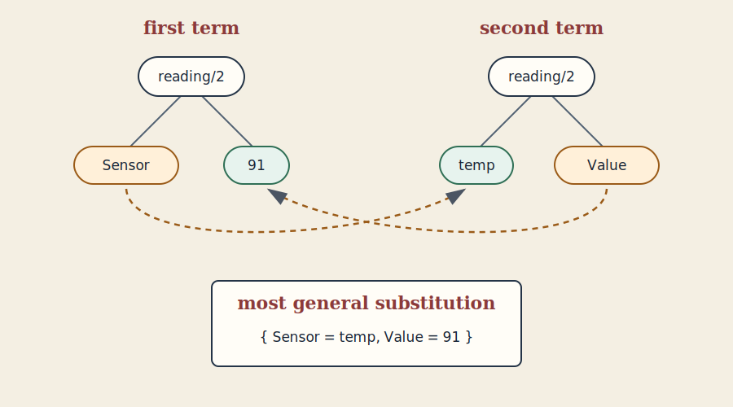
  <figcaption>Unification walks corresponding branches of two term trees and records the bindings needed to make them identical.</figcaption>
</figure>

The picture is worth lingering over. Unification does not assign values in a
one-way parameter list. It aligns two structures. A variable on either side
may receive a binding; a nested pair of compounds causes the same comparison
to continue recursively. The result shown is the most general substitution:
it commits to exactly what structural agreement requires and nothing more.

Eyepl exposes unification as `eq/2`:

```eyepl
same_shape(Pair) :- eq(Pair, pair(X, X)).

query(same_shape(pair(red, red))).
query(same_shape(pair(red, blue))).
```

Only the first query succeeds. `neq/2` succeeds when two resolved terms are not
structurally equal.

Compound terms retain domain structure:

```eyepl
measurement(battery_1, sample(17, volts(28.4), amps(12.1))).
route(a, d, path([a, b, d], cost(9))).
```

As a fact head, `measurement(...)` is an atomic formula. Nested terms are data.
The same surface form serves both roles; context decides which.

`ready` is an atom constant and `"ready"` is a string. Keep symbolic vocabulary
as atoms and human text as strings. Quoted atoms remain atoms:

```eyepl
label(sensor_1, "Cabin temperature").
web_name(sensor_1, '<https://example.org/sensor/1>').
```

**Exercise.** Write `diagonal/1`, which succeeds for `point(X, X)`. Then write
`same_ends/1` for a three-element list whose first and last values agree.

## 3. Rules and their two readings

The executable-clause idea emerged from work on automated theorem proving.
Robinson's resolution principle supplied a general proof rule, while the
development of Prolog specialized proof search around clauses that could be
read as procedures. Eyepl begins further downstream: it offers a compact
definite-clause language rather than a general first-order theorem prover. The
restriction buys a direct correspondence between a rule body and the
subquestions used to establish its head.

A rule has a head and a comma-separated body:

```eyepl
eligible(Person) :-
  age(Person, Years),
  ge(Years, 18),
  registered(Person).
```

Read it declaratively: a person is eligible if the person has an age of at
least 18 and is registered. Read it operationally: to solve the head, solve the
body goals in their written dependency order, carrying bindings into later
goals. Eyepl normally selects from left to right. As a safe optimization, it
may run a ready deterministic built-in filter early; such a filter cannot add
alternative answers and already has the inputs its registered mode requires.

Both readings matter. The declarative reading checks the model. The operational
reading helps make search finite and selective. Put a generator before a
built-in that needs its input:

<figure>
  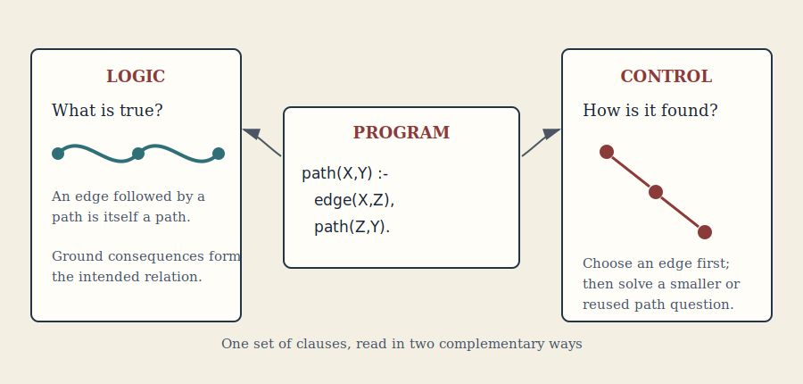
  <figcaption>A clause is both a sentence in a theory and a recipe for reducing a question to subquestions.</figcaption>
</figure>

The two readings are not rivals. The logical reading prevents an efficient
program from quietly answering the wrong question. The operational reading
prevents a beautiful specification from wandering forever without producing
an answer. Much of the craft in this book consists of keeping one reading
steady while improving the other.

```eyepl
adult(Person) :-
  age(Person, Years),
  ge(Years, 18).
```

Multiple clauses express alternatives:

```eyepl
can_enter(Person) :- staff(Person).
can_enter(Person) :- visitor(Person), escorted(Person).
```

Helper predicates reveal the model and improve explanations:

```eyepl
high_score(Case) :-
  score(Case, Score),
  threshold(Threshold),
  ge(Score, Threshold).

status(Case, accepted) :- high_score(Case).
reason(Case, "score meets threshold") :- high_score(Case).
```

### The Herbrand world

The declarative reading needs a precise answer to a deceptively simple
question: what can a term denote? Eyepl uses **Herbrand semantics**. Its
universe contains exactly the ground terms that can be constructed from the
program's atom constants, strings, numbers, list constructors, and compound
functors. There are no unnamed elements hiding behind the notation. A ground
term denotes itself.

This separates the **Herbrand universe**, whose members are terms such as
`pat`, `3`, `[red, blue]`, and `ticket(alice)`, from the **Herbrand base**,
whose members are ground atomic formulas such as `person(pat)` and
`owns(alice, ticket(17))`. A term is not true or false merely by existing:
`pat` is a possible argument, whereas `person(pat)` is a proposition that an
interpretation may make true.

<figure>
  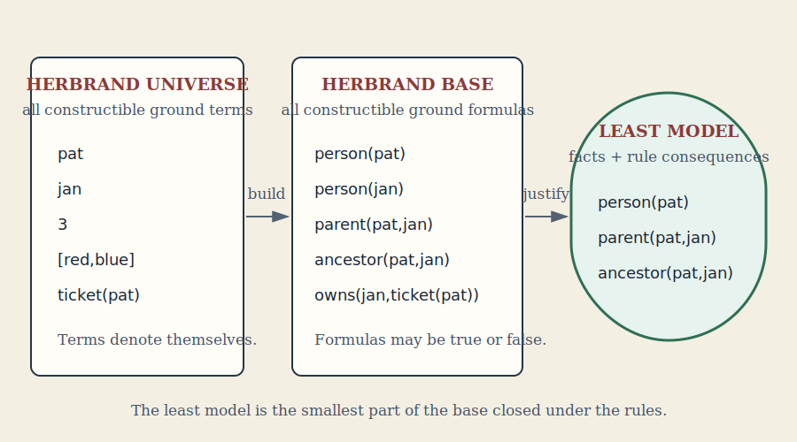
  <figcaption>Terms provide the vocabulary; atomic formulas provide the possible claims; facts and rules select the least model.</figcaption>
</figure>

This three-level distinction answers several recurring questions. A newly
constructed term does not automatically assert anything. A formula that can be
written is not automatically true. And the model is not an arbitrary
collection of convenient formulas: it is the smallest collection forced by
the program. Keeping those levels separate makes symbolic data safe to inspect
without confusing mention with assertion.

A **Herbrand interpretation** is a set of ground atomic formulas regarded as
true. A source fact contributes one such formula:

```eyepl
parent(pat, jan).
```

A rule stands for all of its ground instances. Thus:

```eyepl
ancestor(X, Z) :- parent(X, Y), ancestor(Y, Z).
```

says that for every substitution of `X`, `Y`, and `Z` by Herbrand terms, truth
of both body formulas entails truth of the head formula. Variables in rules
are implicitly universally quantified.

The declarative meaning of a pure Eyepl program is its **least Herbrand
model**: the smallest interpretation containing every fact and closed under
every rule. One mathematical way to obtain it is the immediate-consequence
operation. Begin with the facts; add each ground rule head whose ground body is
already true; repeat until reaching the least fixed point. This construction
defines meaning. It does not prescribe that the implementation enumerate the
model from the bottom up.

### Why terms denote themselves

Herbrand semantics is a particular form of ordinary model theory, chosen
because logic programs inspect and construct symbolic terms. Consider:

```eyepl
different(alice, bob) :- neq(alice, bob).
different(ticket(alice), ticket(bob)) :-
  neq(ticket(alice), ticket(bob)).
```

In an unrestricted first-order interpretation, `alice` and `bob` could denote
the same object unless a unique-name axiom forbids it. Even if they denote
different objects, the interpretation of `ticket` need not be injective.
Additional axioms would be required to show that `ticket(alice)` and
`ticket(bob)` differ.

In the Herbrand universe those terms differ by construction. Different atom
constants are different terms; compound terms are free constructors and are
identical only when functor, arity, and corresponding arguments are identical.
Lists follow the same rule through `[]` and the internal `./2` constructor.
Unification, read-back, witness construction, and proof explanations therefore
share one predictable notion of identity.

This is a property of the representation, not a claim that two names can never
refer to one real-world entity. If `robert` and `bob` name the same person, say
so with `same_as(robert, bob)` or normalize them to one canonical term. The
Herbrand layer keeps names unambiguous; domain rules express equivalence.

The runnable
[`examples/herbrand-semantics.pl`](examples/herbrand-semantics.pl) example and
its normal and proof outputs make this distinction concrete.

### Quantification and visible witnesses

Variables range over Herbrand terms, not external records, pointers, or
host-language objects. Variables in a selected goal are existential in the
logic-programming sense: Eyepl searches for substitutions that make the goal
follow from the program.

Eyepl has no blank nodes or existential variables in rule heads. When a rule
needs to name a consequent object, construct an explicit witness:

```eyepl
has_parent(Child, parent_of(Child)) :-
  person(Child).

registration(Student, Course, registration_of(Student, Course)) :-
  takes(Student, Course).
```

The same inputs construct the same witness term; different inputs construct
different terms. The witness is printable, queryable, and visible in a proof,
rather than being an anonymous object created behind the program's back.

### Equality, unification, and the occurs check

Equality in the pure Herbrand reading is syntactic identity after substitution.
Operationally, unification discovers a substitution that makes terms
identical. Eyepl does not perform an occurs check. Cyclic terms therefore lie
outside the portable Herbrand reading even if an internal binding can
temporarily be recursive. Portable programs should not depend on calls such as:

```eyepl
eq(X, wrapper(X)).
```

### Meaning is not the search strategy

Eyepl's evaluator is goal-directed. It resolves selected goals against facts,
rules, and built-ins using ordered conjunction, clause selection, indexing,
tabling, and deterministic host operations. Written order defines the normal
dataflow; a mode-ready deterministic built-in may be selected early as a pure
filter. For the pure Horn-clause fragment, the answers it finds are intended to
belong to the least Herbrand model. The evaluator is not, however, a complete
bottom-up enumerator. Infinite generation or nonterminating recursion can
prevent it from reaching a true answer.

Built-ins extend the pure core. Relational built-ins such as `eq/2`,
`append/3`, and `member/2` are readily understood over Herbrand terms.
Arithmetic, date handling, regular expressions, aggregation, `once/1`, and
negation have additional operational definitions. They still consume and
produce Eyepl terms: `add(2, 3, X)` binds `X` to the Herbrand number term `5`,
not to an invisible host value.

`not(Goal)` succeeds when the current finite search finds no solution for
`Goal`; it does not insert a negative formula into the Herbrand model.
User-defined negative dependencies should be stratified. In a stratified
program, positive dependencies may remain in the same or a lower layer, while
every negative dependency points strictly downward:

```eyepl
closed(X) :- blocked(X).
open(X) :- candidate(X), not(closed(X)).
```

A cycle containing a negative edge is not stratified:

```eyepl
p(X) :- q(X).
q(X) :- not(p(X)).
```

The CLI reports such portability problems with `--warnings`. JavaScript
embedders can inspect `stratifiedNegation`, `negationStratificationErrors`,
`negationDependencies`, and per-group `negationStratum`; request eager analysis
with `analyzeNegation`, reject it with `strictNegation`, or call
`program.assertStratifiedNegation()`.

## 4. Recursion: describing reachability

Recursive rules define an unbounded family of finite proofs. An ancestor is a
parent, or a parent of an ancestor:

```eyepl
ancestor(X, Y) :- parent(X, Y).
ancestor(X, Z) :- parent(X, Y), ancestor(Y, Z).
query(ancestor(X, Y)).
```

The first clause is the base case. The second reduces an ancestor question to a
subquestion one edge farther through the graph. To design recursion, draw one
proof, find the repeated subquestion, and ensure some path reaches a base case.

Real graphs contain cycles. Naive depth-first recursion can revisit a call
forever. Eyepl analyzes predicate dependencies and automatically tables
suitable positive recursive groups. A table records answers for a recursive
call, iterates cyclic calls to a fixed point, and reuses results. Authors
describe `path/2`; the engine chooses the recursive strategy.

<figure>
  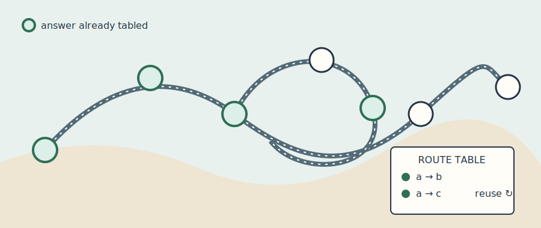
  <figcaption>Recursive route questions may return to the same station. A table acts like a route ledger: new destinations are recorded and recurring questions reuse them.</figcaption>
</figure>

Tabling does not make every open relation finite. A rule that constructs
ever-larger terms can still produce infinitely many distinct calls or answers.
Keep the selected query and its generators finite.

A relation can construct a witness:

```eyepl
path(X, Y, [X, Y]) :- edge(X, Y).
path(X, Z, [X | Rest]) :-
  edge(X, Y),
  path(Y, Z, Rest).
```

On cyclic graphs, track visited vertices and use `not_member/2` to obtain finite
simple paths rather than arbitrary walks.

## 5. Lists as relations

`[a, b, c]` abbreviates nested cons cells. `[Head | Tail]` exposes one cell;
`[]` is empty.

<figure>
  
  <figcaption>A list resembles a train: expose the first carriage as the head, pass the remaining train as the tail, or join two trains with an append relation.</figcaption>
</figure>

```eyepl
first([Head | _], Head).

contains_item(X, [X | _]).
contains_item(X, [_ | Rest]) :- contains_item(X, Rest).

joins([], Ys, Ys).
joins([X | Xs], Ys, [X | Zs]) :- joins(Xs, Ys, Zs).
```

Different modes give `joins/3` different uses. It can construct a concatenated
list, enumerate every prefix/suffix split, or find a missing part. This is the
practical meaning of a relational definition.

Some algorithms carry explicit state through an accumulator:

```eyepl
reverse_acc(List, Reversed) :- reverse_go(List, [], Reversed).
reverse_go([], Acc, Acc).
reverse_go([X | Xs], Acc, Reversed) :-
  reverse_go(Xs, [X | Acc], Reversed).
```

No mutation occurs; every call receives a new term. Eyepl also includes
`member/2`, `append/3`, `select/3`, `nth0/3`, `reverse/2`, `length/2`,
`sort/2`, slicing helpers, and numeric summaries. Improper lists such as
`[a | Tail]` are valid terms, but operations requiring a proper finite list
fail unless the tail is `[]`.

---

# Part II — Search

<figure>
  
  <figcaption>A route is found by exploring alternatives, recognizing dead ends and cycles, and carrying a productive choice toward the destination.</figcaption>
</figure>

A theory may justify many conclusions, but an evaluator must still find them.
This Part studies the finite domains, constraints, failure, and choice that
turn a field of possibilities into a productive computation.

## 6. Arithmetic and finite generation

Arithmetic is predicate-based. There is no `is` operator:

```eyepl
next(X, Y) :- add(X, 1, Y).
area_rectangle(W, H, Area) :- mul(W, H, Area).

hypotenuse(A, B, C) :-
  mul(A, A, A2),
  mul(B, B, B2),
  add(A2, B2, C2),
  sqrt(C2, C).
```

Inputs must be bound to suitable numbers before a numeric function runs.
Comparisons filter generated solutions:

```eyepl
safe_reading(Sensor, Value) :-
  reading(Sensor, Value),
  ge(Value, 0),
  le(Value, 80).
```

`between(Low, High, Value)` enumerates an inclusive integer range or checks an
already-bound value:

```eyepl
square(N, Square) :-
  between(1, 10, N),
  mul(N, N, Square).
```

Finite generators turn loops into searches. Recurrences need intended modes:

```eyepl
factorial(0, 1).
factorial(N, F) :-
  gt(N, 0),
  sub(N, 1, Previous),
  factorial(Previous, PF),
  mul(N, PF, F).

mode(factorial, 2, [in, out]).
```

Mode and determinism declarations are advisory facts for readers and tooling;
they do not direct the solver.

## 7. Failure, negation, and quantification

A goal fails when no clause or built-in proves it under current bindings.
Failure prunes that branch and search tries another choice.

Failure is an operational event, not automatically a statement about the
world. Turning failure into `not(Goal)` is justified only relative to the
program and the current bindings. This is the **closed-world move** familiar
from databases: for some bounded relation, what cannot be derived is treated
as absent. It differs from the open-world stance common on the Web, where a
missing claim may simply be unknown. Neither stance is universally right; the
modeler must say which knowledge boundary is complete.

`not(Goal)` succeeds when `Goal` has no solution:

```eyepl
allowed(User) :-
  user(User),
  not(blocked(User)).
```

This means “blocked cannot be proved from this program,” not classical
negation. Bind variables before negating. Putting `not(blocked(User))` before
`user(User)` asks whether there is no blocked user at all, not whether this
particular user is unblocked.

<figure>
  
  <figcaption>Absence becomes informative only inside a declared complete boundary: Clara is allowed because the event registry is complete and she is not on its blocked list.</figcaption>
</figure>

Negative dependencies should be stratified: compute a lower relation, then
negate it from a higher layer. Use `--warnings` to report negative recursion:

```sh
eyepl --warnings program.pl
```

`once(Goal)` keeps the first solution. `forall(Generator, Check)` succeeds when
every generated solution passes its check; an empty generator makes it true.

```eyepl
all_tests_pass(Suite) :-
  forall(test_in(Suite, Test), passed(Test)).
```

Use negation where the knowledge boundary is closed: a complete roster,
configuration, or finite result set. In open-world data, model explicit states
such as `confirmed_absent` instead of deriving absence from silence.

## 8. Collecting and choosing answers

Finite aggregation asks about a solution set:

```eyepl
findall(Template, Goal, List).
countall(Goal, Count).
sumall(Value, Goal, Sum).
```

```eyepl
outgoing_costs(Node, Costs) :-
  findall(Cost, edge(Node, _, Cost), Costs).

total_outgoing(Node, Total) :-
  sumall(Cost, edge(Node, _, Cost), Total).
```

`findall/3` returns `[]` for no answers; counts and sums return zero.

<figure>
  
  <figcaption>Aggregation temporarily treats a finite family of solutions as a collection: the same baskets can be counted, summed, or compared.</figcaption>
</figure>

Optimization can retain only a best solution:

```eyepl
best_route(From, To, Route, Cost) :-
  aggregate_min(
    [CandidateCost, CandidateRoute],
    CandidateRoute,
    route(From, To, CandidateRoute, CandidateCost),
    [Cost, Route],
    Route
  ).
```

The key `[Cost, Route]` supplies deterministic tie-breaking through term order.
`aggregate_min/5` and `aggregate_max/5` fail when their goal has no answers.
An aggregate opens a smaller query scope inside the surrounding proof, and its
inner search must be finite.

## 9. Structured data, strings, and contexts

Term predicates decompose or construct general terms:

```eyepl
functor(Term, Name, Arity).
arg(Index, Term, Value).
compound_name_arguments(Term, Name, Arguments).
```

`arg/3` uses one-based indexes. Prefer direct pattern matching when the shape
is known; use inspection for generic transformations.

Text is best normalized at the model boundary:

```eyepl
normalized(Input, Words) :-
  trim(Input, Trimmed),
  lowercase(Trimmed, Lower),
  split(Lower, " ", Words).
```

Conversions include `number_string/2`, `atom_string/2`, and `term_string/2`.
Pattern operations include `contains/2`, `matches/2`, `not_matches/2`, and
named-capture `matches/3`. Turn text into structured terms early; keep central
rules relational.

Parenthesized comma terms can serve as context data:

```eyepl
message(event_17, (severity(high), source(sensor_3), reading(temp, 91))).

hot_event(Id) :-
  message(Id, Context),
  holds(Context, severity(high)),
  holds(Context, reading(temp, Value)),
  gt(Value, 80).
```

`holds/2` matches a member. `holds/3` exposes a member's name and argument list.
Context members remain quoted data; inspecting them does not assert them as
ambient facts.

## 10. From puzzles to models

A robust finite search has three layers: generate candidates, constrain them,
and present a concise answer.

```eyepl
color(red).
color(green).
color(blue).

coloring(A, B, C) :-
  color(A),
  color(B),
  neq(A, B),
  color(C),
  neq(B, C),
  neq(A, C).

answer(colors(A, B, C)) :- coloring(A, B, C).
query(answer(X)).
```

Place cheap, selective constraints as soon as their inputs are bound. For
state-transition problems, represent state and moves explicitly:

```eyepl
plan(State, State, _, []).
plan(State, Goal, Seen, [Move | Moves]) :-
  transition(State, Move, Next),
  not_member(Next, Seen),
  plan(Next, Goal, [Next | Seen], Moves).
```

The visited list makes a finite state space explicit. Eyepl is strongest when
the result is a logical consequence with a compact witness: a path, matching,
classification, schedule, proof, or bounded model. Mutable arrays and large
numerical kernels generally belong in a host, with Eyepl as the decision layer.

---

# Part III — Trustworthy reasoning

<figure>
  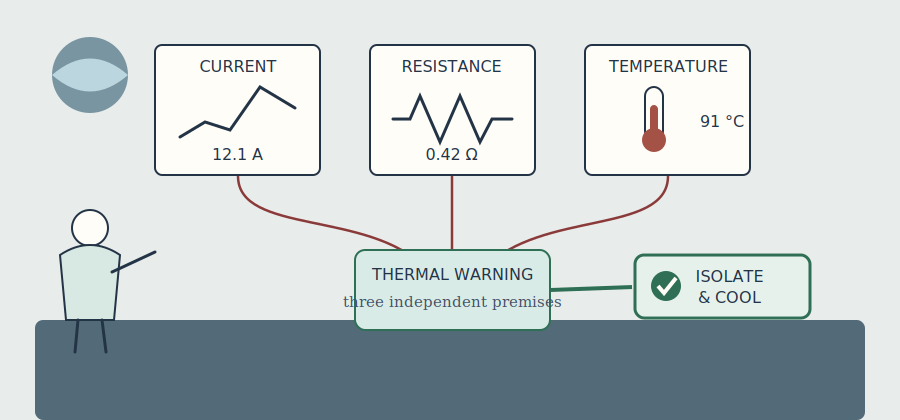
  <figcaption>Current, resistance, and temperature readings remain visible as independent premises for a thermal warning and safety action.</figcaption>
</figure>

An answer becomes useful when its grounds remain visible. Here reasoning is
treated as an accountable structure: queries define the question, proofs retain
support, fuses guard integrity, and knowledge boundaries stay explicit.

## 11. Queries, answers, and proofs

`query/1` is a host declaration selecting goals to run. Eyepl prints ground
answers, removes duplicates, and suppresses answers that merely repeat source
facts. Answers are not inserted back into the running program.

An answer and a derivation serve different audiences. An answer records *what*
the theory supports; a derivation records *how this run supported it*. In
mathematics that distinction resembles theorem versus proof. In data systems
it resembles result versus provenance. The proof is not a substitute for
valid source data or sound domain rules, but it makes both reviewable: a user
can trace a decision to clauses, facts, bindings, and built-in operations
instead of trusting an opaque status code.

Use `--proof` or `-p` to add a machine-readable `why/2` fact after every answer:

```sh
eyepl --proof examples/socrates.pl
```

```eyepl
why(
  type(socrates, mortal),
  proof(
    goal(type(socrates, mortal)),
    by(rule("socrates.pl", clause(4))),
    bindings([binding("X", socrates)]),
    uses([
      proof(
        goal(type(socrates, man)),
        by(fact("socrates.pl", clause(3)))
      )
    ])
  )
).
```

Proof output is valid Eyepl input:

```sh
eyepl --proof examples/socrates.pl > socrates.why.pl
```

A normal answer is one resolved ground term followed by a period. Strings,
quoted atoms, lists, and compounds are rendered in supported source syntax so
the output can be read back. Enabling `--proof`, `--warnings`, or `--stats`
must not change which answers are found.

The second argument of `why/2` is an abstract proof term of the general shape
`proof(goal(G), by(Method), bindings(Bindings), uses(Proofs))`. User clauses
are identified as `fact(Filename, clause(N))` or
`rule(Filename, clause(N))`, with one-based source clause numbers. Built-ins
are identified as `builtin(Name, Arity)`. Explanation data is outside the
logical semantics of the input program: it describes the derivation but does
not participate in finding it.

A second program can query `why/2`. Read a proof as an argument. If it contains
irrelevant detours, improve the helpers. If a key premise is hidden inside an
opaque value, model it as a fact. Designing for a good explanation often
produces a better theory.

## 12. Integrity constraints and inference fuses

A rule headed by `false` is an **inference fuse**:

```eyepl
false :-
  probability(Disease, Probability),
  gt(Probability, 1).
```

Eyepl checks fuses before queries. The first match aborts the CLI with exit code
`65` and reports the rule and matched instance. A bare `false.` is unconditional.

<figure>
  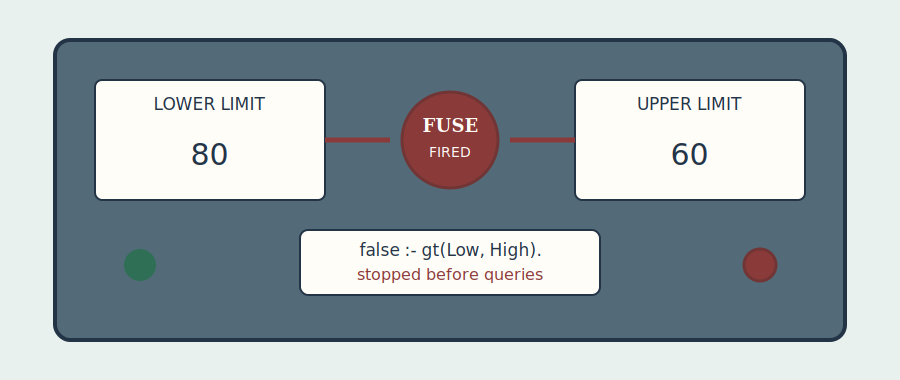
  <figcaption>An inference fuse is a domain interlock: contradictory limits stop every downstream query instead of allowing decisions from an invalid theory.</figcaption>
</figure>

```eyepl
false :-
  assigned(Person, Role),
  incompatible_roles(Role, Other),
  assigned(Person, Other).
```

The logical reading is that no acceptable model contains this combination.
Fuses express domain contradictions, not resource bounds or search limits.

## 13. Termination, tabling, and performance

Declarative clarity and operational care reinforce each other. Bind selective
arguments early, keep generators finite, and make decreasing structure visible.

Naive depth-first search can revisit the same recursive question indefinitely.
Tabling changes the unit of work: a call pattern becomes a shared subproblem,
its answers are remembered, and consumers reuse answers rather than expanding
the same call again. This idea connects logic programming to memoization and
dynamic programming, but tabling also has a semantic role: over a finite
positive recursive domain, repeated rounds can compute the least fixed point.
It is therefore especially natural for reachability, grammars, dependency
analysis, and other recursive relations with overlapping subproblems.

Ordinary goals use indexed depth-first resolution. Positive recursive groups
are tabled automatically. Bound recursive calls reuse answers and cyclic calls
iterate toward a fixed point. Fully open or structurally unbounded calls may
retain ordinary resolution. Recursive components with negative dependencies
are not positive fixed points.

### How clause indexing stays semantic

Every predicate group keeps compact indexes for scalar values in each argument
position. A clause whose indexed head argument is a variable or structured term
stays in a fallback set, and the selected candidates are merged back into
source order before unification. An index narrows where to look; it never
decides whether a clause matches.

For groups of at least ten clauses, a call with several bound scalar arguments
may cause a wider combined index to be built on demand. The admission policy
rejects indexes with too many variable fallbacks or too little expected
speedup, and requires a combined index to improve substantially over the best
single-argument index. These choices are performance details: removing every
index should change running time, not answers or clause order.

Authors choose query modes, finite domains, visited-state representations,
negation strata, and witness size. They normally do not choose the engine's
search strategy.

Inspect counters without changing answer output:

```sh
eyepl --stats examples/observability-log-correlation.pl
```

The reported counters include completed goal lists, calls to the goal solver
and single-goal solver, unification attempts, maximum depth and goal-list size,
deterministic built-in successes and failures, and table fixed-point rounds.
They describe work performed, not logical truth. Compare counters only across
equivalent queries and the same implementation version.

Common sources of nontermination are recursive calls made before constraints,
ever-growing terms, infinite open mathematical queries, negative cycles, and
path enumeration without a visited set. Repair the model by strengthening the
query, adding a finite domain, tracking states, or exposing a decreasing
argument.

## 14. Knowledge engineering

A maintainable theory separates:

- source facts: measurements, records, and asserted relationships;
- helpers: normalization, classifications, and reachability;
- decisions: `status/2`, `action/2`, `risk/2`, and `reason/2`;
- integrity constraints: rules headed by `false`;
- outputs: focused `query/1` declarations.

<figure>
  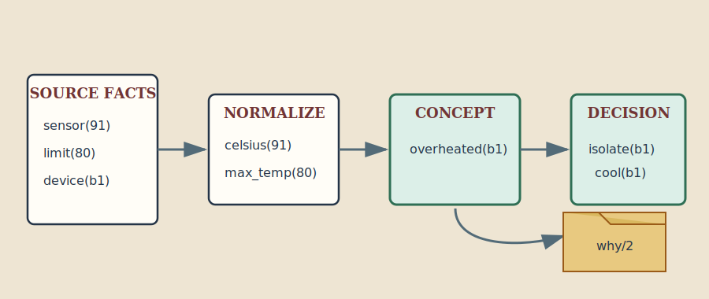
  <figcaption>A maintainable theory moves in visible layers from observations to decisions, while the proof preserves the route back to evidence.</figcaption>
</figure>

Prefer positive domain concepts. Use negation only across a closed boundary.
Represent confidence, alternative worlds, and provenance explicitly rather
than hiding them in rule order.

An evidence-backed diagnosis can separate physics from policy:

```eyepl
heating(Battery, Watts) :-
  current(Battery, Amps),
  resistance(Battery, Ohms),
  mul(Amps, Amps, I2),
  mul(I2, Ohms, Watts).

thermal_warning(Battery) :-
  heating(Battery, Watts),
  heating_limit(Limit),
  gt(Watts, Limit),
  temperature(Battery, Celsius),
  temperature_limit(TLimit),
  gt(Celsius, TLimit).

action(Battery, isolate_and_cool) :- thermal_warning(Battery).
```

Physics, limits, redundant sensing, and policy become distinct proof steps. See
`examples/spacecraft-battery-diagnosis.pl` for a complete case.

Test theories with successful derivations, expected failures, boundary values,
duplicate paths, contradictory inputs, and proof premises. The repository's
conformance cases, example goldens, and proof goldens demonstrate these levels.

## 15. RDF 1.2 as relational data

Eyepl's core is RDF-agnostic. Adapter tools translate datasets into ordinary
`rdf(Subject, Predicate, Object, Graph)` facts:

RDF is a data model before it is a file format. Its basic unit is a directed,
labeled statement identified with Web IRIs; concrete syntaxes such as Turtle,
JSON-LD, and RDF/XML are different ways to serialize that model. Datasets add
named graphs, and RDF 1.2 adds triple terms and directional language strings.
Keeping the adapter explicit prevents serialization concerns from leaking into
ordinary Eyepl rules and makes the boundary between Web identity and local
logical terms visible.

The four-argument representation is intentionally conservative. It does not
claim that an RDF graph and an Eyepl theory have the same semantics. It
preserves RDF terms and graph membership as data, after which Eyepl rules may
derive application-specific conclusions. This separation matters because RDF
normally supports open-world data integration, whereas an Eyepl rule may use a
closed finite relation, negation as failure, or an integrity fuse.

<figure>
  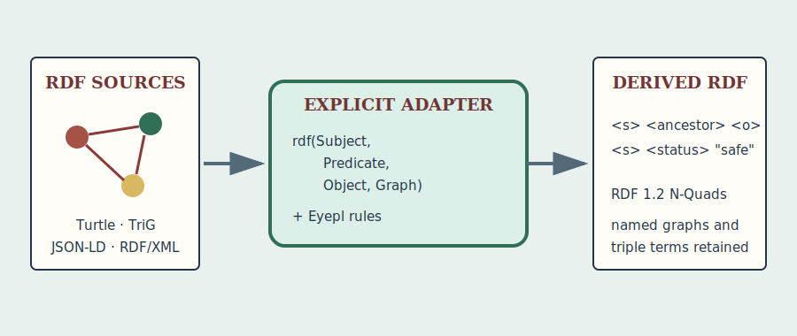
  <figcaption>The adapter preserves web data structure at the boundary while the reasoning core continues to work with ordinary explicit terms and rules.</figcaption>
</figure>

```sh
node tools/rdf-to-eyepl.mjs --rules rules.pl data.trig -o program.pl
eyepl program.pl > derived.pl
node tools/eyepl-to-rdf.mjs derived.pl -o derived.nq
```

Supported inputs include RDF 1.2 Turtle, TriG, N-Triples, N-Quads, RDF/XML,
JSON-LD, RDFa, Microdata, Notation3, and SHACL Compact Syntax. For stdin, supply
`--format`; use `--base` for relative IRIs.

| RDF value | Eyepl term |
| --- | --- |
| IRI | `iri(Value)` |
| Blank node | `bnode(Scope, Label)` |
| Typed literal | `literal(Value, datatype(IRI))` |
| Language string | `literal(Value, lang(Language))` |
| Directional string | `literal(Value, lang(Language, ltr))` or `lang(Language, rtl)` |
| RDF 1.2 triple term | `triple(Subject, Predicate, Object)` |
| Default graph | `default_graph` |

Scopes distinguish blank nodes from different documents. Triple terms may
nest, and named graphs occupy the fourth argument.

```eyepl
rdf(S, iri("https://example/ancestor"), O, G) :-
  rdf(S, iri("https://example/parent"), O, G).
```

By default, source quads support inference but are not copied to output. Pass
`--include-source` to retain them. Output is RDF 1.2 N-Quads. See
[`tools/README.md`](tools/README.md) for the full adapter contract.

## 16. Embedding Eyepl

The JavaScript API exposes a convenience runner and lower-level types:

```js
import { run, Program, Solver } from 'eyepl';

const result = run(`
query(answer(X)).
answer(ok) :- eq(ok, ok).
`);
console.log(result.stdout);
console.log(result.stats);
```

`run/2` accepts source text or an already parsed `Program`. Its options include
`proof` (with `why` and `explain` as aliases), `maxDepth`, `solutionLimit`, a
custom `registry`, and `strictNegation` or `analyzeNegation`. It returns
`stdout` and the solver's numeric `stats`; it does not write to the process
streams.

For applications that inspect or prepare a theory before running it, use
`Program` directly:

```js
const source = `
query(path(a, X)).
edge(a, b).
edge(b, c).
path(X, Y) :- edge(X, Y).
path(X, Z) :- edge(X, Y), path(Y, Z).
`;

const program = Program.parse(source, { analyzeNegation: true });
const path = program.findGroup('path', 2);

console.log(program.queries);
console.log(program.stratifiedNegation);
console.log(path?.recursive, path?.tabled, path?.tableInputPositions);

const solver = new Solver(program, {
  maxDepth: 50_000,
  solutionLimit: 100_000
});
```

The limits are safety ceilings, not logical declarations. Reaching one may
truncate search; it does not prove that no further answer exists.

### Extending the built-in registry

An embedder can start from the standard registry and add a host relation. A
handler is a generator over environments. It should clone before binding and
yield only environments in which its result unifies:

```js
import {
  atom,
  createDefaultRegistry,
  run,
  unify
} from 'eyepl';

const registry = createDefaultRegistry();

registry.add(
  'host_status',
  2,
  function* ({ goal, env }) {
    const next = env.clone();
    if (
      unify(goal.args[0], atom('service'), next) &&
      unify(goal.args[1], atom('ready'), next)
    ) {
      yield next;
    }
  },
  { deterministic: true }
);

const result = run(`
query(answer(X)).
answer(X) :- host_status(service, X).
`, { registry });
```

Only mark a built-in deterministic when it can produce at most one environment
for a call. A mode-sensitive extension can additionally provide `ready`,
`fallbackWhenNotReady`, and `shouldUse` metadata. This metadata affects
dispatch and safe early filtering, so it belongs to the extension's contract.

Fired fuses throw `InferenceFuseError` with code
`INFERENCE_FUSE_EXIT_CODE`. Programs expose stratification diagnostics through
`stratifiedNegation`, `negationStratificationErrors`, and
`assertStratifiedNegation()`.

Treat remote source as executable logic. Although Eyepl has no arbitrary host
call primitive, search can consume CPU and memory. Embedders should impose
appropriate depth, solution, input-size, and time limits.

### Sockets: naming the knowledge boundary

Rules often outlive the source of their facts. Today `parent/2` may be written
in the same file as `ancestor/2`; tomorrow it may come from a database adapter,
a document extractor, or an agent. An **Eyepl Socket** gives that opening a
name and a contract:

<figure>
  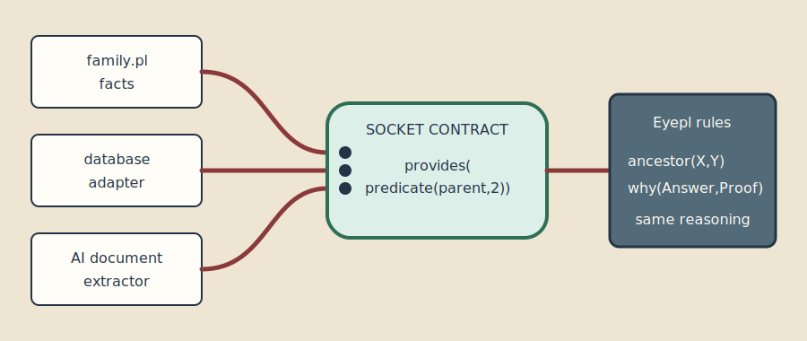
  <figcaption>A socket separates a stable reasoning contract from interchangeable providers; supplied claims remain Eyepl terms that proofs can cite.</figcaption>
</figure>

```eyepl
socket(family_source, provides(predicate(parent, 2))).
plug(family_file, family_source).

parent(pat, jan).
parent(jan, emma).

ancestor(X, Y) :- parent(X, Y).
ancestor(X, Z) :- parent(X, Y), ancestor(Y, Z).
```

The portable vocabulary is deliberately small:

```eyepl
socket(Name, Contract).
plug(Provider, Name).
provides(Signature).
requires(Signature).
```

These are ordinary facts, not magic solver directives. A host may validate or
act on them, but the core proof procedure does not. This modest design is
useful: a host that knows nothing about sockets can still read the program,
reason with the supplied clauses, and explain its answers. A host that does
know about them can check that a provider offers the promised predicate.

Sockets are particularly valuable at an AI boundary. A model can propose
claims, but the claims should enter the theory as visible facts or rules. The
socket states what kind of knowledge may enter; Eyepl checks and combines the
result; `why/2` records which supplied clauses actually supported an answer.

---

# Part IV — The craft of logic programming

<figure>
  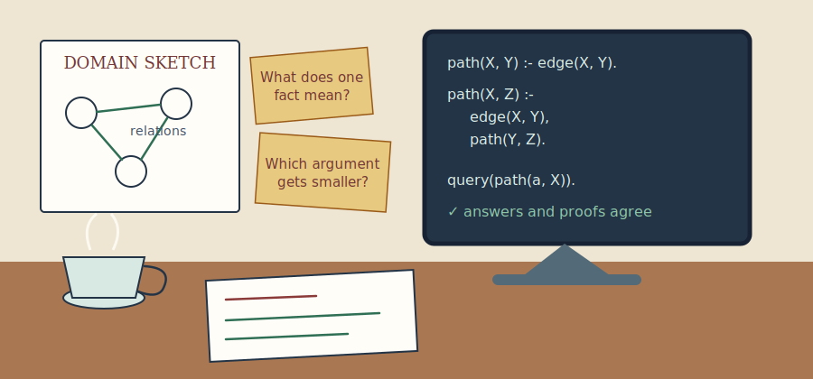
  <figcaption>Craft moves repeatedly between the real domain, the relations on paper, executable clauses, answers, and proofs.</figcaption>
</figure>

The final Part turns from language features to habits of construction. A good
program rarely arrives whole; it is discovered through examples, corrected by
invariants, and refined without losing sight of the relation it means.

## 17. Logic and control

The central pleasure—and central difficulty—of logic programming is that a
short definition plays two roles. Consider:

This distinction is one of logic programming's oldest and most durable design
ideas. The logical component describes admissible answers; the control
component determines which consequences are explored, in what order, and with
what resource cost. A change in indexing, goal order, or tabling policy should
ideally preserve the first while improving the second. In practice, modeful
built-ins and incomplete searches mean that programmers must reason about both.

```eyepl
path(X, Y) :- edge(X, Y).
path(X, Z) :- edge(X, Y), path(Y, Z).
```

As logic, the clauses say that every edge is a path and that an edge followed
by a path is a path. As control, they tell the solver to try a direct edge
first, then choose an outgoing edge and continue from its endpoint.

It is useful to write the relation first as a sentence:

> `path(X, Y)` holds when there is a finite sequence of edges from `X` to `Y`.

That sentence is independent of clause order. It is the specification against
which examples and counterexamples can be judged. Only then ask procedural
questions: which argument will normally be known, which goal generates a
finite set, and which recursive call is smaller or already tabled?

### The same relation, a different computation

Conjunction is logically commutative, but its textual order guides search.
These two rules have the same intended ground consequences:

```eyepl
adult(Person) :- person(Person), age(Person, Age), ge(Age, 18).

adult(Person) :- ge(Age, 18), age(Person, Age), person(Person).
```

The first is executable in the natural open mode because `person/1` and
`age/2` bind values before `ge/2` inspects them. The second asks a comparison
to operate on unbound variables and fails. Logical equivalence therefore does
not imply equivalent behavior for a goal-directed interpreter with modeful
built-ins.

Clause order also gives a search order. Put simple and common proofs where
they can be found cheaply, provided doing so does not starve a necessary base
case. A recursive clause that calls itself before consuming input is a warning:

```eyepl
% Poor control: recursion starts before one list cell is exposed.
bad_member(X, List) :- bad_member(X, Rest), eq(List, [_ | Rest]).
```

The usual definition exposes the decreasing structure first:

```eyepl
item(X, [X | _]).
item(X, [_ | Rest]) :- item(X, Rest).
```

### Modes are part of the design

A predicate has one logical meaning but may support several useful calling
patterns. `append(Prefix, Suffix, Whole)` can:

- construct `Whole` when the first two arguments are known;
- remove a known prefix;
- enumerate every split of a known finite list.

It is not a useful generator when all three arguments are free: there are
infinitely many lists. Before accepting a predicate design, make a small mode
table:

| Call | Intended use | Finite? |
| --- | --- | --- |
| `append(+,+,-)` | concatenate | yes |
| `append(-,-,+)` | enumerate splits | yes |
| `append(-,-,-)` | generate all triples | no |

The `+` and `-` marks are documentation, not Eyepl syntax. Advisory declarations
can record the principal mode:

```eyepl
mode(append, 3, [in, in, out]).
```

A mode is a promise about calls, not a replacement for the relation's meaning.
When a rule calls a helper outside its promised mode, the program may remain
logically plausible while becoming operationally useless.

### Search trees and proof trees

A proof tree contains only the successful choices supporting one answer. A
search tree also contains failed alternatives and repeated attempts. Proof
output shows the former; performance counters give clues about the latter.
Confusing the two leads to a common surprise: a tiny proof may have required a
large search.

<figure>
  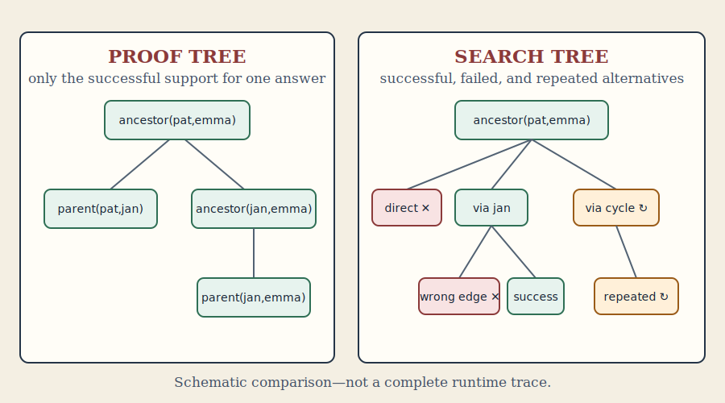
  <figcaption>The proof explains why an answer holds; the search tree explains the work needed to discover that proof.</figcaption>
</figure>

The distinction also explains why explanations are not performance profiles.
Removing a failed branch can make a program dramatically faster without
changing the final `why/2` term. Conversely, introducing a well-named helper
may make a proof longer on paper while making it far clearer to a reader.

When a program is slow, sketch the first few levels of its search tree. Mark:

1. the selected leftmost goal;
2. the clauses or built-ins that can solve it;
3. bindings produced by each choice;
4. the next selected goal;
5. branches that repeat a previous call.

This exercise often reveals that the model is sound but a generator is too
broad, a constraint is too late, or a witness carries needless alternatives.

## 18. Constructing a program

A good logic program is rarely discovered by typing clauses from top to
bottom. It is constructed by moving between examples, relations, and
invariants.

### Begin with ground sentences

Suppose packages must be routed through compatible hubs. Start with sentences
that contain no variables:

```eyepl
routeable(parcel_7, hub_north).
```

Decide exactly what that sentence claims. Does it mean the parcel can enter
the hub, can leave it, or can complete an entire route through it? Ambiguity in
a ground sentence becomes ambiguity in every rule built on it.

Now name the evidence:

```eyepl
routeable(Parcel, Hub) :-
  destination_zone(Parcel, Zone),
  serves(Hub, Zone),
  package_class(Parcel, Class),
  accepts(Hub, Class).
```

The variables express the joins already present in the English explanation.
No variable should appear merely because “a value might be needed later.”
Every repeated variable asserts identity; every distinct variable permits
difference.

### Invent examples before recursion

For a recursive relation, write the smallest positive example, the next larger
positive example, and a near miss. For list prefixes:

```text
prefix([], [a,b])          true
prefix([a], [a,b])         true
prefix([b], [a,b])         false
```

The empty example suggests the base clause. Comparing the second example with
a smaller one suggests removing a matching head from both lists:

```eyepl
prefix([], _).
prefix([X | Xs], [X | Ys]) :- prefix(Xs, Ys).
```

This is a general construction method: find a measure that becomes smaller,
preserve the invariant while reducing it, and state directly the case where
no reduction is needed.

### Separate generate, test, and describe

Finite combinatorial programs become easier to read when their jobs are
separate:

```eyepl
candidate_pair(A, B) :-
  person(A),
  person(B).

compatible_pair(A, B) :-
  candidate_pair(A, B),
  neq(A, B),
  not(conflict(A, B)).

answer(pair(A, B)) :- compatible_pair(A, B).
```

`candidate_pair/2` states the domain. `compatible_pair/2` states the
constraints. `answer/1` controls presentation. The split is not bureaucratic:
it makes the closed domain visible, gives negation bound arguments, and makes
proofs say whether a step generated or rejected a choice.

For performance, tests may be interleaved as soon as their inputs are ready:

```eyepl
compatible_pair(A, B) :-
  person(A),
  person(B),
  neq(A, B),
  not(conflict(A, B)).
```

The conceptual separation remains even when the final clause is compact.

### Choose representations by the operations they support

The same domain can be represented in many ways. A graph may be edge facts, a
list of edge terms, or a context. Ask which questions dominate:

- Separate `edge/2` facts suit indexed relational lookup and proof provenance.
- A list suits passing a private, changing graph through a recursive helper.
- A compound state term suits transitions that replace several components.
- A comma context suits inspecting a small record whose fields are themselves
  structured assertions.

Do not encode structure into strings and then recover it throughout the
theory. Parse once at the boundary. A term such as
`address(City, PostalCode)` can be unified, inspected, and explained; a string
containing the same data needs repeated procedural parsing.

### Grow a theory through layers

Large rule sets benefit from a dependency direction:

```text
source facts → normalized facts → domain concepts → decisions → answers
```

Negation should normally point in the same direction, from a higher layer to a
complete lower layer. Cycles among positive domain concepts may be tabled;
cycles through negation usually signal that the concepts have not been given
a stable meaning.

At every layer, add one representative query. Do not wait for the final
decision predicate to discover that normalization silently failed. Small
queries are the logic-programming counterpart of inspecting intermediate
values, but they retain the declarative vocabulary of the model.

## 19. Correctness and termination

Testing examples is necessary, but a reusable relation deserves a stronger
argument. Two questions should be asked separately:

1. **Partial correctness:** if the program returns an answer, is it justified?
2. **Completeness:** for the intended finite calls, can it find every answer
   required by the specification?

For `prefix/2`, partial correctness follows by the clauses. The base clause
returns only the empty prefix. The recursive clause adds the same head to a
smaller valid prefix, so the result remains a prefix. Completeness follows in
the opposite direction: every nonempty prefix shares its first element with
the whole list, and removing that element yields a smaller prefix problem
covered by the recursive clause.

This informal induction is often enough. State the property, justify each base
clause, assume recursive calls satisfy it, and show that each recursive clause
preserves it.

### Termination needs its own argument

A correct relation may still fail to return. For ordinary structural recursion,
identify a well-founded measure:

- length of the remaining list;
- a nonnegative integer that decreases;
- number of unvisited states in a finite graph;
- size of a syntax tree.

The measure must decrease before the recursive call in the intended mode. For
factorial, `N` decreases while remaining a nonnegative integer:

```eyepl
factorial(0, 1).
factorial(N, F) :-
  gt(N, 0),
  sub(N, 1, Previous),
  factorial(Previous, PF),
  mul(N, PF, F).
```

Reordering the subtraction after the recursive call preserves a mathematical
equation but destroys the termination argument.

Tabling changes the argument for graph recursion. A cyclic `path/2` call can
terminate when the program has only finitely many distinct tabled calls and
answers. The measure is then not necessarily smaller at each edge; finiteness
comes from exhausting a finite answer space. Tabling cannot rescue a rule that
constructs `s(s(s(...)))` without bound.

### Negation and aggregation require bounded subsearch

`not(Goal)`, `forall/2`, and aggregates ask the engine to settle a nested
search. Their meaning is usable only when that search can finish. Before
writing:

```eyepl
not(disqualified(Person))
```

check that `Person` is bound and that `disqualified/1` has a finite search for
that value. Before collecting routes, decide whether only simple routes, only
routes below a cost, or some other finite family is intended.

### Integrity is not merely failure

Ordinary failure says that one attempted proof did not work. An inference fuse
says that the supplied theory violates a condition that must hold:

```eyepl
false :-
  lower_limit(Name, Low),
  upper_limit(Name, High),
  gt(Low, High).
```

This distinction matters operationally and socially. A failed eligibility
query may be a legitimate negative result. Contradictory limits invalidate the
knowledge base and should stop all decisions until repaired.

## 20. Improving a program

Program improvement begins with observation, not cleverness. Preserve a set of
representative answers and proofs, collect solver statistics, and change one
structural choice at a time.

### Strengthen calls before adding machinery

The most effective improvement is often a better question. Prefer
`route(brussels, Destination)` to a completely open enumeration if the
application already knows its origin. Put selective, indexed relations early
enough to bind arguments for later work. Avoid constructing a large witness
when the caller needs only existence.

Compare:

```eyepl
connected(X, Y) :- path_with_nodes(X, Y, _).
```

with a direct reachability relation that tables pairs. The first may enumerate
many distinct paths to establish one fact; the second records the fact itself.
Keep the witness-producing relation for callers that truly need a path.

### Introduce helpers that express invariants

Inlining every condition creates wide clauses with repeated work. A helper can
name a stable concept:

```eyepl
within_thermal_limits(Battery) :-
  temperature(Battery, T),
  temperature_limit(Max),
  le(T, Max).
```

The gain is not just reuse. Proofs now contain a domain statement, and later
changes to the limit policy have one home. Choose helpers that add vocabulary;
avoid names such as `step2/3` that merely expose an implementation sequence.

### Move invariant work outward

If a recursive call repeatedly computes a value that does not change, compute
it once and pass the result:

```eyepl
search(Request, Answer) :-
  normalized_request(Request, Normalized),
  search_normalized(Normalized, initial_state, Answer).
```

This resembles loop-invariant code motion in procedural programming, but the
relational formulation is explicit: the helper's arguments show exactly which
values vary from step to step.

### Preserve meaning while changing control

Reordering goals, adding a helper, or specializing a predicate should preserve
the intended ground answers. Verify that with:

- ordinary positive examples;
- cases expected to fail;
- duplicate derivations;
- boundary numeric values;
- cyclic data;
- proof premises, not only printed conclusions.

An optimization that changes which proof is found first may affect `once/1`,
tie-breaking aggregates, and explanation shape even when the answer set is
unchanged. Treat those observable choices as part of the calling contract
whenever users depend on them.

### Know when to stop

Not every relation should be made maximally general. A three-mode predicate can
be harder to terminate, explain, and index than two simple predicates with
clear contracts. Generalize when a real second use appears. The art lies in
keeping the logical idea visible while giving it enough control to run well.

# Appendix A. Language summary

Eyepl source is UTF-8. `%` starts a line comment. Plain atoms begin with a
lowercase ASCII letter. Variables begin with uppercase or underscore. The bare
`_` is fresh each time. Single quotes delimit quoted atoms; double quotes
delimit strings. Integers, decimals, and scientific notation are accepted.

Unquoted names deliberately use ASCII spelling. Unicode belongs inside quoted
atoms and strings:

```eyepl
city('München').
message("café").
```

Inside a quoted atom, a single quote is doubled: `'don''t'`. Strings support
the common escapes `\n`, `\t`, `\"`, and `\\`. Whitespace is insignificant
between tokens, and a `%` comment continues to the end of its line. Doubling
the active delimiter is also accepted inside either quoted form, so `""`
inside a string denotes one literal double quote.

Graphic atoms may contain `#$&*+-/<=>@^~\`. Colon names and unquoted
angle-bracket IRIs are not syntax; quote names containing such punctuation.

```text
program             ::= { clause }
clause              ::= head "."
                      | head ":-" goal-list "."
head                ::= term
goal-list           ::= term { "," term }
term                ::= variable | atom-constant | string | number
                      | compound | list | parenthesized-term
compound            ::= atom-constant "(" term { "," term } ")"
list                ::= "[" "]"
                      | "[" term { "," term } [ "|" term ] "]"
parenthesized-term  ::= "(" term [ "," term { "," term } ] ")"
variable            ::= "_"
                      | variable-start { name-continue }
atom-constant       ::= plain-atom | quoted-atom | graphic-atom
plain-atom          ::= lowercase-letter { name-continue }
number              ::= [ "-" ] digits [ "." digits ] [ exponent ]
exponent            ::= ( "e" | "E" ) [ "+" | "-" ] digits
variable-start      ::= uppercase-letter | "_"
name-continue       ::= uppercase-letter | lowercase-letter | digit | "_"
```

Zero-arity compounds such as `ready()` are unsupported; use `ready`. Every
clause ends in a period. There are no user-defined operators and no variables
in functor or predicate position. Parentheses around one term denote that term;
parentheses around two or more comma-separated terms construct a
right-associated `','/2` term. In goal position it is conjunction; in data
position it remains inspectable data.

The pure definite-clause fragment has a Herbrand reading: ground terms denote
themselves, predicates denote sets of ground atomic formulas, variables have
clause scope, and unification is structural. The implementation performs
first-order unification without an occurs check. Thus programmers should avoid
attempting to bind a variable to a term containing that same variable.

An **atom constant** such as `pat` is a term. An **atomic formula** such as
`parent(pat, jan)` is a proposition that may be a fact, rule head, or goal.
The surface form `pair(pat, jan)` may also be compound data when nested inside
another term; its role comes from context. Predicate identity includes arity,
so `edge/2` and `edge/3` are different predicates.

Execution is goal-directed rather than complete bottom-up saturation. Goals in
a body normally run from left to right; the solver may select a ready
deterministic built-in early as a pure filter. Ordinary user-defined calls use
depth-first resolution, while eligible positive recursive groups are tabled
automatically. `not/1` is stratified negation as failure, not classical
negation.

Eyepl deliberately omits cut, operator declarations, modules, dynamic database
updates, DCGs, and a complete ISO Prolog library.

### Declarations

`query(Goal)` selects a goal for host execution. `mode(Name, Arity, Modes)`,
`det(Name, Arity)`, and `semidet(Name, Arity)` are advisory documentation for
people and tools; they do not alter proof search. A clause headed by `false`
is different: it is an inference fuse, checked before queries, and aborts
execution when its body succeeds.

Normal output contains only ground query answers, one term and period at a
time. Source facts are not echoed as new conclusions, and duplicate answers
are suppressed. Answers are not asserted back into the running program.
Supported output syntax is designed to be readable as Eyepl input.

#### Automatic hybrid reasoning

The program loader detects predicate-dependency cycles, including dependencies
inside conjunction, `not/1`, `once/1`, `forall/2`, and aggregate goals.
Positive recursive components—including directly queried recursive
relations—are tabled to an answer fixed point before answers are replayed.
Components with a negative dependency retain guarded ordinary resolution,
because positive least-fixed-point tabling does not define unstratified
negation. Nonrecursive groups use indexed, depth-first resolution.

For calls with ground structural input, tabled answers can be reused within a
solver run. The engine infers common structurally decreasing inputs from
recursive heads. Fully open calls and calls whose inferred structural input is
not ground may remain under ordinary resolution rather than forcing a possibly
infinite relation into a table. This changes control, not declarative meaning.

#### Query execution

The argument of `query/1` must be callable and may contain constants or
variables. A program without queries prints no normal answers. The host:

1. parses all inputs into one program;
2. collects source facts, queries, and inference fuses;
3. checks every fuse;
4. solves each declared query;
5. retains only ground answers;
6. removes answers identical to source facts and suppresses duplicates;
7. prints each answer and, only when requested, its `why/2` explanation.

`query/1` affects host execution rather than the program's logical meaning.
One query's answers are not asserted for later queries, although internal
tables may be reused during the solver run. For stable output, queries for
known predicates are grouped by the source order in which their predicate
groups first appear; declarations within one group retain their declaration
order. Queries for predicates with no group follow the known groups.

#### Modes and determinism

For `mode(Name, Arity, Modes)`, `Name` is an atom constant, `Arity` is a
nonnegative integer, and `Modes` is a proper list of the same length. Portable
mode values are `in` (supplied by the caller), `out` (produced by the
predicate), and `any` (no commitment).

`det(Name, Arity)` documents exactly one intended answer in the documented
modes. `semidet(Name, Arity)` documents zero or one. Eyepl does not enforce
these promises during search; hosts may use them for documentation, linting,
editor support, or indexing advice. Since all three declarations are also
ordinary facts, a program may query them.

# Appendix B. Built-in predicates

The implementation registers 80 name/arity entries across 78 names. The
conformance corpus under `test/conformance/cases/` is the precise executable
contract.

A built-in looks like any other atomic formula, but its relation is supplied by
the implementation instead of source clauses. Many are mode-sensitive: their
input arguments must be sufficiently bound before they can run. If a relation
is conceptually sound but mysteriously fails, check the binding state at the
built-in call before checking the arithmetic or text operation itself.

The following index is deliberately written with canonical predicate
indicators so it can be compared mechanically with the implementation
registry:

| Family | Registered predicate indicators |
| --- | --- |
| Core | `eq/2`, `neq/2`, `local_time/1`, `difference/3` |
| Arithmetic | `neg/2`, `abs/2`, `sin/2`, `cos/2`, `tan/2`, `asin/2`, `acos/2`, `sqrt/2`, `floor/2`, `ceiling/2`, `trunc/2`, `rounded/2`, `exp/2`, `log/2`, `add/3`, `sub/3`, `mul/3`, `div/3`, `mod/3`, `min/3`, `max/3`, `pow/3`, `atan2/3` |
| Comparison and generation | `lt/2`, `gt/2`, `le/2`, `ge/2`, `between/3`, `smallest_divisor_from/3` |
| Strings | `str_concat/3`, `contains/2`, `matches/2`, `matches/3`, `not_matches/2`, `split/3`, `join/3`, `substring/4`, `replace/4`, `lowercase/2`, `uppercase/2`, `trim/2`, `number_string/2`, `atom_string/2`, `term_string/2` |
| Lists | `append/3`, `nth0/3`, `set_nth0/4`, `head/2`, `rest/2`, `last/2`, `take/3`, `drop/3`, `slice/4`, `member/2`, `select/3`, `not_member/2`, `reverse/2`, `length/2`, `sum_list/2`, `min_list/2`, `max_list/2`, `list_to_set/2`, `sort/2` |
| Aggregation | `findall/3`, `countall/2`, `sumall/3`, `aggregate_min/5`, `aggregate_max/5` |
| Context | `holds/2`, `holds/3` |
| Search control | `not/1`, `once/1`, `forall/2` |
| Term inspection | `functor/3`, `arg/3`, `compound_name_arguments/3` |

### Readiness, determinism, and fallback

The registry records more than a handler. It also records whether a built-in is
deterministic, when its arguments make it ready, and whether user clauses of
the same name and arity should remain available while the built-in is not
ready. This is why an early deterministic filter is safe and why a
mode-sensitive projection need not hide a user-defined relation in other
modes.

For example, `lowercase(Text, Lower)` becomes ready when `Text` has a lexical
value. `arg(Index, Term, Arg)` becomes ready when `Index` is a nonnegative
integer spelling and `Term` is compound. `compound_name_arguments/3` becomes
ready either for decomposition of an atom or compound, or for construction
when its name and proper argument list are known. These are operational modes,
not extra logical axioms.

## B.1 Equality and unification

| Built-in | Meaning |
| --- | --- |
| `eq(A, B)` | Succeeds when `A` and `B` unify, retaining the resulting bindings. |
| `neq(A, B)` | Succeeds when `A` and `B` do not unify. |

`eq/2` is the direct operational form of unification. `neq/2` is a test, not a
constraint store: call it only when its arguments have enough structure for
the intended decision.

## B.2 Arithmetic

| Built-in | Meaning |
| --- | --- |
| `neg(A, B)` | `B` is the numeric negation of `A`. |
| `abs(A, B)` | `B` is the absolute value of `A`. |
| `sin(A, B)`, `cos(A, B)`, `tan(A, B)` | Trigonometric floating-point functions. |
| `asin(A, B)`, `acos(A, B)` | Inverse trigonometric floating-point functions. |
| `atan2(Y, X, Angle)` | Two-argument inverse tangent. |
| `sqrt(A, B)` | `B` is the square root of `A`; fails for negative input. |
| `floor(A, B)` | `B` is `A` rounded toward negative infinity. |
| `ceiling(A, B)` | `B` is `A` rounded toward positive infinity. |
| `trunc(A, B)` | `B` is `A` rounded toward zero. |
| `rounded(A, B)` | `B` is `A` rounded to the nearest integer. |
| `exp(A, B)` | `B` is the natural exponential of `A`. |
| `log(A, B)` | `B` is the natural logarithm of `A`; fails when `A` is not positive. |
| `add(A, B, C)` | `C = A + B`. |
| `sub(A, B, C)` | `C = A - B`. |
| `mul(A, B, C)` | `C = A * B`. |
| `div(A, B, C)` | `C = A / B`; integer inputs use integer division and division by zero fails. |
| `mod(A, B, C)` | `C` is the integer remainder of `A` divided by `B`. |
| `pow(A, B, C)` | `C = A^B`. |
| `min(A, B, C)`, `max(A, B, C)` | `C` is the numeric minimum or maximum. |

Integer arithmetic uses arbitrary-precision decimal representations where
possible. Floating operations follow the host's IEEE-754 double-precision
behavior. In particular, `sqrt/2` rejects negative input and `log/2` rejects
nonpositive input. Numeric domain errors fail rather than introducing an Eyepl
exception term.

## B.3 Comparison, dates, and generators

| Built-in | Meaning |
| --- | --- |
| `lt(A, B)` | `A < B`. |
| `gt(A, B)` | `A > B`. |
| `le(A, B)` | `A =< B`. |
| `ge(A, B)` | `A >= B`. |
| `local_time(T)` | Binds `T` to the local date string. |
| `difference(End, Start, D)` | Computes the calendar difference from ISO-like `Start` to `End`; fails for invalid dates or when `End` precedes `Start`. |
| `between(Low, High, X)` | Enumerates inclusive integers or checks a bound `X`. |
| `smallest_divisor_from(N, Start, D)` | Finds a divisor of `N` beginning at `Start`. |

Comparisons interpret integer or finite numeric-looking scalar terms
numerically, ISO-like `P…Y…M…D` durations componentwise, and other scalar terms
lexically. `difference/3` returns a string such as `"P1Y2M3D"` or `"P0D"`;
it borrows calendar days when needed rather than reducing every month to a
fixed number of days. For repeatable tests,
`EYEPL_LOCAL_TIME=YYYY-MM-DD` overrides the date returned by `local_time/1`.
Generators must have finite bounds in productive calls.

## B.4 Strings and atom constants

| Built-in | Meaning |
| --- | --- |
| `str_concat(A, B, C)` | Concatenates textual values. |
| `contains(Text, Needle)` | Succeeds when `Text` contains `Needle`. |
| `matches(Text, Pattern)` | Treats `Pattern` as literal alternatives separated by `|` and succeeds when any alternative occurs in `Text`. |
| `matches(Text, Pattern, Context)` | Applies a JavaScript regular expression with named captures and returns a comma context of unary capture terms. |
| `not_matches(Text, Pattern)` | Succeeds when `matches/2` does not. |
| `split(Text, Separator, Parts)` | Splits text into a proper list of strings. |
| `join(Parts, Separator, Text)` | Joins a proper list of scalar terms into a string. |
| `substring(Text, Start, Length, Out)` | Extracts a zero-based substring. |
| `replace(Text, Search, Replacement, Out)` | Replaces every nonempty literal occurrence of `Search`. |
| `lowercase(Text, Out)` | Converts text to lowercase. |
| `uppercase(Text, Out)` | Converts text to uppercase. |
| `trim(Text, Out)` | Removes leading and trailing whitespace. |
| `number_string(Number, String)` | Renders a number as a string, or parses a numeric string/atom into a number. |
| `atom_string(Atom, String)` | Renders an atom as a string, or converts a string, atom, or number in the second argument to an atom. |
| `term_string(Term, String)` | Renders a non-variable term as Eyepl source text. |

Text operations are valuable at an input boundary, but structured terms make a
better internal model. In `matches/3`, a pattern such as
`"(?<kind>[a-z]+)-(?<id>[0-9]+)"` can produce a context such as
`(kind("sensor"), id("17"))`, which ordinary `holds/2` or `holds/3` calls can
inspect. Unlike `matches/3`, `matches/2` does not compile a JavaScript regular
expression: `"red|blue"` means “contains `red` or contains `blue`.”

## B.5 Lists

| Built-in | Meaning |
| --- | --- |
| `append(A, B, C)` | When `A` is proper, places its items before tail `B`; when `C` is proper, enumerates proper prefix/suffix splits. |
| `nth0(Index, List, Value)` | Performs zero-based lookup and can enumerate indexes. |
| `set_nth0(Index, List, Value, Out)` | Functionally replaces one zero-based position. |
| `head(List, Head)` | Returns the head of a nonempty list. |
| `rest(List, Tail)` | Returns the tail of a nonempty list. |
| `last(List, Last)` | Returns the final item of a nonempty proper list. |
| `take(N, List, Prefix)` | Takes the first `N` items of a proper list. |
| `drop(N, List, Suffix)` | Drops the first `N` items of a proper list. |
| `slice(Start, Length, List, Slice)` | Extracts a zero-based proper-list slice. |
| `member(X, List)` | Enumerates or checks members. |
| `select(X, List, Rest)` | Selects one occurrence and returns the remaining list. |
| `not_member(X, List)` | Succeeds when `X` is absent. |
| `reverse(A, B)` | Reverses a proper list. |
| `length(List, N)` | Returns a proper list's length. |
| `sum_list(List, Sum)` | Sums numeric items; `[]` produces `0`. |
| `min_list(List, Min)`, `max_list(List, Max)` | Return the minimum or maximum under standard term ordering. |
| `list_to_set(List, Set)` | Removes duplicates while preserving first-occurrence order. |
| `sort(Input, Output)` | Sorts and deduplicates a proper list. |

The word “proper” matters: `[a | Tail]` is a valid term, but operations that
must find the end of a list fail unless the tail eventually reaches `[]`.
`nth0/3` is zero-based, unlike the one-based `arg/3`.

## B.6 Aggregation and ordering

| Built-in | Meaning |
| --- | --- |
| `findall(Template, Goal, Bag)` | Collects a resolved template for every solution of `Goal`; no solutions produce `[]`. |
| `countall(Goal, Count)` | Counts solutions; no solutions produce `0`. |
| `sumall(Template, Goal, Sum)` | Sums numeric template values; no solutions produce `0`. |
| `aggregate_min(Key, Template, Goal, BestKey, BestTemplate)` | Returns the solution with the smallest resolved key; fails when there is no solution. |
| `aggregate_max(Key, Template, Goal, BestKey, BestTemplate)` | Returns the solution with the largest resolved key; fails when there is no solution. |

An aggregate evaluates a nested solution space. That space must be finite.
Structured keys give deterministic lexicographic tie-breaking; for example
`[Cost, Route]` orders equal-cost results by `Route`.

## B.7 Context and term inspection

| Built-in | Meaning |
| --- | --- |
| `holds(Context, Term)` | Enumerates member terms of a comma context. |
| `holds(Context, Name, Args)` | Exposes every context member as an atom name and proper argument list, for any arity. |
| `functor(Term, Name, Arity)` | Decomposes a non-variable term into name and arity. |
| `arg(Index, Term, Arg)` | Extracts a compound term's one-based argument. |
| `compound_name_arguments(Term, Name, Args)` | Decomposes a compound, treats an atom as zero-argument data, or constructs an atom/compound from a lexical name and proper argument list. |

```eyepl
holds((ready, name(alice, "Alice"), route(alice, bob, 7)), Name, Args).
functor(route(alice, bob, 7), route, 3).
arg(2, route(alice, bob, 7), bob).
compound_name_arguments(Term, route, [alice, bob, 7]).
compound_name_arguments(nil, nil, []).
```

`holds/3` is the schema-oriented form: the one relation can inspect
`heartbeat/0`, `source/1`, `temperature/2`, and `signature/4` without assuming
one arity. A context remains data; inspecting `temperature(sensor17, 38)` in a
context does not assert it as a global `temperature/2` fact.

## B.8 Search control

| Built-in | Meaning |
| --- | --- |
| `not(Goal)` | Negation as failure; succeeds when the nested goal has no solution. |
| `once(Goal)` | Retains at most the first solution. |
| `forall(Generator, Test)` | Succeeds when every generated solution passes `Test`, including vacuously when there are none. |

These predicates deliberately expose operational control. Their nested goals
must terminate, and order is observable for `once/1`. Portable user-defined
negation should be sufficiently ground, finite, and stratified.

## B.9 Implementation-specific built-ins

A host may add predicates beyond this standard catalog—for example a
finite-domain accelerator or an application integration. Such a predicate is
not required for conformance, and a portable program should not depend on it
without naming its target environment.

An extension should still behave like an Eyepl relation: use ordinary
atomic-formula syntax, accept and return Herbrand terms, document its intended
modes, and succeed or fail without changing the meaning of facts, unification,
or standard built-ins. Proof-capable hosts should report a successful
extension at least as an opaque built-in step, rather than claiming that no
clause supported it.

# Appendix C. Command-line reference

```text
eyepl [options] [file-or-url.pl|- ...]
```

| Option | Meaning |
| --- | --- |
| `-h`, `--help` | Show usage |
| `-p`, `--proof` | Print `why/2` explanations |
| `-s`, `--stats` | Print solver counters to stderr |
| `-v`, `--version` | Print the package version |
| `-w`, `--warnings` | Print non-fatal portability warnings |
| `--` | Treat following arguments as inputs |

Inputs may be local files, HTTP(S) URLs, or one `-` for stdin. With no input,
stdin is used.

# Appendix D. Study paths and review

For a first week, run `socrates.pl` and `ancestor.pl`, rewrite them from memory,
inspect their proofs, learn `member/2`, `append/3`, and `select/3`, solve one
finite puzzle, and add one inference fuse.

Modelers should study `access-control-policy.pl`,
`clinical-trial-screening.pl`, `gdpr-compliance.pl`, and
`trust-flow-provenance-threshold.pl`. Identify facts, derived concepts,
decisions, closed-world assumptions, and proof premises.

Algorithm students should study `graph-reachability.pl`,
`dijkstra-risk-path.pl`, `stable-marriage.pl`, `sat-solver-dpll.pl`, and
`type-inference.pl`. For each, identify the finite domain, branching relation,
pruning goals, witness, and termination argument.

Review questions:

1. What distinguishes an atom constant from an atomic formula?
2. Why can one append relation construct lists and split them?
3. When does goal order affect performance but not declarative meaning?
4. Why should variables usually be bound before `not/1`?
5. What does automatic tabling solve, and what does it not solve?
6. Why is proof output useful when the answer is already known?
7. When is a fuse preferable to an ordinary `invalid/1` conclusion?
8. What does an explicit RDF adapter preserve about the core language?

# Appendix E. Further examples

The `examples/` directory is executable documentation. Runnable examples have
golden answers in `examples/output/`; selected programs have proof goldens in
`examples/proof/`.

| Theme | Examples |
| --- | --- |
| Core logic | `socrates.pl`, `ancestor.pl`, `graph-reachability.pl` |
| Lists/search | `list-collection.pl`, `n-queens-8.pl`, `zebra.pl` |
| Mathematics | `fibonacci.pl`, `peano-arithmetic.pl`, `stirling-bell-numbers.pl` |
| Planning | `route-planning.pl`, `blocks-world-planning.pl`, `wolf-goat-cabbage.pl` |
| Policy | `access-control-policy.pl`, `gdpr-compliance.pl`, `workplace-compliance.pl` |
| Science | `beam-deflection.pl`, `competitive-enzyme-kinetics.pl`, `spacecraft-battery-diagnosis.pl` |
| Program analysis | `abstract-interpretation.pl`, `pointer-analysis.pl`, `type-inference.pl` |
| Symbolic systems | `symbolic-derivative.pl`, `knuth-bendix-completion.pl`, `equality-saturation.pl` |
| RDF 1.2 | `rdf12-triple-term.pl`, `rdf12-trig-named-graph.pl`, `rdf12-directional-language.pl` |

Run the complete executable corpus with `npm test`.

# Appendix F. Conformance and portability

A conforming Eyepl implementation presents the language as one surface:
lexical syntax, facts and definite clauses, first-order unification without an
occurs check, ordered goal-directed search with safe early deterministic
filters, lists, comma conjunctions, the standard built-ins, automatic hybrid
execution, declarations, fuses, answer formatting, and—when exposed by the
host—proof output.

The executable contract lives under `test/conformance/`. Positive programs and
their exact output cover arithmetic, strings, lists, terms, atoms, variables,
negation, declarations, queries, rules, and syntax. Separate corpora cover
expected errors, warnings, and proofs:

```sh
npm run test:conformance
node test/run-conformance-report.mjs
```

### Relationship to ISO Prolog

Eyepl uses familiar Prolog clause syntax, variable spelling, quoted atoms, and
lists, but it is not ISO Prolog. Portable Eyepl programs should remember these
differences:

- there are no operators or operator declarations;
- zero-arity compound syntax such as `ready()` is absent;
- cut, modules, dynamic database updates, and DCGs are absent;
- variables cannot occupy functor or predicate position;
- term ordering and the standard library are not the complete ISO versions;
- unification has no occurs check.

Write terms explicitly, keep variables uppercase or underscore-prefixed, and
quote atom names that are neither lowercase plain names nor graphic tokens.
These restrictions keep the language small and its source easy to transport,
but superficial similarity is not a promise that an arbitrary Prolog program
will run unchanged.

### Security and resource use

Eyepl has no general host-call primitive, yet an untrusted theory is still
executable input. It can request enormous finite searches or construct
unbounded terms. URL inputs also cross a network and trust boundary.
Applications should restrict accepted sources and impose suitable input-size,
time, depth, memory, and solution limits. Proof output can be larger than
answer output and needs its own budget.

Sockets do not grant authority by themselves. They describe expected
knowledge; the embedding host remains responsible for authenticating a
provider and validating what it supplies.

# Appendix G. Notes and references

The book is self-contained as an Eyepl guide. These sources provide historical
and technical background for the ideas that Eyepl adapts. They describe larger
languages and theories, so they should not be read as additional Eyepl
specifications.

- J. A. Robinson, [“A Machine-Oriented Logic Based on the Resolution
  Principle”](https://doi.org/10.1145/321250.321253), *Journal of the ACM*
  12(1), 1965, pp. 23–41. The foundational account of resolution and
  machine-oriented unification behind later logic-programming proof
  procedures.

- Alain Colmerauer and Philippe Roussel,
  [“The Birth of Prolog”](https://doi.org/10.1145/234313.234314), in *History
  of Programming Languages II*, 1996, pp. 331–367. A first-person history of
  how theorem proving, natural-language processing, and programming-language
  design converged in early Prolog.

- Maarten H. van Emden and Robert A. Kowalski,
  [“The Semantics of Predicate Logic as a Programming
  Language”](https://doi.org/10.1145/321978.321991), *Journal of the ACM*
  23(4), 1976, pp. 733–742. The classic fixed-point and model-theoretic
  account behind the least-Herbrand-model discussion in Chapter 3.

- Robert A. Kowalski,
  [“Algorithm = Logic + Control”](https://doi.org/10.1145/359131.359136),
  *Communications of the ACM* 22(7), 1979, pp. 424–436. The source of the
  distinction developed throughout Chapters 3 and 17–20.

- Krzysztof R. Apt, Howard A. Blair, and Adrian Walker,
  [“Towards a Theory of Declarative
  Knowledge”](https://ir.cwi.nl/pub/10404), in *Foundations of Deductive
  Databases and Logic Programming*, 1988, pp. 89–148. Background for
  stratified negation and for treating negative dependencies as layers rather
  than unrestricted cycles.

- Weidong Chen and David S. Warren,
  [“Tabled Evaluation with Delaying for General Logic
  Programs”](https://doi.org/10.1145/227595.227597), *Journal of the ACM*
  43(1), 1996, pp. 20–74. A foundational treatment of tabled logic-program
  evaluation. Eyepl's automatic positive tabling is smaller in scope, but the
  shared-call and fixed-point intuitions are closely related.

- W3C, [*RDF 1.2 Concepts and Abstract
  Data Model*](https://www.w3.org/TR/rdf12-concepts/) and
  [*RDF 1.2 N-Quads*](https://www.w3.org/TR/rdf12-n-quads/). These
  specifications define the RDF terms, datasets, triple terms, directional
  language strings, and output syntax represented by the adapters in Chapter
  15.

- Dörthe Arndt and Stephan Mennicke,
  [“Notation3 as an Existential Rule
  Language”](https://arxiv.org/abs/2308.07332), 2023. Context for the N3 and
  EYE side of Eyepl's name and for the relationship between Semantic Web rule
  languages and existential-rule reasoning. Eyepl deliberately implements a
  different, compact Horn-clause language.

The aim of Eyepl is not to make every difficult problem easy. It is to keep the
theory visible while the machine searches it: facts you can inspect, rules you
can discuss, answers you can test, and proofs you can carry forward as data.
